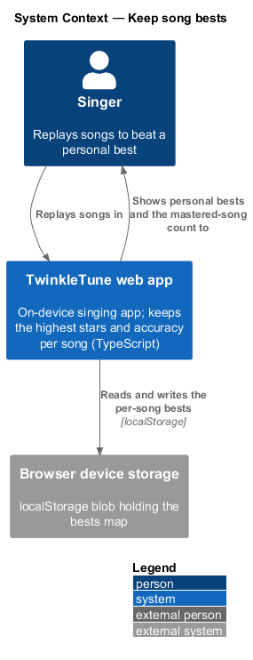
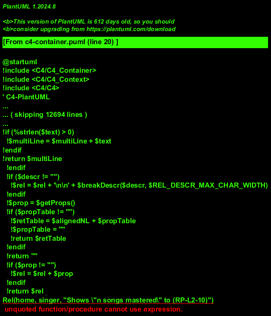
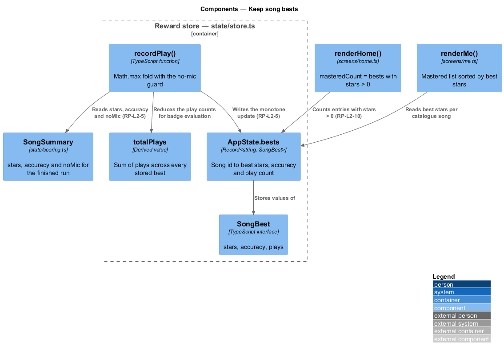
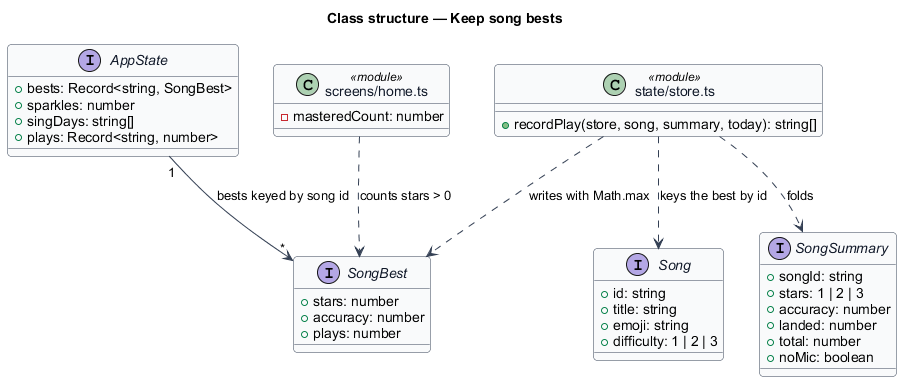
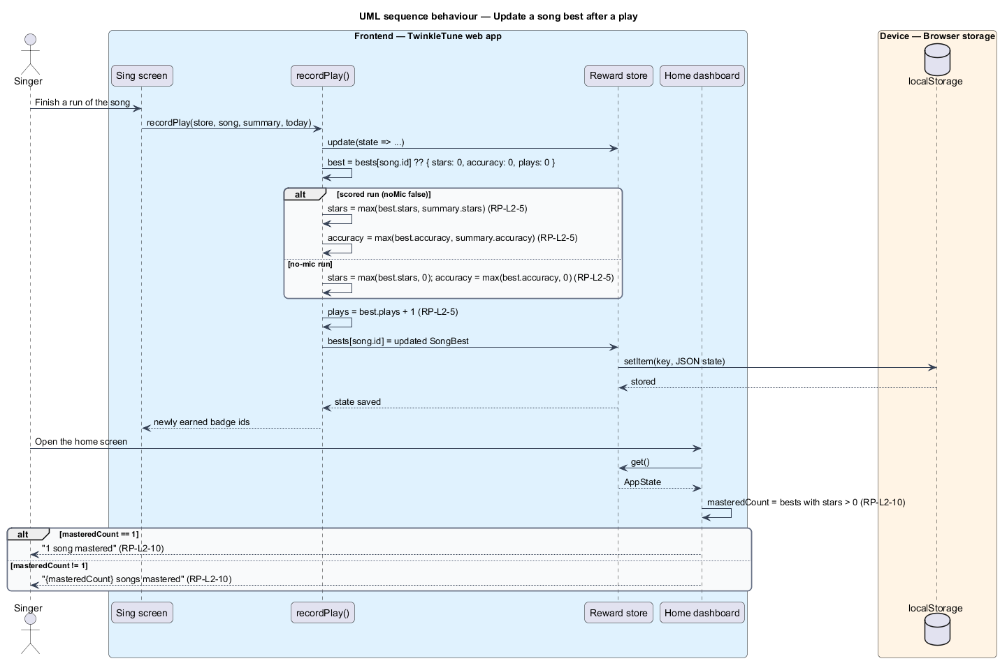

# Keep Song Bests

## Overview

A personal best turns a song into something a child can own. TwinkleTune keeps
one best per song — the highest stars ever earned, the highest accuracy ever
reached, and how many times the song has been played — and updates it only
upward, so a weaker run never erases a good one. A no-mic run counts as a play
but contributes nothing to stars or accuracy, which keeps a best meaningful: it
always reflects real singing that the microphone heard.

The bests also answer a simpler question the home dashboard asks: how many songs
has this singer mastered. Mastery is defined generously as any song whose best
stars exceed zero.

The terms below are used throughout.

- song best — per-song record of highest stars, highest accuracy, and total play
  count
- best stars — highest star rating, 1 to 3, ever awarded for the song in a scored
  run
- best accuracy — highest landed-note ratio, 0 to 1, ever reached for the song in
  a scored run
- play count — number of completed runs of the song, incremented for scored and
  no-mic runs alike
- no-mic run — "just for fun" play with no microphone, which earns no stars and no
  accuracy
- mastered song — song whose best stars exceed 0
- monotone update — property that a stored best changes only when the new value
  is higher

Bests live in the same on-device state blob as sparkles and badges, keyed by song
id, and are written by the same single `recordPlay` operation.

## Description

Frontend — reward state (`frontend/src/state/store.ts`):

- **`SongBest`** — interface with `stars: number`, `accuracy: number`, and
  `plays: number`.
- **`AppState.bests`** — `Record<string, SongBest>` keyed by `song.id`,
  initialised to `{}` by `emptyState()`.
- **`recordPlay`** — reads `const best = s.bests[song.id] ?? { stars: 0, accuracy: 0, plays: 0 }`
  and writes back
  `{ stars: Math.max(best.stars, summary.noMic ? 0 : summary.stars), accuracy: Math.max(best.accuracy, summary.noMic ? 0 : summary.accuracy), plays: best.plays + 1 }`.
  The `noMic ? 0 :` guard is what keeps an unscored run from raising a best, and
  `Math.max` is what keeps the update monotone.
- **`totalPlays`** — derived inside `recordPlay` as
  `Object.values(s.bests).reduce((sum, b) => sum + b.plays, 0)`, feeding the badge
  evaluation.

Frontend — scoring input (`frontend/src/state/scoring.ts`):

- **`SongSummary.stars`** — `1 | 2 | 3` overall rating for the run.
- **`SongSummary.accuracy`** — landed-note ratio for the run.
- **`SongSummary.noMic`** — true when the run was played without the microphone.

Frontend — home dashboard (`frontend/src/screens/home.ts`):

- **`masteredCount`** — `Object.values(s.bests).filter((b) => b.stars > 0).length`.
- **`My Songs` tile** — renders
  `${masteredCount} song${masteredCount === 1 ? '' : 's'} mastered`, which yields
  `1 song mastered` for one and `3 songs mastered` for three.

Frontend — progress screen (`frontend/src/screens/me.ts`):

- **`mastered`** — pairs each catalogue song from `currentSongs()` with
  `s.bests[song.id]`, filters to `best && best.stars > 0`, and sorts descending by
  `best.stars` for the "Songs I shine at" list.

Constants (the shipped baseline): mastery threshold of `stars > 0`, star scale
1 to 3, accuracy scale 0 to 1, and a no-mic contribution of `0` to both stars and
accuracy.

## Requirements

The feature realizes the following level-2 (L2) requirements. Each L2 requirement
refines a level-1 (L1) requirement, cited by identifier.

| L2 ID | Refines (L1) | Requirement |
|-------|--------------|-------------|
| `RP-L2-5` | `RP-L1-3` | Each song's best shall keep the maximum stars and accuracy ever achieved and a total play count; a no-mic run shall increment the play count but shall contribute 0 to best stars and accuracy. |
| `RP-L2-10` | `RP-L1-5` | The home dashboard shall report the number of songs the singer has mastered (best stars > 0), with correct singular and plural wording. |

## Diagrams

### System context

The singer replays songs on the device; the app keeps the highest result each
song has ever reached and reports how many songs are mastered (`RP-L2-5`,
`RP-L2-10`).

### Containers

The sing screen hands a summary to the reward store, which folds it into the
song's best; the home dashboard counts the mastered songs from the same map.

### Components

`recordPlay` applies the `Math.max` fold and the no-mic guard to `AppState.bests`;
`renderHome` filters the same map on `stars > 0` (`RP-L2-10`).

### Class structure

`SongBest` is the stored shape, `SongSummary` is the per-run input, and the map
from song id to best is the association between them.

### Behaviour — update a song best after a play

The `alt` contrasts the two run kinds: a scored run offers `summary.stars` and
`summary.accuracy` to `Math.max`, while a no-mic run offers `0` to both and still
increments the play count (`RP-L2-5`). The home dashboard then recounts the
mastered songs and picks singular or plural wording (`RP-L2-10`).

