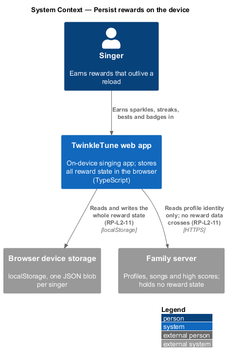
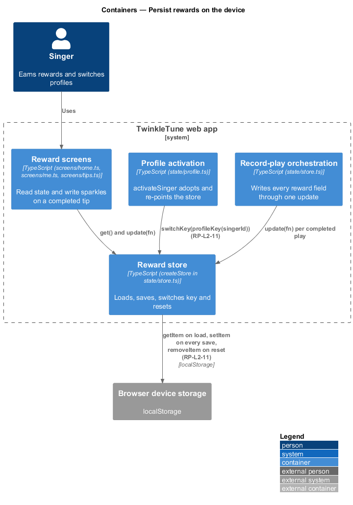
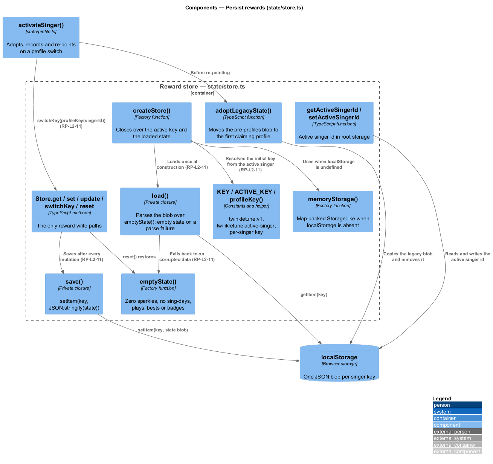
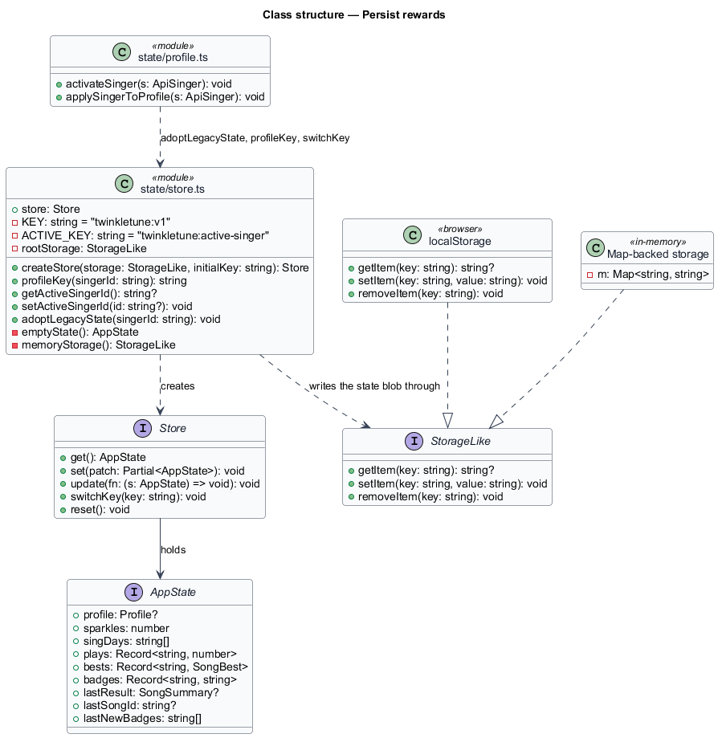
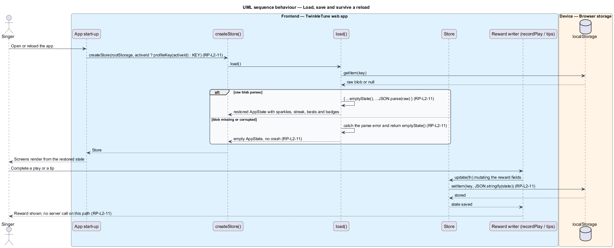
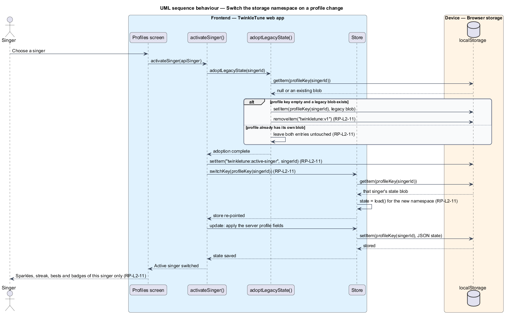

# Persist Rewards

## Overview

Sparkles, streaks, bests, and badges belong to the child and to the device — never
to a server. This feature is the storage layer beneath every other reward: a
small store over `localStorage` that loads one JSON blob on creation, saves the
whole blob after every mutation, and can be re-pointed at another singer's blob
when profiles switch. Two properties matter beyond plain reading and writing.
Corrupted stored data starts an empty state rather than throwing, so a damaged
blob costs progress but never the app. And the store's key is namespaced per
singer, so two children sharing one tablet keep separate journeys.

The terms below are used throughout.

- reward state — the single `AppState` object holding profile, sparkles,
  sing-days, plays, bests, badges, and the results hand-off fields
- storage port — narrow `getItem` / `setItem` / `removeItem` interface the store
  writes through, satisfied by `localStorage` and by an in-memory stand-in
- state blob — JSON serialisation of the whole reward state, written under one
  storage key
- profile namespace — per-singer storage key of the form `twinkletune:v1:{singerId}`
- active singer — singer id recorded under `twinkletune:active-singer`, used to
  choose the key at start-up
- legacy blob — pre-profiles state stored under the bare `twinkletune:v1` key
- state adoption — one-time move of the legacy blob to the first server profile
  that claims it
- corruption fallback — behaviour of returning an empty state when the stored blob
  cannot be parsed

## Description

Frontend — reward store (`frontend/src/state/store.ts`):

- **`StorageLike`** — the storage port: `getItem(key): string | null`,
  `setItem(key, value)`, `removeItem(key)`.
- **`KEY`** — module constant `'twinkletune:v1'`, the default and legacy key.
- **`emptyState()`** — factory returning the zero state: `profile: null`,
  `sparkles: 0`, `singDays: []`, `plays: {}`, `bests: {}`, `badges: {}`,
  `lastResult: null`, `lastSongId: null`, `lastNewBadges: []`.
- **`createStore(storage, initialKey = KEY)`** — builds a `Store` over the port.
  Its private `load()` reads the raw string, and on a truthy value returns
  `{ ...emptyState(), ...JSON.parse(raw) }`; the surrounding `try`/`catch`
  swallows a parse failure and falls through to `emptyState()`. Spreading over
  `emptyState()` also supplies defaults for fields absent from an older blob.
- **`save()`** — private closure calling `storage.setItem(key, JSON.stringify(state))`.
- **`Store.get()` / `set(patch)` / `update(fn)`** — `set` merges a patch and
  saves; `update` applies a mutation and saves. Every reward write goes through
  one of the two, so no path changes state without persisting it.
- **`Store.switchKey(newKey)`** — re-points the store at another key and reloads,
  which is how profile switching swaps journeys.
- **`Store.reset()`** — replaces the state with `emptyState()` and removes the key
  from storage.
- **`memoryStorage()`** — `Map`-backed `StorageLike` used where `localStorage` is
  absent, which keeps the store usable under tests and non-browser hosts.
- **`rootStorage`** — `typeof localStorage !== 'undefined' ? localStorage : memoryStorage()`.
- **`ACTIVE_KEY`** — module constant `'twinkletune:active-singer'`.
- **`profileKey(singerId)`** — returns `` `${KEY}:${singerId}` ``.
- **`getActiveSingerId()` / `setActiveSingerId(id)`** — read and write the active
  singer id in root storage; passing `null` removes it.
- **`adoptLegacyState(singerId)`** — when the target profile key holds nothing and
  the legacy `KEY` holds a blob, copies the blob to the profile key and removes
  the legacy entry, so a pre-profiles singer keeps their sparkles and badges.
- **`store`** — the module-level singleton, created as
  `createStore(rootStorage, activeId ? profileKey(activeId) : KEY)`.

Frontend — profile switching (`frontend/src/state/profile.ts`):

- **`activateSinger(s)`** — calls `adoptLegacyState(s.id)`, `setActiveSingerId(s.id)`,
  `store.switchKey(profileKey(s.id))`, and then `applySingerToProfile(s)`, in that
  order, so the adoption happens before the store re-points.

Constants (the shipped baseline): storage keys `twinkletune:v1`,
`twinkletune:v1:{singerId}`, and `twinkletune:active-singer`; one JSON blob per
singer; no server call on any reward path.

## Requirements

The feature realizes the following level-2 (L2) requirements. Each L2 requirement
refines a level-1 (L1) requirement, cited by identifier.

| L2 ID | Refines (L1) | Requirement |
|-------|--------------|-------------|
| `RP-L2-11` | `RP-L1-6` | All rewards (sparkles, sing-days, plays, bests, badges) shall persist in device storage under the active profile's namespace and survive reloads; corrupted stored state shall fall back to an empty state rather than crashing. No reward data shall require the server. |

## Diagrams

### System context

Reward state is written to and read from the device only; the family server takes
no part in any reward path (`RP-L2-11`).

### Containers

Every reward screen and the record-play orchestration write through the one store,
which serialises the whole state under the active singer's key.

### Components

`createStore` closes over the key and the loaded state; `load` supplies the
corruption fallback, `save` the write, and `switchKey` the per-profile
re-pointing (`RP-L2-11`).

### Class structure

`StorageLike` is the port, `Store` the interface over it, `AppState` the persisted
shape, and the two storage implementations sit behind the port.

### Behaviour — load, save and survive a reload

Start-up resolves the active singer's key and loads the blob; the `alt` shows the
corruption fallback returning `emptyState()` instead of throwing (`RP-L2-11`).
Each subsequent `update` writes the whole state, so a reload restores it.

### Behaviour — switch the storage namespace on a profile change

Activating a singer adopts the legacy blob when the profile key is empty, records
the active singer, and re-points the store, so each child reads and writes only
their own rewards (`RP-L2-11`).

