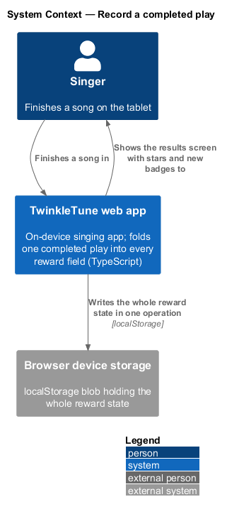
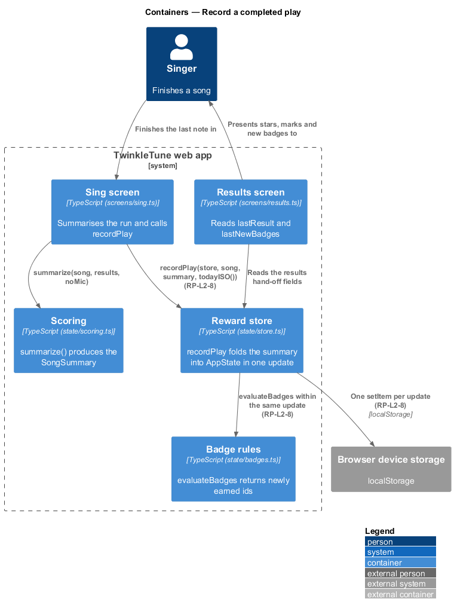
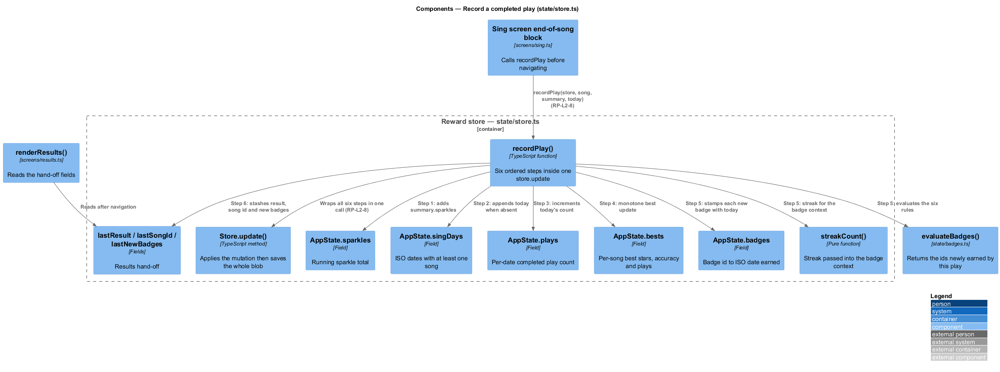
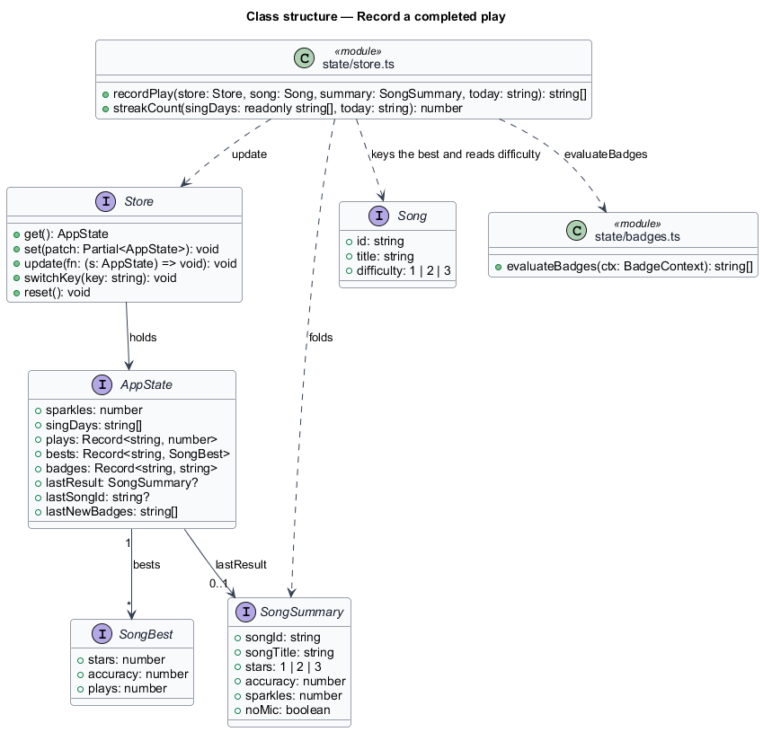
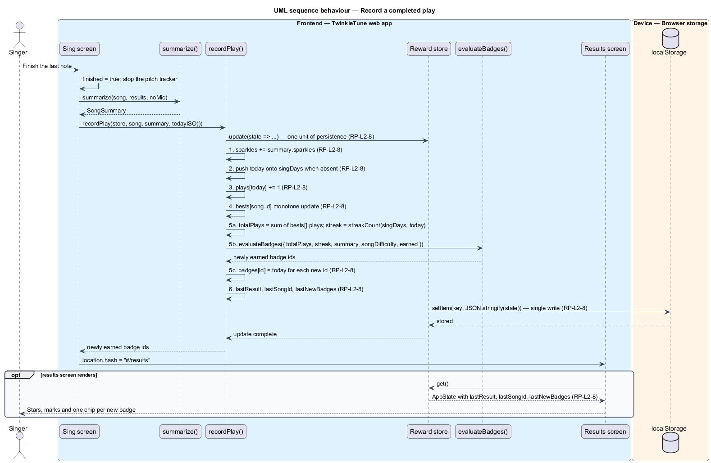

# Record Play

## Overview

Every reward in TwinkleTune is written by one function. When a song ends, the
sing screen hands the play summary to `recordPlay`, which folds six changes into
the on-device state in a single persisted operation: sparkles are added, today is
marked as a sing-day, today's play count is incremented, the song's best is
updated, badges are evaluated and stamped, and the last result is stashed for the
results screen. Doing all six inside one `store.update` call is what keeps the
state self-consistent — a state where a play raised the sparkle total but never
counted towards the streak cannot be persisted.

This feature is the orchestration itself. The individual rules it invokes belong
to the sparkle, streak, best, and badge features; what is described here is the
order, the atomicity, and the hand-off to the results screen.

The terms below are used throughout.

- record-play orchestration — single function that folds a completed play's
  summary into every reward field at once
- play summary — `SongSummary` produced by scoring and results (SR) for the run
  just finished
- unit of persistence — one `store.update` call, whose callback mutates the state
  and whose completion writes the whole blob to device storage
- last result — copy of the play summary kept in state so the results screen can
  render without re-scoring
- results hand-off — the trio of `lastResult`, `lastSongId`, and `lastNewBadges`
  that the results screen reads after navigation

The function is deliberately synchronous and server-free: it returns the newly
earned badge ids to its caller and leaves navigation to the sing screen.

## Description

Frontend — reward state (`frontend/src/state/store.ts`):

- **`recordPlay(store, song, summary, today)`** — the orchestration. It declares
  `let newBadges: string[] = []`, runs one `store.update((s) => { ... })`, and
  returns `newBadges`. Inside the callback, in order:
  1. `s.sparkles += summary.sparkles`;
  2. `if (!s.singDays.includes(today)) s.singDays.push(today)`;
  3. `s.plays[today] = (s.plays[today] ?? 0) + 1`;
  4. the `s.bests[song.id]` monotone update with the `noMic` guard;
  5. `totalPlays` reduced from `s.bests`, then `newBadges = evaluateBadges({ totalPlays, streak: streakCount(s.singDays, today), summary, songDifficulty: song.difficulty, earned: new Set(Object.keys(s.badges)) })`
     and `s.badges[id] = today` for each new id;
  6. `s.lastResult = summary`, `s.lastSongId = song.id`, `s.lastNewBadges = newBadges`.
- **`Store.update(fn)`** — applies `fn` to the live state object and then calls
  `save()`, which serialises the whole state with `JSON.stringify` and writes it
  under the active key. One `update` call is therefore one write.
- **`AppState.lastResult` / `lastSongId` / `lastNewBadges`** — the results
  hand-off fields, initialised to `null`, `null`, and `[]`.
- **Step ordering** — the badge evaluation runs after the sing-day, play-count,
  and best updates, so `streakCount` sees today already marked and `totalPlays`
  already includes this play. That ordering is what lets `First Song` be awarded
  on the first run.

Frontend — sing screen (`frontend/src/screens/sing.ts`):

- **end-of-song block** — after `finished = true`, it stops the pitch tracker,
  computes `const summary = summarize(song, results, noMic)`, and calls
  `recordPlay(store, song, summary, todayISO())` before any navigation.

Frontend — results screen (`frontend/src/screens/results.ts`):

- **`renderResults`** — reads `state.lastResult` for the stars, marks, and
  coaching line, and `state.lastNewBadges` for the new-badge chips.

Frontend — song list (`frontend/src/screens/songs.ts`):

- **`renderSongs`** — reads `state.lastSongId` to resolve the most recently sung
  song.

## Requirements

The feature realizes the following level-2 (L2) requirements. Each L2 requirement
refines a level-1 (L1) requirement, cited by identifier.

| L2 ID | Refines (L1) | Requirement |
|-------|--------------|-------------|
| `RP-L2-8` | `RP-L1-6` | Recording a completed play shall, in one persisted operation, add sparkles, mark today as a sing-day (without duplicates), increment today's play count, update the song best, evaluate and store newly earned badges with today's date, and stash the last result, song id, and new-badge list for the results screen. |

## Diagrams

### System context

The singer finishes a song; the app folds that one event into every reward it
keeps on the device, with no network step in the path (`RP-L2-8`).

### Containers

The sing screen produces the summary, the reward store folds it in and persists
once, and the results screen reads the hand-off fields afterwards.

### Components

`recordPlay` sits between the summary and the six state fields it writes, calling
`streakCount` and `evaluateBadges` from inside the same `store.update` callback
(`RP-L2-8`).

### Class structure

The orchestration's inputs — `Store`, `Song`, and `SongSummary` — and the
`AppState` fields it writes, including the three results hand-off fields.

### Behaviour — record a completed play

The six steps run in order inside one `store.update`, and the single
`setItem` at the end is the one persisted operation the requirement calls for
(`RP-L2-8`). The `opt` shows the results screen reading the hand-off fields after
navigation.

