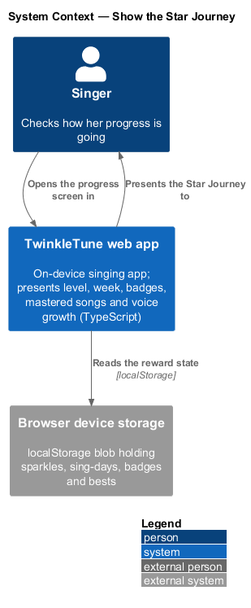
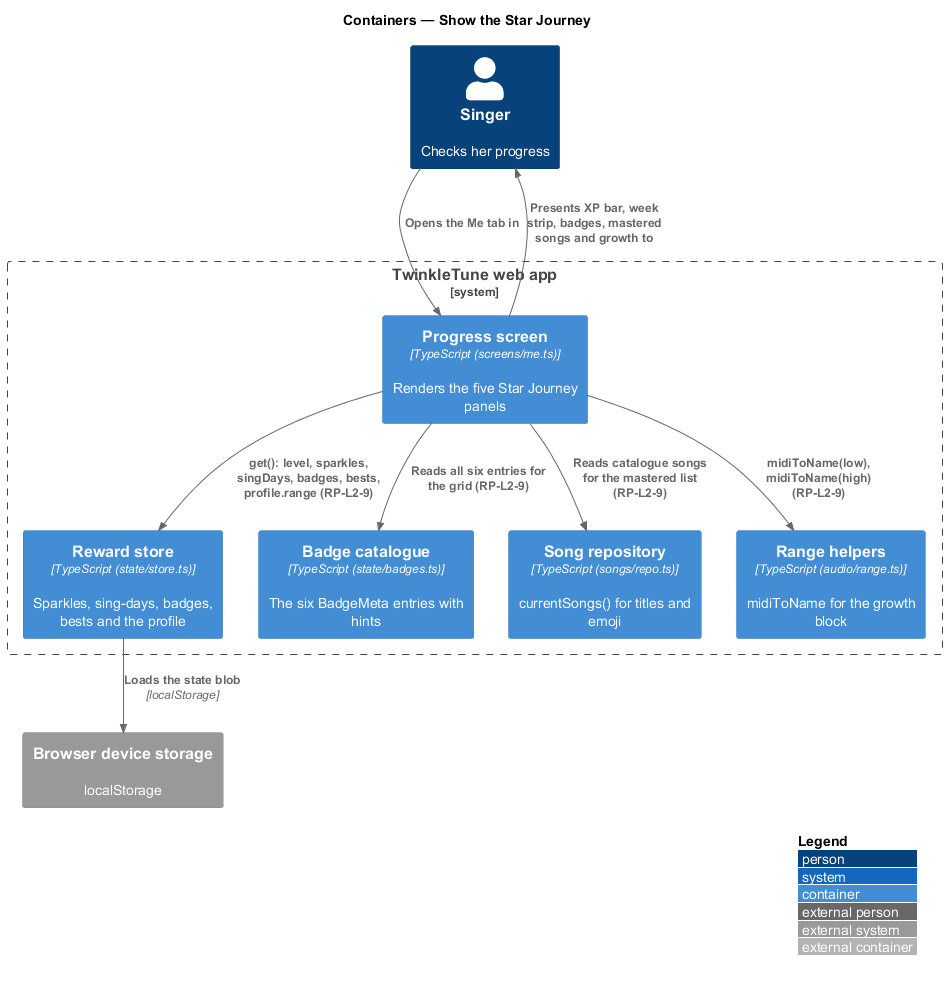
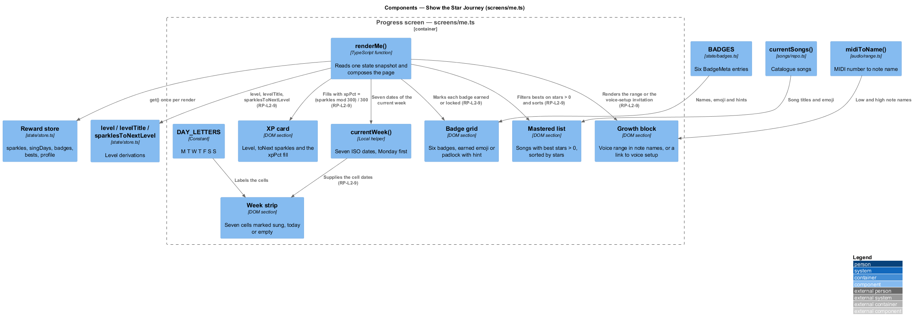
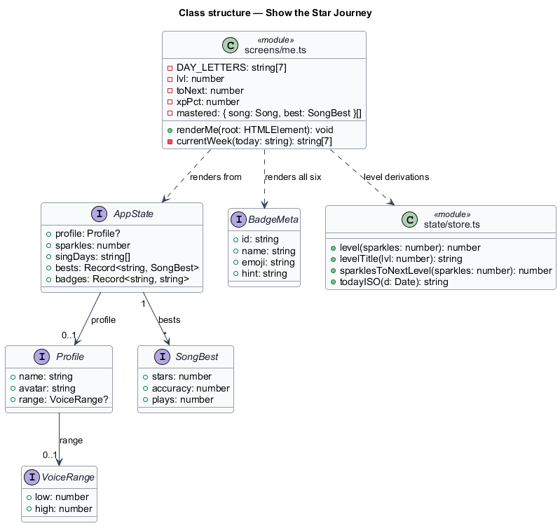
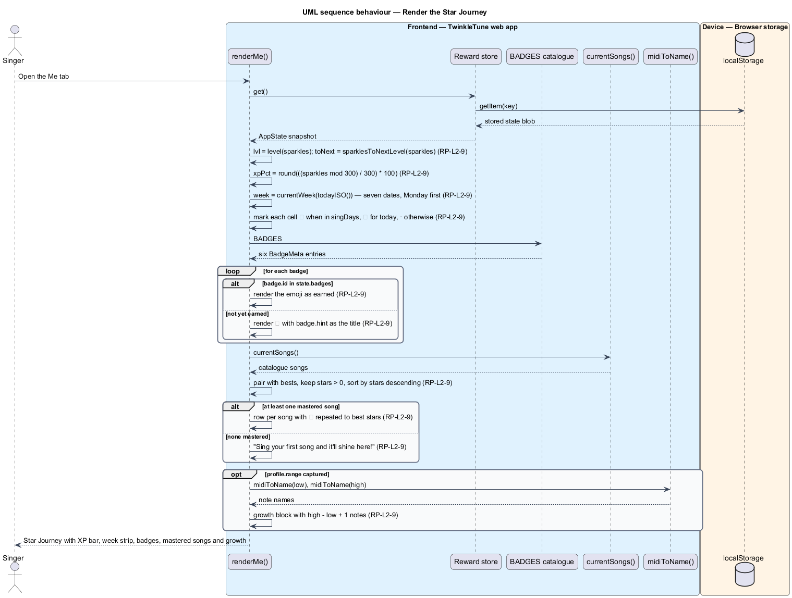

# Show Star Journey

## Overview

Progress that nobody sees is not motivating. The "Me" screen — titled
"{name}'s Star Journey" — gathers everything the reward model has recorded into
one page a child can scroll with pride: the current level with an XP bar towards
the next, a seven-day strip of the week showing which days were sung, the full
badge grid with locked entries hinting at what to try, the songs already shone
at, and a note on how far the voice reaches. It reads state only; nothing on this
screen awards anything.

The terms below are used throughout.

- Star Journey — the progress screen that presents level, week, badges, mastered
  songs, and voice growth in one view
- XP bar — horizontal fill showing the share of the current 300-sparkle level
  already earned
- week strip — seven cells, Monday first, one per day of the current calendar
  week
- sung day marker — star shown on a week-strip cell whose date is in `singDays`
- today marker — microphone shown on the week-strip cell for the current date
  when that date has no sung-day marker
- locked badge — catalogue badge not yet earned, drawn as a padlock with its hint
  as the tooltip
- mastered list — "Songs I shine at", the catalogue songs with best stars above
  zero, ordered by best stars descending
- growth block — sentence naming the singer's lowest and highest comfortable
  notes and the number of notes between them

## Description

Frontend — progress screen (`frontend/apps/game/src/screens/me.ts`):

- **`renderMe(root)`** — the whole screen. It reads `store.get()` once and derives
  everything from that snapshot.
- **XP card** — `lvl = level(s.sparkles)`, `toNext = sparklesToNextLevel(s.sparkles)`,
  and `xpPct = Math.round(((s.sparkles % 300) / 300) * 100)`. It renders
  `Level ${lvl}`, `${toNext} ✨ to Level ${lvl + 1}!`, a `div.fill` of width
  `${xpPct}%`, and `✨ ${s.sparkles} sparkles collected`. The header repeats
  `Level ${lvl} ${levelTitle(lvl)}`.
- **`DAY_LETTERS`** — module constant `['M', 'T', 'W', 'T', 'F', 'S', 'S']`,
  Monday-first.
- **`currentWeek(today)`** — returns the seven ISO dates of the week containing
  `today`, computing the Monday-first weekday as `(date.getDay() + 6) % 7` and
  offsetting from that.
- **week strip** — one `div.day` per date, with class `done` when
  `sung.has(iso)`, class `today` when `iso === today`, and an icon of `⭐` when
  sung, `🎤` when today and not yet sung, and `·` otherwise.
- **badge grid** — maps all six `BADGES`; `earned = b.id in s.badges` picks
  between `b.emoji` and `🔒`, adds the `locked` class when not earned, and sets
  `title="${b.hint}"`.
- **`mastered`** — `currentSongs()` paired with `s.bests[song.id]`, filtered to
  `best && best.stars > 0`, sorted by `b.best.stars - a.best.stars`. Each row
  shows the song emoji, title, and `'★'.repeat(best.stars) + '☆'.repeat(3 - best.stars)`.
- **empty state** — when `mastered.length` is zero, the list is replaced by
  `Sing your first song and it'll shine here!`.
- **growth block** — with a captured range, it reads
  `midiToName(profile.range.low)`, `midiToName(profile.range.high)`, and
  `profile.range.high - profile.range.low + 1` notes; without one, it renders a
  link to `#/voice` inviting the singer to find their voice.
- **settings entry** — the gear button calls `parentGate(showSettings)`, so the
  grown-ups' corner sits behind the parent gate rather than on the screen itself.

Frontend — collaborating modules: `level`, `levelTitle`, `sparklesToNextLevel`,
and `todayISO` from `state/store.ts`; `BADGES` from `state/badges.ts`;
`currentSongs()` from `songs/repo.ts`; `midiToName` from `audio/range.ts`.

Constants (the shipped baseline): 300 sparkles per level for the XP bar, 7 week
cells, 6 badges, a 3-star maximum in the mastered rows, and a mastery threshold of
`stars > 0`.

## Requirements

The feature realizes the following level-2 (L2) requirements. Each L2 requirement
refines a level-1 (L1) requirement, cited by identifier.

| L2 ID | Refines (L1) | Requirement |
|-------|--------------|-------------|
| `RP-L2-9` | `RP-L1-5` | The progress ("Me") screen shall show the level and sparkles with an XP bar to the next level, a seven-day week strip marking sung days and today, all six badges as earned or locked with hints, the songs mastered (best stars > 0) sorted by stars, and the voice-range growth block. |

## Diagrams

### System context

The singer opens the progress screen; every panel is rendered from state already
on the device, so the view works with no network (`RP-L2-9`).

### Containers

The progress screen reads the reward store, the badge catalogue, and the song
repository, and renders the five panels of the Star Journey.

### Components

`renderMe` composes the XP card, the week strip built by `currentWeek`, the badge
grid over `BADGES`, the mastered list filtered on `stars > 0`, and the growth
block from the profile range (`RP-L2-9`).

### Class structure

The screen module's derived values and the state it reads: sparkles for the XP
card, `singDays` for the week, `badges` for the grid, and `bests` for the mastered
list.

### Behaviour — render the Star Journey

One state snapshot feeds all five panels in order (`RP-L2-9`). The two `alt`
blocks show the badge grid choosing between an emoji and a padlock, and the
mastered list falling back to its encouraging empty state; the `opt` covers the
growth block for a singer without a captured range.

