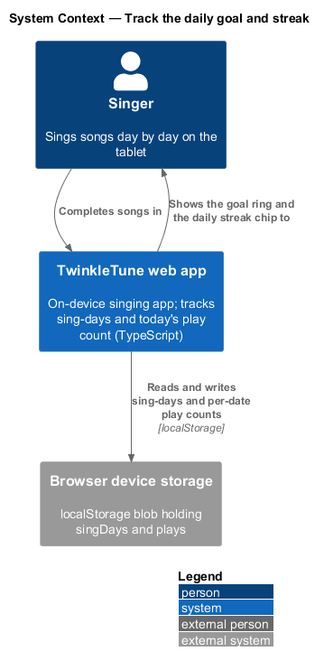
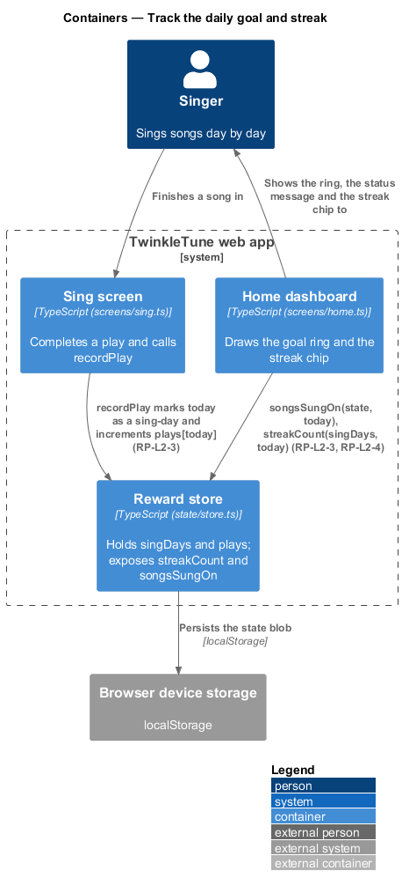
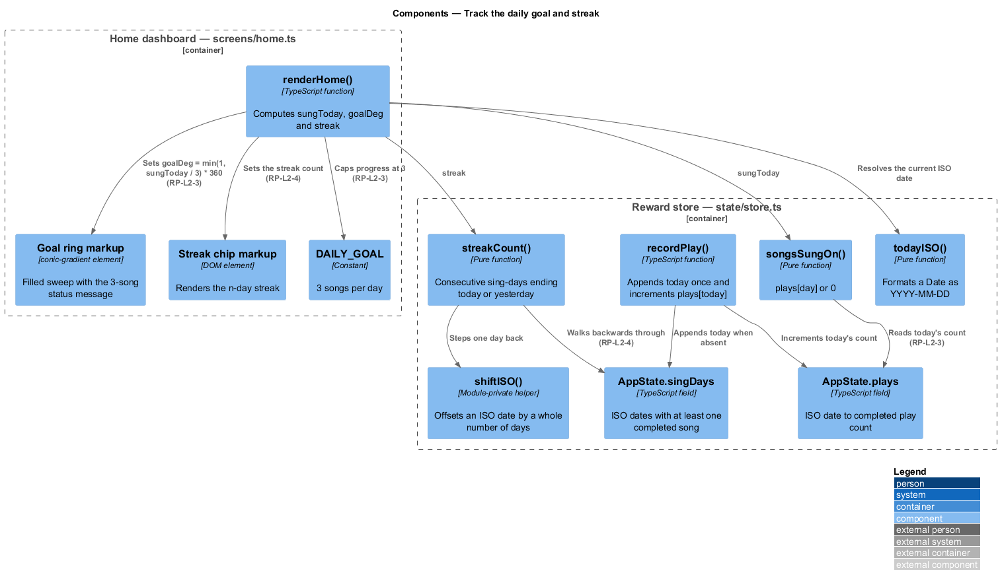
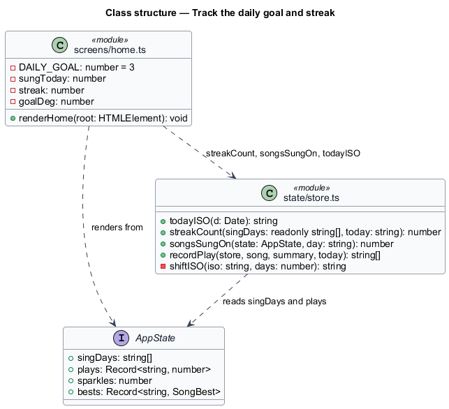
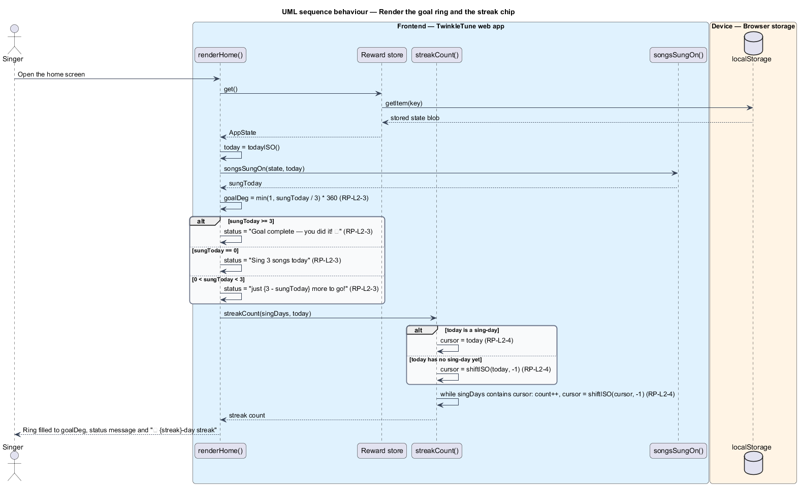
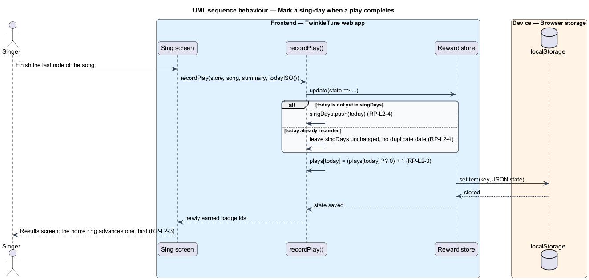

# Track Daily Goal And Streak

## Overview

Habit is the point of this feature: a child who sings a little every day improves
far more than one who sings once a month. TwinkleTune states the habit as a small
daily goal of three songs, drawn as a ring that fills as the day goes on, and as
a streak of consecutive days sung, shown as a chip in the home header. The tone
stays kind — the streak counts a day as still alive until a whole day has passed
without singing, so a child who has not sung yet this morning does not open the
app to a streak of zero.

The terms below are used throughout.

- sing-day — ISO date (`YYYY-MM-DD`) on which at least one song was completed
- daily goal — target of 3 songs completed within one calendar day
- goal ring — conic-gradient arc on the home dashboard whose filled sweep is
  proportional to songs sung today, capped at a full circle
- daily streak — count of consecutive sing-days ending at today, or at yesterday
  when today has no sing-day yet
- forgiving streak — property that a streak stays intact for the whole of the
  current day before it is treated as broken
- play count — per-date tally of completed plays, held separately from the
  sing-day list so the ring can show partial progress

Both readings are pure functions of state that `recordPlay` maintains: the
`singDays` list drives the streak, and the `plays` map drives the ring. Neither
requires the family server.

## Description

Frontend — reward state (`frontend/apps/game/src/state/store.ts`):

- **`AppState.singDays`** — `string[]` of ISO dates on which at least one song
  was sung. `recordPlay` appends today only when `!s.singDays.includes(today)`,
  so a date appears at most once.
- **`AppState.plays`** — `Record<string, number>` mapping ISO date to completed
  plays. `recordPlay` sets `s.plays[today] = (s.plays[today] ?? 0) + 1`.
- **`todayISO(d = new Date())`** — formats a `Date` as `YYYY-MM-DD` using local
  year, month, and day, zero-padded.
- **`shiftISO(iso, days)`** — module-private helper that parses an ISO date,
  offsets it by `days` through the `Date` constructor, and re-formats it, so
  month and year boundaries are handled by the platform.
- **`streakCount(singDays, today)`** — builds a `Set` of the sing-days, starts the
  cursor at `today` when present and otherwise at `shiftISO(today, -1)`, then
  walks backwards one day at a time while the set contains the cursor, returning
  the number of steps taken.
- **`songsSungOn(state, day)`** — returns `state.plays[day] ?? 0`.

Frontend — home dashboard (`frontend/apps/game/src/screens/home.ts`):

- **`DAILY_GOAL`** — module constant set to `3`.
- **`renderHome`** — computes `sungToday = songsSungOn(s, today)`,
  `streak = streakCount(s.singDays, today)`, and
  `goalDeg = Math.min(1, sungToday / DAILY_GOAL) * 360`.
- **goal ring markup** — a `div.goal-ring` whose background is
  `conic-gradient(var(--blue) 0 ${goalDeg}deg, #E3F1FB ${goalDeg}deg 360deg)`,
  labelled `${sungToday} of ${DAILY_GOAL} songs done` and captioned
  `${Math.min(sungToday, DAILY_GOAL)}/${DAILY_GOAL}`.
- **status message** — three-way choice: `Goal complete — you did it! 🎉` at or
  above the goal, `Sing 3 songs today` at zero, and
  `Sing 3 songs — just ${DAILY_GOAL - sungToday} more to go!` in between.
- **streak chip** — `div.streak-chip-top` rendering `⭐ ${streak}-day streak`.
- **goal card gating** — the goal card renders only when `profile.range` is set;
  a singer who has not completed voice setup sees the `Find my voice` card in its
  place.

Constants (the shipped baseline): `DAILY_GOAL = 3`, a full ring at `360` degrees,
and a streak lookback of one day before a streak is treated as broken.

## Requirements

The feature realizes the following level-2 (L2) requirements. Each L2 requirement
refines a level-1 (L1) requirement, cited by identifier.

| L2 ID | Refines (L1) | Requirement |
|-------|--------------|-------------|
| `RP-L2-3` | `RP-L1-2` | The home screen shall track songs sung today against a goal of 3 and render a ring that fills proportionally, capped at complete, with a status message for none, partial, and complete. |
| `RP-L2-4` | `RP-L1-2` | The daily streak shall count consecutive sing-days ending at today, or at yesterday when today has not yet been sung, so a streak is not shown as lost partway through the day. |

## Diagrams

### System context

The singer sings on the device; the app reads the dates and per-date play counts
it has stored there to draw the goal ring and the streak chip (`RP-L2-3`,
`RP-L2-4`).

### Containers

The sing screen writes today's sing-day and play count into the reward store, and
the home dashboard reads them back through `songsSungOn` and `streakCount`.

### Components

`renderHome` derives `sungToday`, `goalDeg`, and `streak` from `AppState.plays`
and `AppState.singDays`; `shiftISO` supplies the backwards day walk that
`streakCount` uses (`RP-L2-4`).

### Class structure

The two state fields, the pure functions that read them, and the home-screen
constant that sets the goal.

### Behaviour — render the goal ring and the streak chip

The home screen reads the stored state, computes the ring sweep from today's play
count capped at the goal, and picks one of the three status messages
(`RP-L2-3`). The `alt` over `streakCount` shows the forgiving rule: the walk
starts at today when today is a sing-day and at yesterday otherwise (`RP-L2-4`).

### Behaviour — mark a sing-day when a play completes

Completing a song appends today to `singDays` only when it is not already
present, and increments today's entry in `plays`, which is what makes the ring
advance and the streak extend (`RP-L2-3`, `RP-L2-4`).

