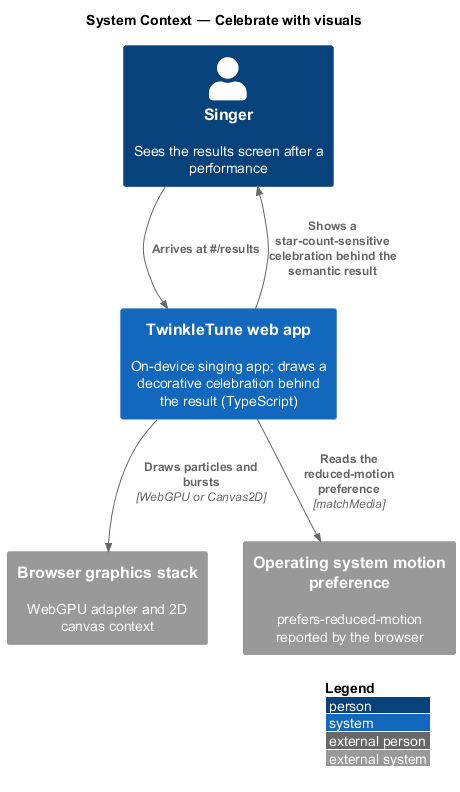
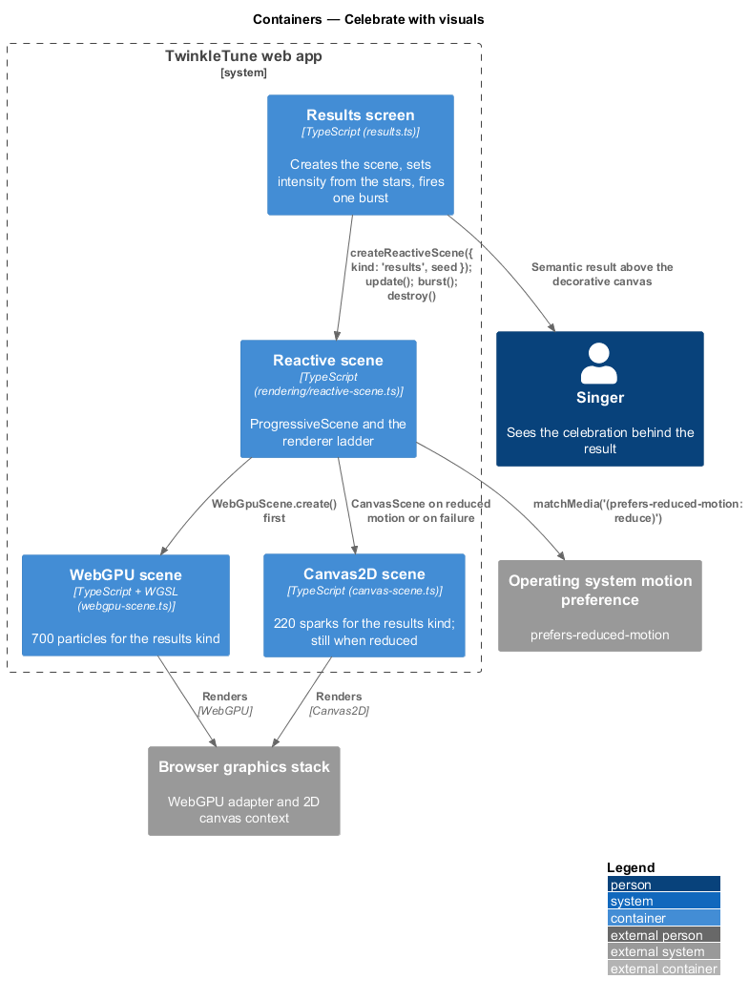
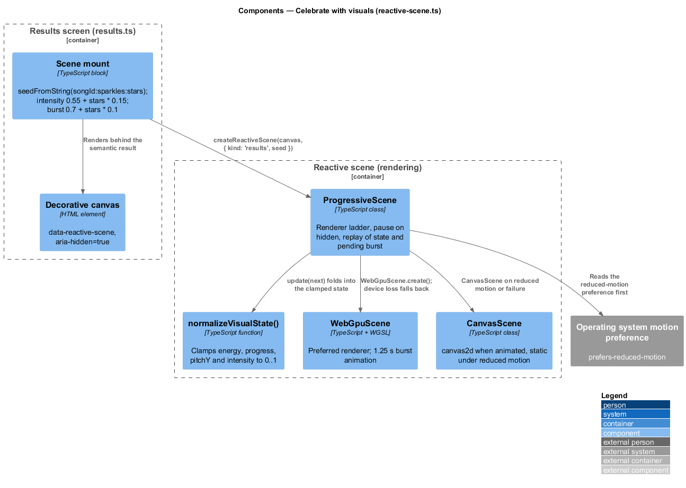
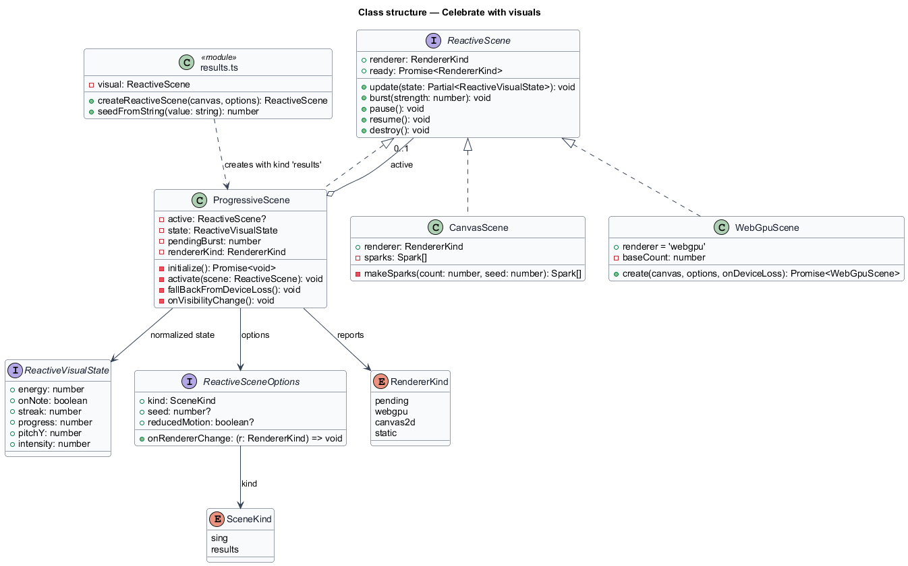
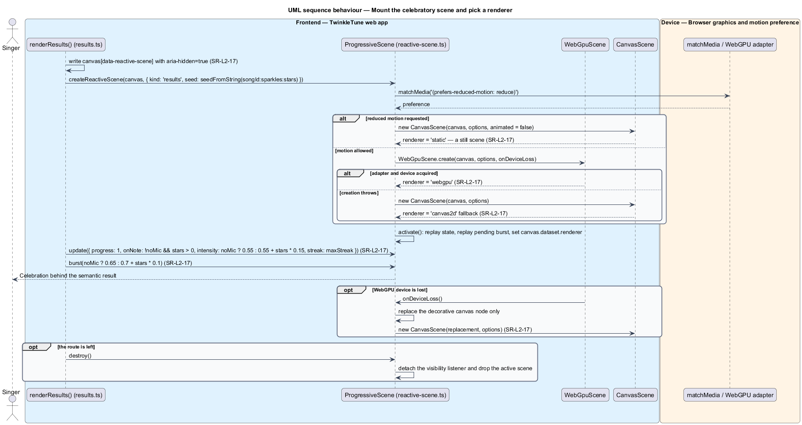

# Celebrate With Visuals

## Overview

The results screen carries a full-bleed decorative canvas behind the outcome:
drifting sparks, a warm aura, and a burst timed to the moment the screen appears.
The strength of that celebration follows the star count, so three stars feel
louder than one, and a no-mic run still gets a gentle one. The canvas is a
decoration and nothing else — every fact of the result lives in semantic DOM
above it, so a child using a screen reader, an old tablet without WebGPU, or a
device set to reduced motion sees the same complete result.

reactive scene — decorative canvas that renders drifting particles and bursts
driven by a small normalized visual state

The feature covers the results-screen instance of that scene: its seed, the
visual state it is given, the burst it fires, the renderer ladder that backs it,
and its teardown. The gameplay instance of the same scene belongs to singing
gameplay.

The terms below are used throughout.

- renderer kind — one of `pending`, `webgpu`, `canvas2d`, or `static`, naming
  which backend is currently drawing the scene
- renderer ladder — ordered preference of WebGPU, then Canvas2D, then a still
  scene, each step taken only when the one above is unavailable
- visual state — normalized record of `energy`, `onNote`, `streak`, `progress`,
  `pitchY`, and `intensity`, each clamped to a valid range before use
- burst — short-lived radial expansion of particles, requested with a strength
  from 0 to 1
- scene seed — number derived from the run, so the same result draws the same
  particle layout
- reduced motion — user preference reported by `prefers-reduced-motion: reduce`,
  under which the scene renders once and does not animate
- decorative node — element marked `aria-hidden="true"` so assistive technology
  skips it entirely

## Description

The results screen creates one scene and drives it with three calls; the scene
itself picks its renderer. No server participates.

Frontend — the results-screen instance (`frontend/apps/game/src/screens/results.ts`):

- **Scene canvas** — a `<canvas class="reactive-scene reactive-scene--results"
  data-reactive-scene aria-hidden="true">` written as the first node of the
  screen, behind the semantic `<main>`.
- **`createReactiveScene(canvas, options)`** — called with
  `{ kind: 'results', seed: seedFromString(\`${r.songId}:${r.sparkles}:${r.stars}\`) }`,
  so a replayed run with the same outcome draws the same layout.
- **`visual.update({ … })`** — called once with `progress: 1`,
  `onNote: !r.noMic && r.stars > 0`, `intensity: r.noMic ? 0.55 : 0.55 + r.stars * 0.15`,
  and `streak: r.maxStreak`, which is where the star count sets the celebration
  strength.
- **`visual.burst(strength)`** — fired once with `r.noMic ? 0.65 : 0.7 + r.stars * 0.1`.
- **Teardown** — `renderResults` returns `() => visual.destroy()`, so leaving the
  route releases the scene.

Frontend — the scene (`frontend/apps/game/src/rendering/reactive-scene.ts`,
`types.ts`, `webgpu-scene.ts`, `canvas-scene.ts`):

- **`ProgressiveScene`** — class implementing `ReactiveScene`. Its `initialize()`
  reads `options.reducedMotion ?? window.matchMedia('(prefers-reduced-motion:
  reduce)').matches`; when reduced it activates `new CanvasScene(canvas, options,
  false)`, otherwise it awaits `WebGpuScene.create(...)` and falls back to
  `new CanvasScene(canvas, options)` on any thrown error.
- **`activate(scene)`** — sets `canvas.dataset.renderer`, replays the accumulated
  state and any pending burst onto the newly active scene, pauses it when the
  document is hidden, and resolves the `ready` promise with the renderer kind.
- **`fallBackFromDeviceLoss()`** — replaces the canvas node with a fresh clone and
  activates a `CanvasScene` on it, because a canvas cannot switch context modes
  once WebGPU has claimed it. Only the decorative node is replaced.
- **`onVisibilityChange`** — pauses the active scene while the document is hidden
  and resumes it otherwise.
- **`normalizeVisualState(current, next)`** — clamps `energy`, `progress`,
  `pitchY`, and `intensity` to 0–1 through `clamp01`, and floors `streak` at 0.
- **`seedFromString(value)`** — FNV-style hash producing a number in 0–1.
- **`CanvasScene`** — reports renderer `canvas2d` when animated and a 2D context
  exists, and `static` otherwise; it seeds 220 sparks for the `results` kind
  against 120 for `sing`, and paints the results gradient from `#B9DDF5` to
  `#F4DBE3` with the aura centred at (0.5, 0.34).
- **`WebGpuScene`** — reports renderer `webgpu`, uses a base particle count of 700
  for the `results` kind against 320 for `sing`, and animates a burst over
  1.25 seconds.

## Requirements

The feature realizes the following level-2 (L2) requirement, which refines a
level-1 (L1) requirement, cited by identifier.

| L2 ID | Refines (L1) | Requirement |
|-------|--------------|-------------|
| `SR-L2-17` | `SR-L1-5` | The results screen shall present star-count-sensitive celebratory particles and animated stars appropriate to a joyful moment. Particles shall prefer WebGPU, fall back to Canvas2D, remain decorative to assistive technology, and become a still scene under reduced motion. |

## Diagrams

### System context

The singer sees the celebration on the device; the scene draws through whichever
graphics backend the browser offers and never leaves the tablet (`SR-L2-17`).

### Containers

The results screen creates one reactive scene and drives it with a visual state
and a burst; the scene chooses between the WebGPU and Canvas2D backends behind
that one interface (`SR-L2-17`).

### Components

`ProgressiveScene` owns the renderer ladder — reduced motion goes straight to the
still `CanvasScene`, otherwise `WebGpuScene.create` is attempted and any failure
falls back (`SR-L2-17`).

### Class structure

`ReactiveScene` is the one interface the results screen depends on;
`ProgressiveScene`, `WebGpuScene`, and `CanvasScene` all realize it.

### Behaviour — mount the celebratory scene and pick a renderer

The screen seeds the scene from the run and sets intensity from the star count,
then the `alt` traces the renderer ladder from reduced motion through WebGPU to
the Canvas2D fallback, with device loss and teardown as `opt` blocks
(`SR-L2-17`).

