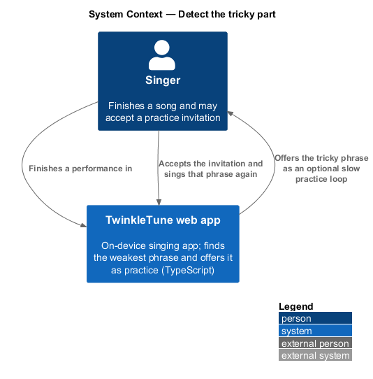
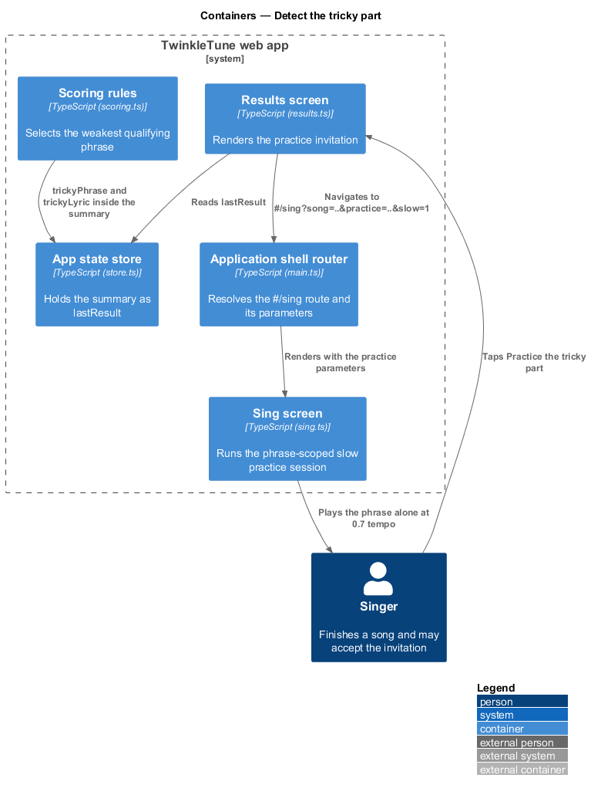
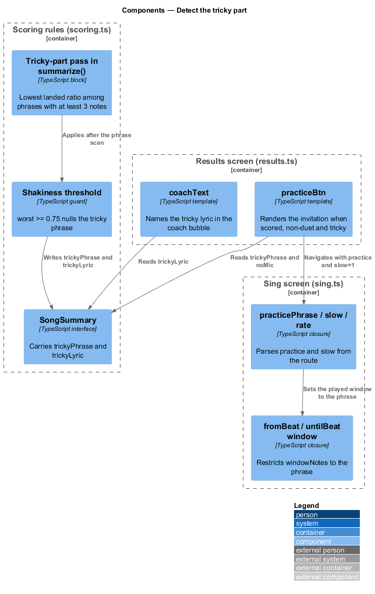
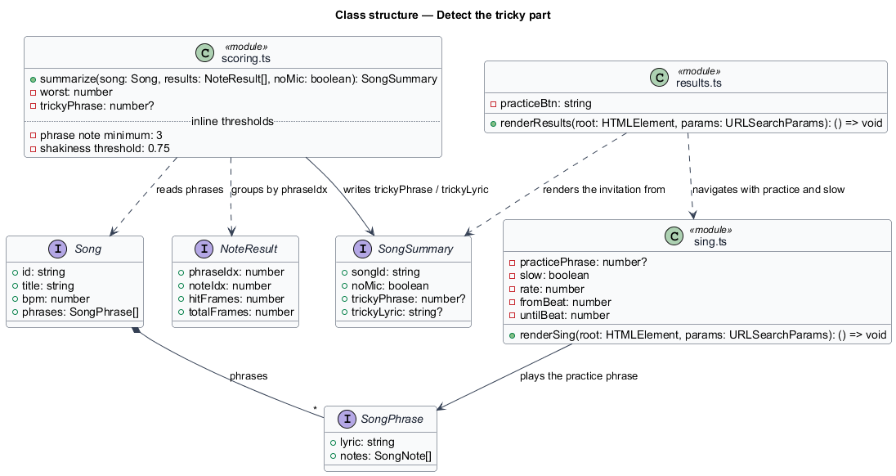
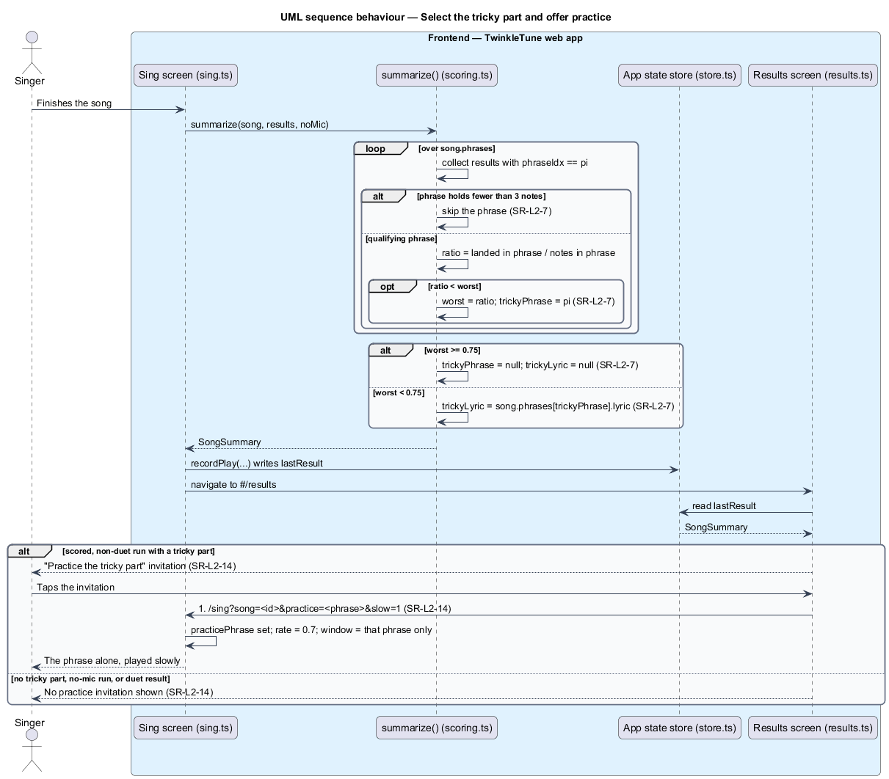

# Detect The Tricky Part

## Overview

A child who stumbles over one line of a song is offered that line back as a game,
not as a correction. This feature finds the single weakest phrase of a
performance, and only when the phrase was genuinely shaky, then turns it into an
optional invitation on the results screen that reopens exactly that phrase at a
slower tempo. When every phrase went well there is no tricky part and no
invitation, so the offer never reads as a consolation prize.

tricky part — phrase of a song with the lowest landed ratio in one performance,
offered afterwards as an optional practice loop

The slice runs from the scoring reduction through the results screen and into the
sing screen's practice mode. Judging individual notes belongs to the
judge-landed-notes feature, and the rest of the summary belongs to the
summarize-performance feature; this feature owns the phrase selection, the
shakiness threshold, the invitation, and the practice navigation.

The terms below are used throughout.

- phrase — one lyric line of a song, holding an ordered list of notes
- landed ratio — landed notes of a phrase divided by that phrase's note count in
  the played window
- qualifying phrase — phrase holding at least 3 notes in the played window, the
  minimum for a landed ratio to be meaningful
- shakiness threshold — landed ratio of 0.75, at or above which no phrase is
  reported as tricky
- practice mode — sing session restricted to one phrase and played at 0.7 of the
  song tempo
- practice invitation — optional call to action on the results screen that opens
  the tricky part in practice mode

## Description

The selection happens inside `summarize`; the invitation is rendered by the
results screen; the practice session is set up by the sing screen from URL
parameters. No server participates.

Frontend — phrase selection (`frontend/apps/game/src/state/scoring.ts`):

- **Tricky-part pass inside `summarize`** — iterates `song.phrases` with their
  index, collects the `NoteResult` entries whose `phraseIdx` matches, and skips
  any phrase holding fewer than 3 of them. For each remaining phrase it computes
  the landed ratio from `landedFlags` and keeps the lowest seen in `worst`,
  recording its index in `trickyPhrase`. After the pass, `if (worst >= 0.75)
  trickyPhrase = null` discards a merely-average weakest phrase.
- **`SongSummary.trickyPhrase`** — phrase index, or `null` when no phrase
  qualified.
- **`SongSummary.trickyLyric`** — `song.phrases[trickyPhrase].lyric` when a tricky
  phrase exists, otherwise `null`; the lyric is what the coach message names.

Frontend — the invitation (`frontend/apps/game/src/screens/results.ts`):

- **`practiceBtn`** — markup produced when `!r.noMic && r.trickyPhrase !== null`,
  rendering an anchor styled `btn btn-gold btn-xl rise d7` and labelled
  "Practice the tricky part 🎯". Its `href` is
  `#/sing?song=<songId>&practice=<trickyPhrase>&slow=1`.
- **Duet suppression** — the CTA row renders `${duet ? '' : practiceBtn}`, so a
  duet result offers another duet instead of a solo practice loop.

Frontend — practice mode (`frontend/apps/game/src/screens/sing.ts`):

- **`practicePhrase`** — `Number(params.get('practice'))` when the parameter is
  present, otherwise `null`.
- **`slow`** and **`rate`** — `slow` is true when `slow=1` is present or a
  practice phrase is set; `rate` is `0.7` when slow and `1` otherwise.
- **`fromBeat`** and **`untilBeat`** — the start of the phrase's first note and
  the end of its last note, so `windowNotes` holds only that phrase and the
  performance is scored over it alone.

Constants (the shipped baseline): minimum qualifying phrase length `3` notes,
shakiness threshold `0.75`, practice playback rate `0.7`.

## Requirements

The feature realizes the following level-2 (L2) requirements. Each L2 requirement
refines a level-1 (L1) requirement, cited by identifier.

| L2 ID | Refines (L1) | Requirement |
|-------|--------------|-------------|
| `SR-L2-7` | `SR-L1-4` | The system shall select, among phrases with at least 3 notes, the one with the lowest landed ratio as the tricky part — but only if that ratio is under 0.75; otherwise there shall be no tricky part. |
| `SR-L2-14` | `SR-L1-4` | When a scored, non-duet run has a tricky part, the results screen shall offer a prominent, optional "Practice the tricky part" action that opens that phrase in slow practice mode at `#/sing?song=<id>&practice=<phrase>&slow=1`. |

## Diagrams

### System context

The singer finishes a song and the TwinkleTune web app offers the weakest phrase
back as an optional practice loop, entirely on the device (`SR-L2-7`,
`SR-L2-14`).

### Containers

The scoring module selects the phrase, the results screen renders the invitation,
and the sing screen reopens that phrase in practice mode when the invitation is
taken (`SR-L2-14`).

### Components

The tricky-part pass inside `summarize` reads `landedFlags` per phrase and writes
`trickyPhrase` and `trickyLyric`; `practiceBtn` reads them and builds the
practice route that `renderSing` parses.

### Class structure

`SongSummary` carries the tricky phrase index and lyric between the reduction and
both consumers; `SongPhrase` is what the index points into.

### Behaviour — select the tricky part and offer practice

The `loop` over phrases skips phrases under 3 notes and keeps the lowest landed
ratio, then the `alt` applies the 0.75 shakiness threshold (`SR-L2-7`). The
invitation renders only for a scored, non-duet run and navigates to the
phrase-scoped slow session (`SR-L2-14`).

