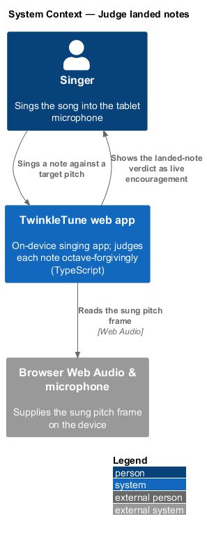
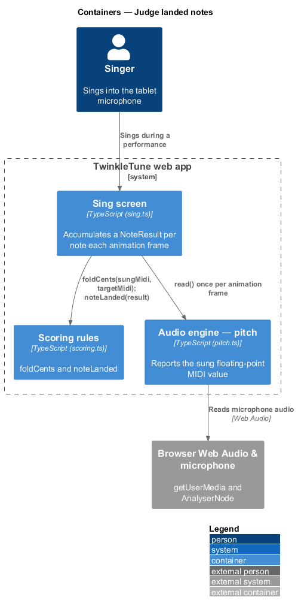
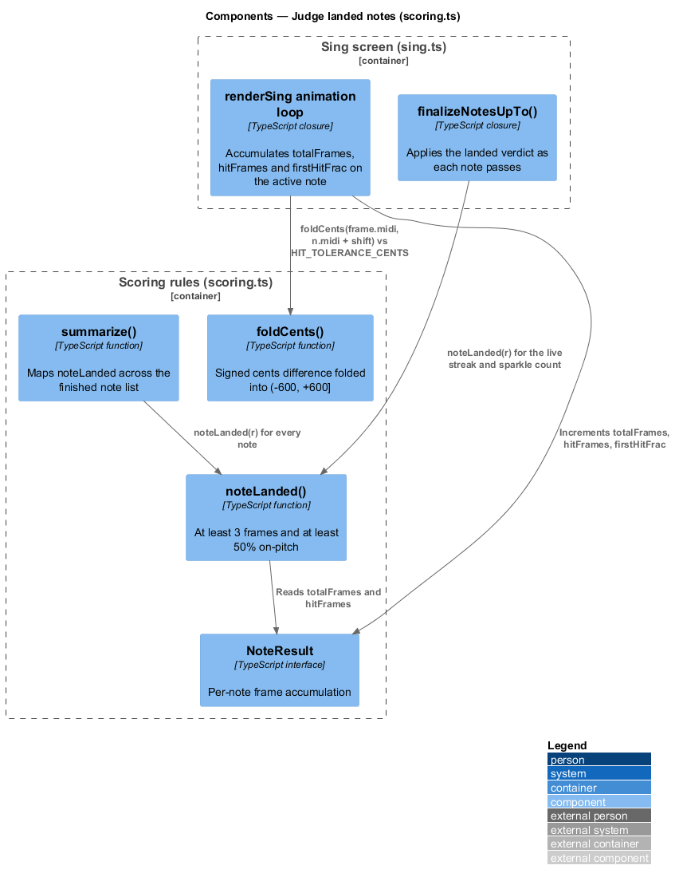
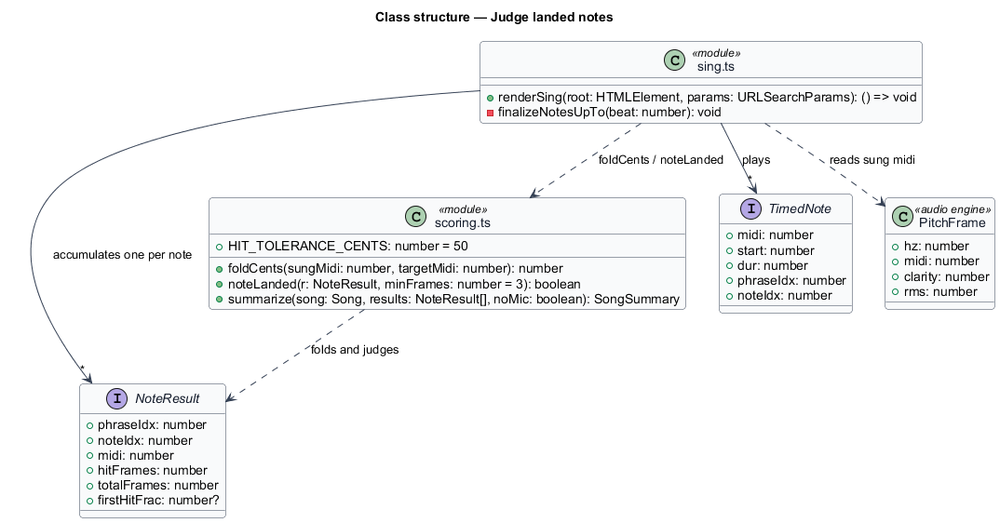
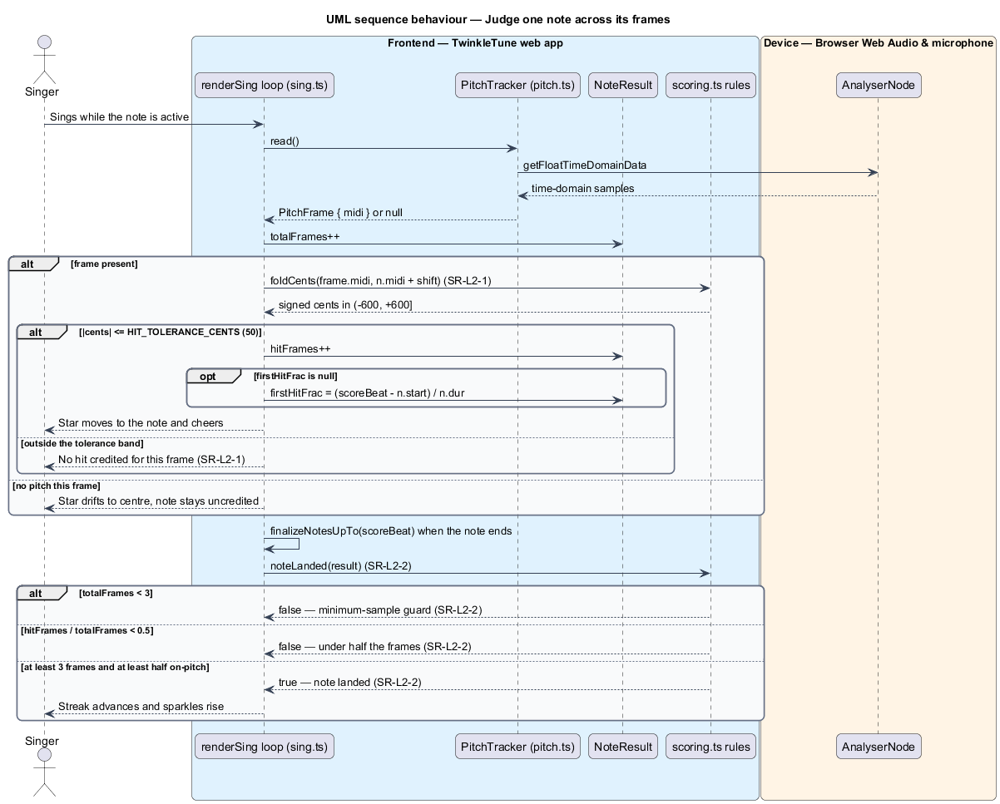

# Judge Landed Notes

## Overview

TwinkleTune decides whether a child sang a note, and it decides generously. Two
rules carry that judgement: pitch is compared by pitch class, so the right note
sung an octave away still counts, and a note is credited once it was on-pitch for
half of the frames it was heard. Every star, sparkle, streak, and tricky part
downstream rests on these two rules, so they sit at the base of the scoring
subsystem and nothing else in it re-derives them.

scoring and results — subsystem that turns a captured performance into an
accuracy, a star rating, dimensioned feedback, and a results screen

This feature covers the two decisions only: the octave-folded comparison of one
sung pitch against one target pitch, and the landed/not-landed verdict for one
note. Producing the pitch itself belongs to the audio engine, accumulating frames
during play belongs to singing gameplay, and reducing landed notes into a summary
belongs to the summarize feature.

The terms below are used throughout.

- pitch class — note identity modulo an octave, so MIDI 48, 60, and 72 share one
  class
- octave folding — comparison of two pitches by pitch class, discarding the
  octave each was sung in
- folded cents difference — signed distance in cents between sung and target
  pitch after octave folding, held in (−600, +600]
- hit tolerance — ±50 cent band inside which one sung frame counts as on-pitch
- note result — per-note accumulation of frames observed, frames on-pitch, and
  the position of the first on-pitch frame
- landed note — note observed for at least 3 frames and on-pitch for at least
  half of them
- minimum-sample guard — floor of 3 observed frames, below which a note cannot
  land however well it was sung
- first-hit fraction — position within a note, from 0 to 1, at which the first
  on-pitch frame occurred, or `null` when the note was never hit

## Description

The rules live in `frontend/src/state/scoring.ts`; the accumulation that feeds
them lives in the sing screen. No server participates.

Frontend — scoring rules (`frontend/src/state/scoring.ts`):

- **`foldCents(sungMidi, targetMidi)`** — function returning the signed cents
  difference between two MIDI values after octave folding. It takes
  `(sungMidi − targetMidi) % 12`, subtracts 12 when the remainder exceeds 6, adds
  12 when it is at or below −6, and multiplies by 100. The `d === 0 ? 0 : d * 100`
  form normalizes the negative zero JavaScript's `%` can produce. A fifth up
  (MIDI 67 against 60) therefore reads as −500 cents, a fourth down.
- **`HIT_TOLERANCE_CENTS`** — exported constant `50`, the half-width of the
  on-pitch band applied to the folded difference.
- **`noteLanded(r, minFrames = 3)`** — predicate returning true when
  `r.totalFrames >= minFrames` and `r.hitFrames / r.totalFrames >= 0.5`. The
  default `minFrames` of 3 is the minimum-sample guard; the 0.5 ratio is the
  forgiving half-the-frames rule.
- **`NoteResult`** — interface carrying `phraseIdx`, `noteIdx`, `midi`,
  `hitFrames`, `totalFrames`, and `firstHitFrac`. One instance exists per note in
  the played window.

Frontend — accumulation and consumption (`frontend/src/screens/sing.ts`):

- **`renderSing` animation loop** — builds one `NoteResult` per note in
  `windowNotes`, then, for the note active at the latency-adjusted `scoreBeat`,
  increments `totalFrames`, and increments `hitFrames` when
  `Math.abs(foldCents(frame.midi, n.midi + shift)) <= HIT_TOLERANCE_CENTS`. The
  target is the transposed note (`n.midi + shift`), so judgement happens in the
  singer's own key. On the first hit it records
  `firstHitFrac = (scoreBeat − n.start) / n.dur`.
- **`finalizeNotesUpTo(beat)`** — calls `noteLanded(r)` as each note passes, and
  uses the verdict for the live streak counter and the running sparkle count, so
  the live display and the final summary agree on one rule.
- **`summarize(song, results, noMic)`** — maps `noteLanded` across every
  `NoteResult` into `landedFlags`, the single source every later assessment reads.

Constants (the shipped baseline): `HIT_TOLERANCE_CENTS = 50`, `minFrames = 3`,
landed ratio threshold `0.5`, fold interval `(−600, +600]`.

## Requirements

The feature realizes the following level-2 (L2) requirements. Each L2 requirement
refines a level-1 (L1) requirement, cited by identifier.

| L2 ID | Refines (L1) | Requirement |
|-------|--------------|-------------|
| `SR-L2-1` | `SR-L1-1` | The system shall compare sung and target pitch by pitch class, returning the signed cents difference folded into (−600, +600], so an exact pitch class in any octave reads as 0 cents. |
| `SR-L2-2` | `SR-L1-2` | A note shall be counted as landed only if it was observed for at least 3 frames and was on-pitch — within ±50 cents, octave-folded — for at least half of those frames. |

## Diagrams

### System context

The singer sings into the TwinkleTune web app, which judges each note on the
device against the song's target pitches; no audio and no verdict leaves the
tablet (`SR-L2-1`, `SR-L2-2`).

### Containers

The sing screen polls the audio engine for a pitch frame each animation frame and
asks the scoring module whether that frame is on-pitch and whether the finished
note landed (`SR-L2-1`, `SR-L2-2`).

### Components

`foldCents` and `noteLanded` are the two rules; the sing loop accumulates a
`NoteResult` per note and reads both, and `summarize` re-reads `noteLanded` over
the finished list.

### Class structure

`NoteResult` is the record the two rules operate on; `HIT_TOLERANCE_CENTS` is the
band `foldCents` output is tested against (`SR-L2-1`, `SR-L2-2`).

### Behaviour — judge one note across its frames

Each frame folds the sung pitch against the transposed target and counts a hit
inside ±50 cents (`SR-L2-1`); when the note ends, the minimum-sample guard and
the half-the-frames rule decide whether it landed (`SR-L2-2`). The `alt` branches
model the too-few-frames and too-few-hits rejections.

