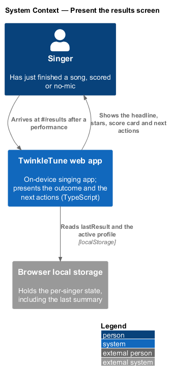
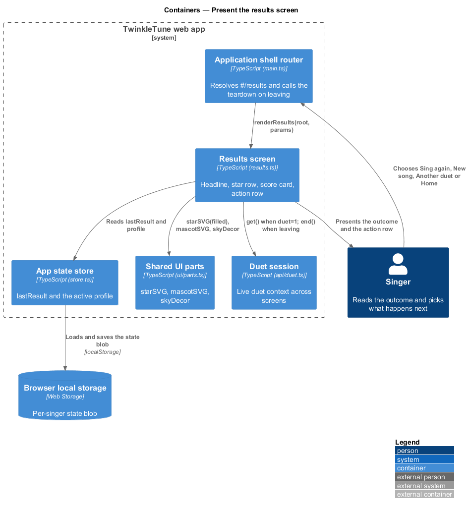
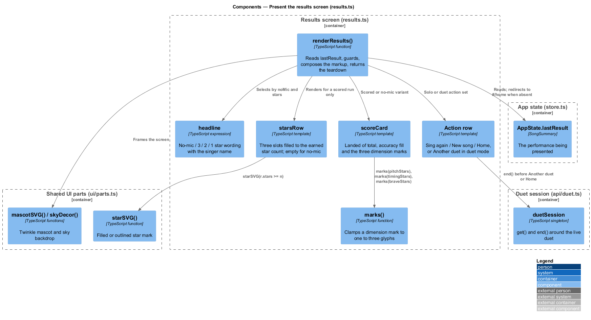
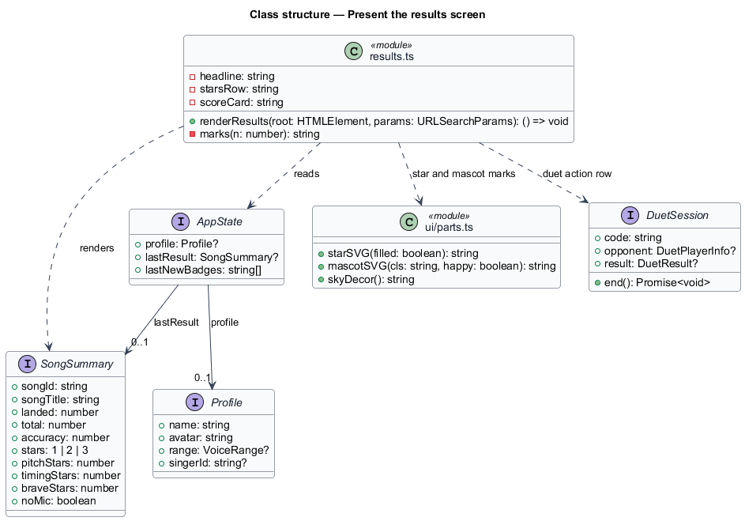
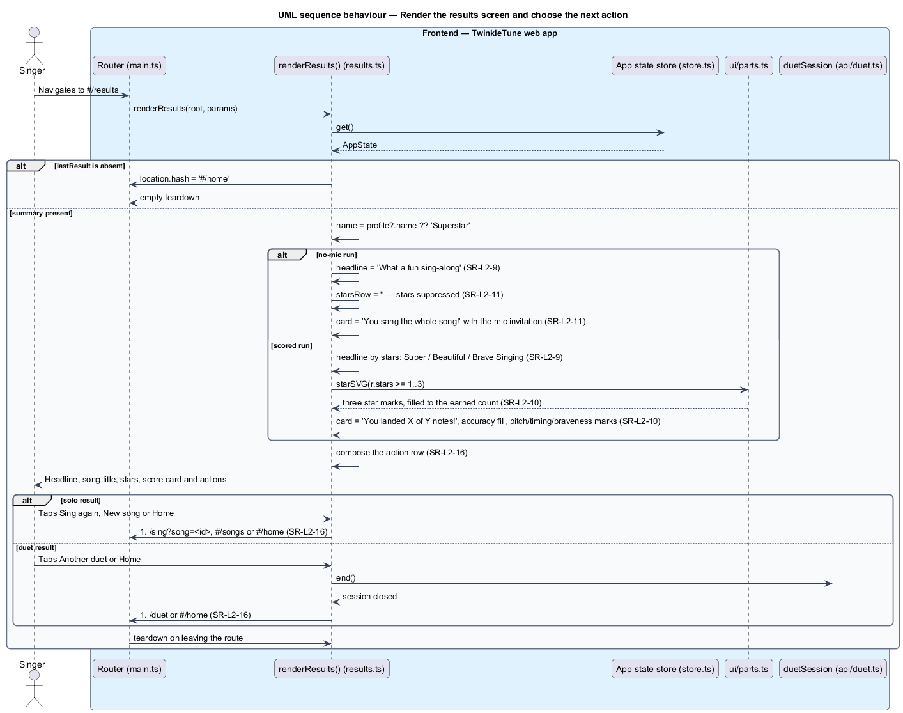

# Present The Results Screen

## Overview

The results screen is where a performance becomes a feeling. It is the one moment
in TwinkleTune that decides whether a child leaves the song proud, so every
variant of it is positive: a one-star run is "Brave Singing", and a run without a
microphone is "What a fun sing-along" with no stars at all rather than zero stars.
The screen names the outcome, shows what was landed, and then offers the next
thing to do.

results screen — route `#/results` that renders the last performance summary as a
headline, a star row, a score card, and a row of next actions

This feature covers the headline, the three-star row, the scored score card, the
no-mic variant, and the closing actions. The badge reveal and coach message are
covered by the reveal-badges-and-coaching feature, the celebratory particles by
the celebrate-with-visuals feature, the practice invitation by the
detect-tricky-part feature, and the high-score submission by the
submit-family-high-score feature.

The terms below are used throughout.

- headline — outcome-selected greeting personalised with the singer's name, shown
  above the song title
- star row — three star slots, filled left to right to the earned star count
- score card — panel reporting notes landed of total, the accuracy fill, and the
  three dimension marks
- dimension mark — one to three star glyphs standing for the pitch, timing, or
  braveness assessment
- no-mic variant — results layout for an unscored run, replacing stars and the
  score card with a celebration of finishing the song
- teardown function — closure returned by the screen renderer that the router
  calls when the route is left

## Description

The screen is one function in `frontend/src/screens/results.ts` that reads the
last summary from the store and writes markup into the route root. No server
participates in this slice.

Frontend — the screen (`frontend/src/screens/results.ts`):

- **`renderResults(root, params)`** — route renderer returning a teardown
  function. It reads `store.get()`, and when `state.lastResult` is absent it sets
  `location.hash = '#/home'` and returns an empty teardown, so the screen is never
  shown without a performance behind it.
- **`name`** — `state.profile?.name ?? 'Superstar'`, the fallback used when no
  profile is set.
- **`duet`** — `duetSession.get()` when the route carries `duet=1`, otherwise
  `null`; it switches the action row and the coach bubble to their duet forms.
- **`headline`** — `'What a fun sing-along'` for a no-mic run, then
  `'Super Singing'` at 3 stars, `'Beautiful Singing'` at 2, and `'Brave Singing'`
  otherwise. It renders as `${headline}, ${name}! 🎉` with `<small>${r.songTitle}</small>`
  beneath.
- **`starsRow`** — empty string for a no-mic run; otherwise three ``
  elements carrying `starSVG(r.stars >= n)` for `n` of 1, 2, and 3, with the
  unfilled slots marked `empty`. The container carries
  `aria-label="${r.stars} star(s) earned"`.
- **`marks(n)`** — helper repeating `'⭐'` `Math.max(1, Math.min(3, n))` times, so
  a dimension mark always shows between one and three glyphs.
- **`scoreCard`** — for a no-mic run, a card headed "You sang the whole song! 🎉"
  with the invitation to let Twinkle listen next time. For a scored run, a card
  headed `You landed ${r.landed} of ${r.total} notes! 🎯`, a `track`/`fill` bar
  set to `Math.round(r.accuracy * 100)%`, a note that depends on whether the
  profile has a captured range, and the three `marks` for `pitchStars`,
  `timingStars`, and `braveStars`.
- **Action row** — a solo result offers `Sing again 🔁` linking to
  `#/sing?song=${r.songId}` and `New song 🎵` linking to `#/songs`; a duet result
  replaces the replay with a `data-again-duet` button. Both offer `Home 🏠`
  linking to `#/home`.
- **Duet teardown handlers** — the `data-again-duet` click awaits
  `duetSession.end()` then routes to `#/duet`; the `data-home` click calls
  `duetSession.end()` without awaiting, so leaving by either path closes the
  session.

Frontend — shared UI parts (`frontend/src/ui/parts.ts`):

- **`starSVG(filled)`** — returns the filled or outlined star mark used in each
  star slot.
- **`mascotSVG(cls, happy)`** and **`skyDecor()`** — the Twinkle mascot and the
  sky backdrop that frame the screen.

Frontend — the state read (`frontend/src/state/store.ts`):

- **`store.get().lastResult`** — the `SongSummary` written by `recordPlay` at the
  end of the performance, and the only input the screen scores from.

## Requirements

The feature realizes the following level-2 (L2) requirements. Each L2 requirement
refines a level-1 (L1) requirement, cited by identifier.

| L2 ID | Refines (L1) | Requirement |
|-------|--------------|-------------|
| `SR-L2-9` | `SR-L1-5` | The results headline shall be selected by outcome and personalised with the singer's name, and shall always be positive — "Brave Singing" even at one star. |
| `SR-L2-10` | `SR-L1-5` | For a scored run, the results screen shall show a three-star row filled to the earned star count and a score card reporting notes landed of total, the accuracy percentage, and the three dimension marks. |
| `SR-L2-11` | `SR-L1-7` | For a no-mic run, the results screen shall suppress the stars and the scored card, showing instead a celebration of completing the song and a gentle invitation to sing with the microphone next time. |
| `SR-L2-16` | `SR-L1-5` | The results screen shall offer to sing the same song again, pick a new song, or go home; in duet mode it shall offer another duet, ending the current session, instead of a solo replay. |

## Diagrams

### System context

The singer arrives at the results screen inside the TwinkleTune web app, which
presents the outcome and the next actions from state held on the device
(`SR-L2-9`, `SR-L2-16`).

### Containers

The results screen reads the last summary from the app state store, renders
through the shared UI parts, and hands the chosen action back to the router
(`SR-L2-10`, `SR-L2-16`).

### Components

`renderResults` composes the headline, the star row, and the score card, each
branching on `noMic` (`SR-L2-9`, `SR-L2-10`, `SR-L2-11`), then the action row
whose duet form ends the duet session (`SR-L2-16`).

### Class structure

`renderResults` reads `AppState.lastResult` and the active `Profile`, and calls
into `parts.ts` for the star and mascot marks.

### Behaviour — render the results screen and choose the next action

The screen redirects home when no summary exists, then branches between the
scored and no-mic layouts (`SR-L2-9`, `SR-L2-10`, `SR-L2-11`) and offers the
action row, with the duet form ending the session before routing (`SR-L2-16`).

