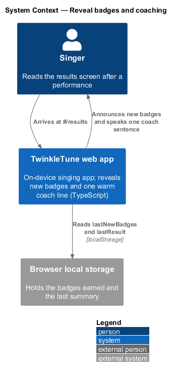
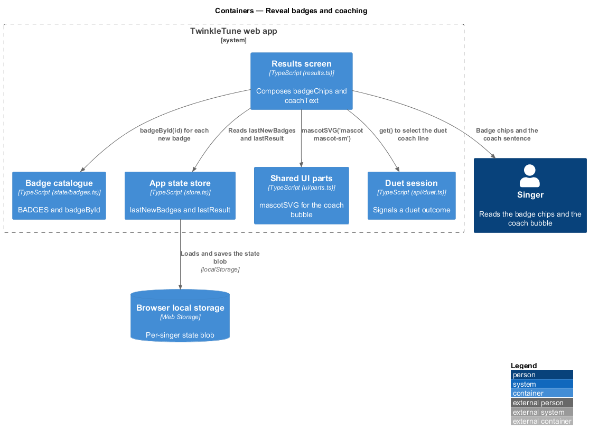
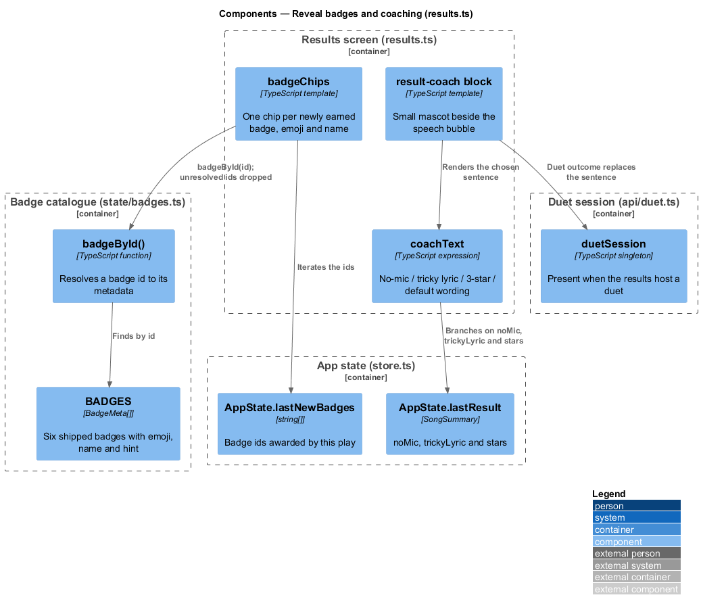
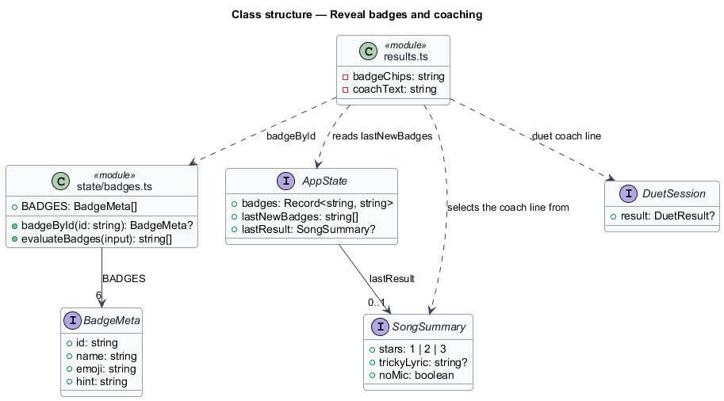
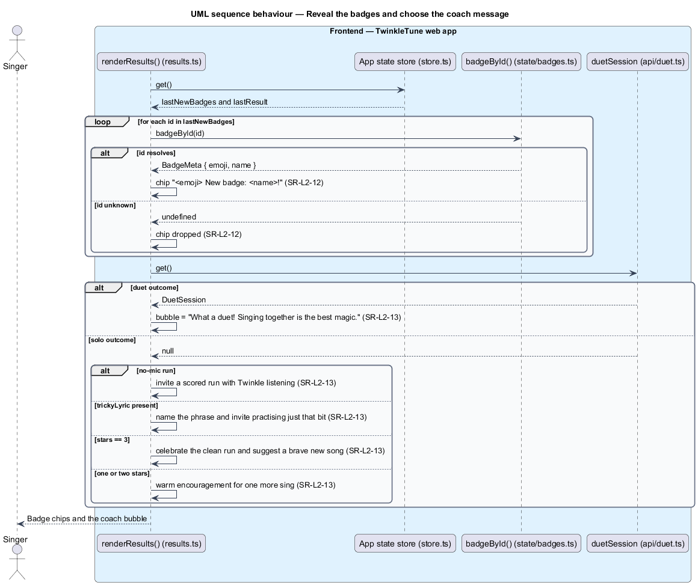

# Reveal Badges And Coaching

## Overview

Two pieces of warmth sit between the score card and the buttons on the results
screen: the badges this play has just earned, and one sentence from Twinkle. The
badge chips are a surprise the child did not ask for; the coach line is the only
place the product comments on how the singing went, and it comments kindly in
every branch — including the branch that names a shaky phrase, which it frames as
an invitation rather than a fault.

coach message — single sentence spoken by the Twinkle mascot on the results
screen, selected from the run's outcome

This feature covers the badge chips and the coach sentence on the results screen.
Deciding which badges a play earns belongs to rewards and progression; this
feature reveals what that evaluation already recorded. The headline, star row,
and score card belong to the present-results-screen feature.

The terms below are used throughout.

- badge — named, emoji-marked award earned once for a milestone such as a first
  song or a ten-note streak
- badge chip — small element on the results screen announcing one newly earned
  badge by emoji and name
- new-badge list — badge ids awarded by the play just finished, held in
  `lastNewBadges`
- coach bubble — speech bubble beside the small Twinkle mascot holding the coach
  message
- duet variant — coach message shown when the results screen is hosting a duet
  outcome, celebrating singing together rather than an individual score

## Description

Both elements are composed inside `renderResults` from state written at the end
of the performance. No server participates.

Frontend — badge reveal (`frontend/apps/game/src/screens/results.ts`,
`frontend/apps/game/src/state/badges.ts`):

- **`badgeChips`** — maps `state.lastNewBadges` through `badgeById`, drops the ids
  that resolve to nothing, and renders one `div.badge-toast` per badge reading
  `${b.emoji} New badge: ${b.name}!`. Each chip carries the animation class
  `pop d${5 + i}`, so the chips arrive one after another.
- **`badgeById(id)`** — lookup over the `BADGES` array returning the matching
  `BadgeMeta` or `undefined`.
- **`BadgeMeta`** — record of `id`, `name`, `emoji`, and `hint`; the six shipped
  entries are `first-song` (🎤), `streak-3` (🔥), `high-note-hero` (🚀),
  `show-stopper` (🎭), `brave-bird` (🐦), and `perfect-ten` (🔟).
- **`state.lastNewBadges`** — the ids `recordPlay` wrote for this play, empty when
  the play earned nothing new; a badge already held is never re-announced.

Frontend — coach message (`frontend/apps/game/src/screens/results.ts`):

- **`coachText`** — selected in one chain: a no-mic run invites a scored run
  ("Want to sing it again with Twinkle listening?"); otherwise a present
  `r.trickyLyric` reports that the notes sparkled, names the phrase, and asks
  whether to practise just that bit; otherwise a 3-star run celebrates the clean
  run and suggests a brave new song; otherwise the message is warm encouragement
  that one more sing will make it shine brighter.
- **Duet override** — the bubble renders `${duet ? '…Singing together is the best
  magic. 💙' : coachText}`, so a duet outcome celebrates the pair rather than
  either score.
- **`result-coach` block** — the small mascot from `mascotSVG('mascot mascot-sm')`
  beside a `bubble bubble-left` element holding the chosen message.

## Requirements

The feature realizes the following level-2 (L2) requirements. Each L2 requirement
refines a level-1 (L1) requirement, cited by identifier.

| L2 ID | Refines (L1) | Requirement |
|-------|--------------|-------------|
| `SR-L2-12` | `SR-L1-5` | Newly earned badges from this play shall be revealed on the results screen with their emoji and name. |
| `SR-L2-13` | `SR-L1-5` | The coach message shall be chosen by outcome: invite a scored run for a no-mic play; name the tricky phrase and invite practice when a tricky part exists; celebrate a clean run at 3 stars; otherwise offer warm encouragement; and in duet mode celebrate singing together. |

## Diagrams

### System context

The singer reads the badge reveal and the coach sentence on the device; both are
composed from state already held in the browser (`SR-L2-12`, `SR-L2-13`).

### Containers

The results screen reads `lastNewBadges` and the summary from the app state
store, resolves badge metadata from the badge catalogue, and renders the chips
and the coach bubble (`SR-L2-12`, `SR-L2-13`).

### Components

`badgeChips` resolves each new badge id through `badgeById` (`SR-L2-12`), and
`coachText` selects one sentence from `noMic`, `trickyLyric`, and `stars`, with
the duet session overriding the bubble (`SR-L2-13`).

### Class structure

`BadgeMeta` is what a badge id resolves to, and `SongSummary` carries the three
fields the coach message branches on.

### Behaviour — reveal the badges and choose the coach message

Each id in `lastNewBadges` resolves to a chip, and unresolved ids are dropped
(`SR-L2-12`); the `alt` chain then selects one coach sentence from the outcome,
with the duet branch replacing it entirely (`SR-L2-13`).

