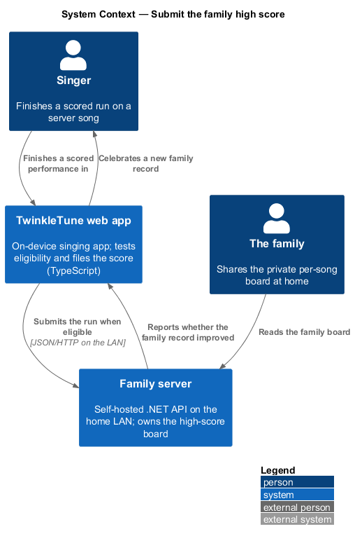
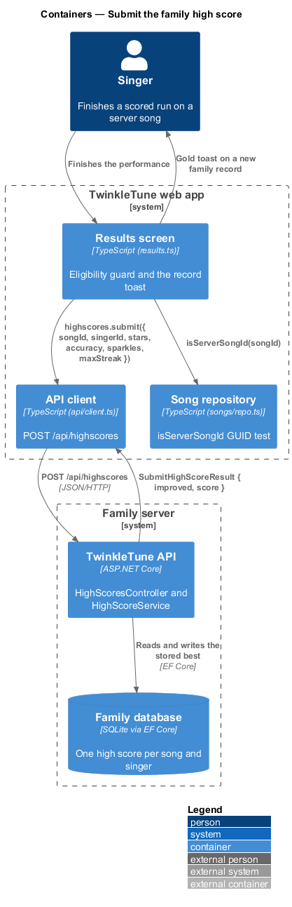
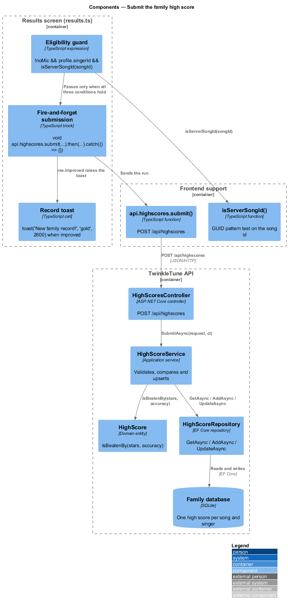
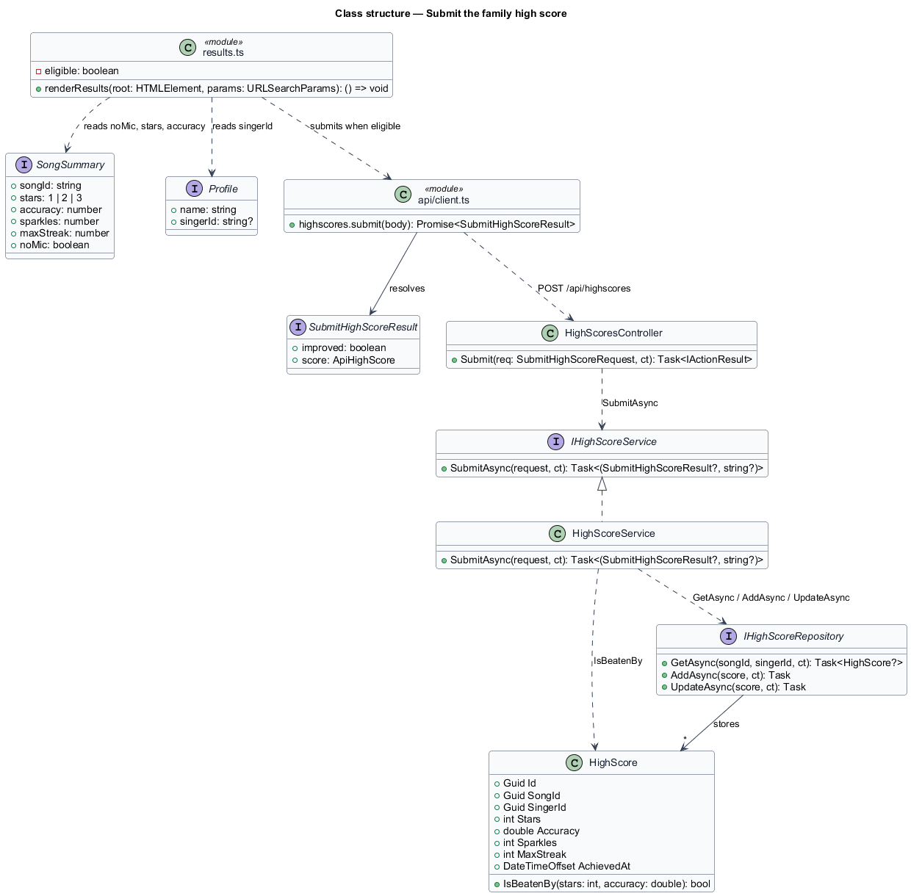
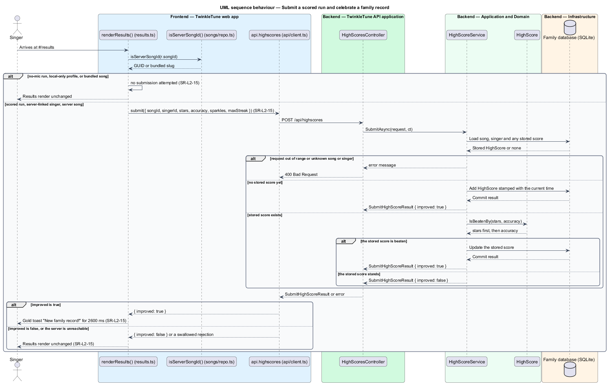

# Submit The Family High Score

## Overview

A family that runs the optional family server keeps a private per-song board of
its own singers. The results screen is what puts a run on that board, and it is
deliberately strict about which runs qualify: a run without a microphone is not
scored, a local-only profile has no singer to file the score under, and a bundled
song has no server record to attach it to. When the server accepts a run that
beats the stored one, the screen celebrates it as a family record and nothing
more — there is no ranking against anyone outside the home.

family high score — best result for one singer on one song, held on the family
server and shown on the family's own boards

The slice runs from the eligibility test on the results screen, through the REST
call, into the backend service that decides whether the stored score is beaten.
The boards themselves and the upsert repository belong to family high scores; this
feature owns the trigger, the eligibility rule, and the record moment.

The terms below are used throughout.

- scored run — performance played with the microphone, which carries stars and an
  accuracy
- server-linked singer — profile holding a `singerId`, meaning the family server
  knows this singer
- server song — song whose id is a GUID, meaning it came from the family server
  rather than the offline bundle
- eligibility rule — conjunction of scored run, server-linked singer, and server
  song, all three of which shall hold before a submission is attempted
- improvement flag — boolean the server returns when the submitted run replaced
  the stored best
- family record moment — gold toast reading "🏆 New family record!" shown when
  the improvement flag is set
- fire-and-forget submission — request whose result never blocks or alters the
  rendering of the results screen

## Description

The frontend decides eligibility and fires the request; the backend decides
whether the score is an improvement.

Frontend — the trigger (`frontend/apps/game/src/screens/results.ts`):

- **Eligibility guard** — `if (!r.noMic && state.profile?.singerId &&
  isServerSongId(r.songId))`, evaluated once as the screen renders. A no-mic run,
  a local-only profile, or a bundled song id skips the submission entirely.
- **Submission** — `void api.highscores.submit({ songId, singerId, stars,
  accuracy, sparkles, maxStreak })`, with `.then(...)` reading `res.improved` and
  `.catch(() => {})` swallowing any failure, so an unreachable server leaves the
  results screen intact.
- **`toast('🏆 New family record!', 'gold', 2600)`** — the record moment, shown
  for 2600 ms in the gold variant when `res.improved` is true.

Frontend — supporting checks and clients (`frontend/apps/game/src/songs/repo.ts`,
`frontend/apps/game/src/api/client.ts`):

- **`isServerSongId(id)`** — returns true when the id matches the GUID pattern
  `^[0-9a-f]{8}-[0-9a-f]{4}-[0-9a-f]{4}-[0-9a-f]{4}-[0-9a-f]{12}$`; bundled songs
  carry slugs such as `twinkle`.
- **`api.highscores.submit(body)`** — posts JSON to `/api/highscores` and resolves
  to a `SubmitHighScoreResult`.
- **`SubmitHighScoreResult`** — `{ improved: boolean, score: ApiHighScore }`.
- **`Profile.singerId`** — server singer id, `null` or absent for a local-only
  profile.

Backend — TwinkleTune API application
(`backend/src/TwinkleTune.Api/Controllers/HighScoresController.cs`):

- **`HighScoresController.Submit`** — `[HttpPost("/api/highscores")]` action that
  calls `IHighScoreService.SubmitAsync` and returns `BadRequest(new { error })`
  when the service reports one, otherwise `Ok(result)`.

Backend — Application and Domain
(`backend/src/TwinkleTune.Application/Services/HighScoreService.cs`,
`backend/src/TwinkleTune.Domain/Entities/HighScore.cs`):

- **`HighScoreService.SubmitAsync`** — rejects `Stars` outside 0–3 and `Accuracy`
  outside 0–1, then rejects an unknown `SongId` or `SingerId`. With no stored
  score it adds a new `HighScore` stamped `time.GetUtcNow()` and returns
  `improved: true`. With a stored score it updates and returns `improved: true`
  only when the stored score is beaten, otherwise it returns the stored score with
  `improved: false`.
- **`HighScore.IsBeatenBy(stars, accuracy)`** — `stars > Stars || (stars == Stars
  && accuracy > Accuracy)`, the stars-then-accuracy ordering the boards also use.

Backend — Infrastructure
(`backend/src/TwinkleTune.Infrastructure/Repositories/Repositories.cs`):

- **`IHighScoreRepository`** — `GetAsync(songId, singerId)`, `AddAsync`, and
  `UpdateAsync` over the EF Core SQLite store, unique per song and singer.

Constants (the shipped baseline): accepted `Stars` range 0–3, accepted `Accuracy`
range 0–1, toast duration `2600 ms`.

## Requirements

The feature realizes the following level-2 (L2) requirement, which refines two
level-1 (L1) requirements, cited by identifier.

| L2 ID | Refines (L1) | Requirement |
|-------|--------------|-------------|
| `SR-L2-15` | `SR-L1-6, SR-L1-7` | The results screen shall submit a family high score only for a scored run by a server-linked singer on a server (GUID) song; if the submission improves the family record, it shall celebrate "New family record!". A no-mic run, a local-only profile, or a bundled song shall not submit. |

## Diagrams

### System context

The singer finishes a scored run in the TwinkleTune web app, which files the
result with the family server on the home network; nothing crosses the home
boundary (`SR-L2-15`).

### Containers

The results screen tests eligibility and posts to the TwinkleTune API, which
records the score in the SQLite store and reports whether the family record moved
(`SR-L2-15`).

### Components

The eligibility guard reads `noMic`, `profile.singerId`, and `isServerSongId`
before the client posts; on the server, `HighScoreService` compares the request
against the stored score through `HighScore.IsBeatenBy` (`SR-L2-15`).

### Class structure

`SongSummary` and `Profile` supply the eligibility inputs and the request fields;
`HighScore` is the stored record the request is measured against.

### Behaviour — submit a scored run and celebrate a family record

The `alt` shows the three eligibility conditions, each of which suppresses the
submission on its own (`SR-L2-15`); the server branches decide the improvement
flag, and only a true flag raises the gold record toast.

