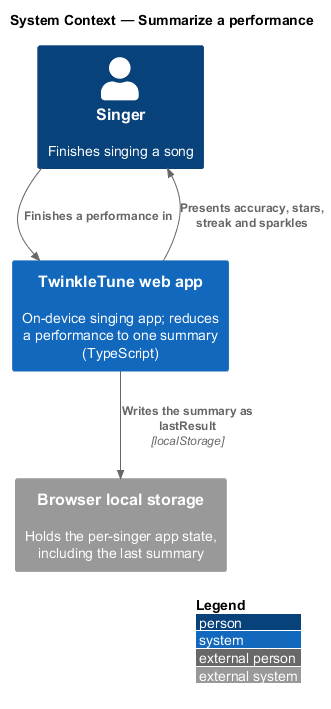
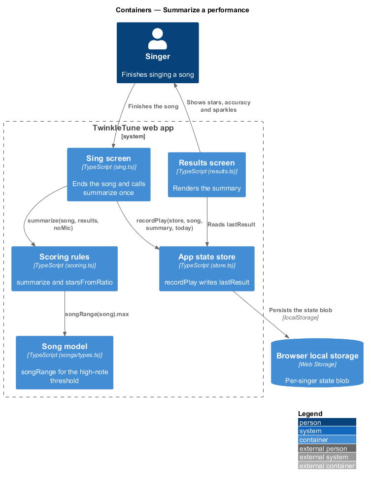
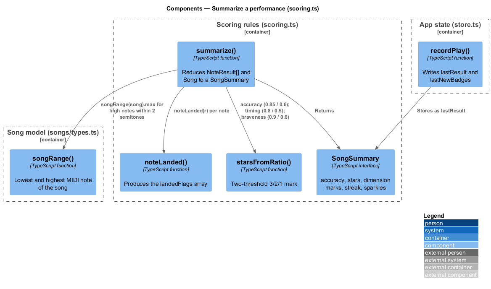
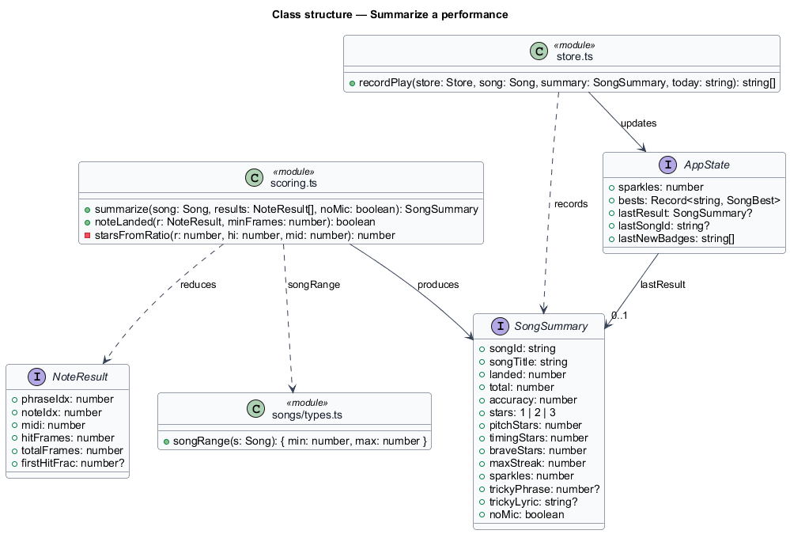
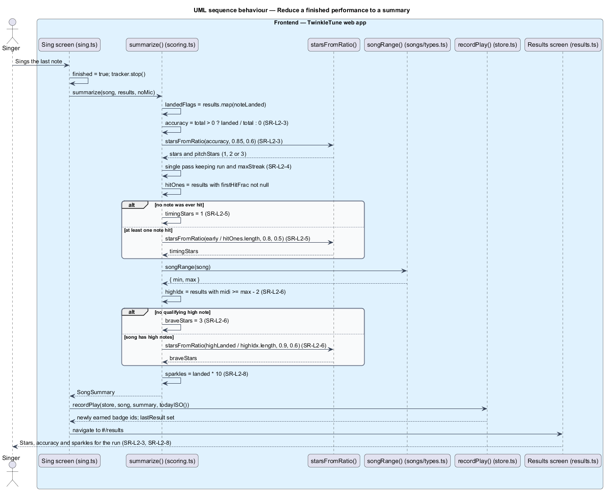

# Summarize A Performance

## Overview

When a song ends, the list of per-note verdicts becomes one small record that the
rest of the product reads: the results screen renders it, rewards spend its
sparkles, badges are evaluated against it, and the family high score is submitted
from it. This feature is that reduction. It reports one accuracy and one star
rating, and it splits the encouragement across three dimensions — pitch, timing,
and braveness — so a child who sang bravely at the top of the song is credited
for that even when the accuracy is modest.

song summary — record of one completed performance, carrying accuracy, stars,
dimension marks, the longest streak, sparkles, and the tricky part

This feature covers the reduction only: accuracy and overall stars, the longest
in-song streak, the timing and braveness assessments, and the sparkle award.
Deciding which notes landed belongs to the judge-landed-notes feature, selecting
the tricky part belongs to the detect-tricky-part feature, and persisting the
summary belongs to rewards and progression.

The terms below are used throughout.

- accuracy — landed notes divided by total notes in the played window, 0 when no
  notes were played
- star rating — mark of 1, 2, or 3 derived from a ratio by two thresholds
- in-song streak — longest run of consecutive landed notes within one performance
- timing assessment — star rating over the fraction of hit notes caught inside
  the first 40% of the note
- braveness assessment — star rating over the fraction of the song's highest
  notes that landed
- high note — note whose MIDI value sits within 2 semitones of the song's highest
  note
- sparkle — universal reward point, awarded ten per landed note
- no-mic run — performance played without the microphone, which earns sparkles
  but no stars and no high score

## Description

The whole reduction is one function in `frontend/src/state/scoring.ts`, called
once by the sing screen when a performance finishes. No server participates.

Frontend — the reduction (`frontend/src/state/scoring.ts`):

- **`summarize(song, results, noMic = false)`** — function reducing a
  `NoteResult[]` and its `Song` into a `SongSummary`. It computes `landedFlags` by
  mapping `noteLanded`, then `landed` as the count of true flags, then
  `accuracy = total > 0 ? landed / total : 0`.
- **`starsFromRatio(r, hi = 0.85, mid = 0.6)`** — module-private helper returning
  `3` at or above `hi`, `2` at or above `mid`, otherwise `1`. Three assessments
  call it with three threshold pairs.
- **Overall and pitch stars** — both are `starsFromRatio(accuracy)` with the
  default `0.85` and `0.6` thresholds; `stars` is narrowed to the union type
  `1 | 2 | 3` and `pitchStars` carries the same value.
- **Longest streak** — a single pass over `landedFlags` keeping `run` and
  `maxStreak`; `run` resets to 0 on any flag that is false.
- **Timing stars** — `hitOnes` filters the notes whose `firstHitFrac` is not
  `null`; `early` counts those at or below `0.4`. The mark is
  `starsFromRatio(early / hitOnes.length, 0.8, 0.5)`, or `1` when no note was
  ever hit.
- **Braveness stars** — `songRange(song).max` gives the song's top note; `highIdx`
  keeps the results whose `midi` is at or above `max − 2`. The mark is
  `starsFromRatio(highLanded / highIdx.length, 0.9, 0.6)`, or `3` when the song
  has no qualifying high note, so a song without a high stretch never costs a
  star.
- **Sparkles** — `sparkles: landed * 10`.
- **`SongSummary`** — interface carrying `songId`, `songTitle`, `landed`,
  `total`, `accuracy`, `stars`, `pitchStars`, `timingStars`, `braveStars`,
  `maxStreak`, `sparkles`, `trickyPhrase`, `trickyLyric`, and `noMic`.

Frontend — song geometry (`frontend/src/songs/types.ts`):

- **`songRange(s)`** — helper returning `{ min, max }` over the MIDI values of
  every note in the song, used for the high-note threshold.

Frontend — the caller (`frontend/src/screens/sing.ts`, `frontend/src/state/store.ts`):

- **`renderSing` finish path** — calls `summarize(song, results, noMic)` after
  stopping the tracker, then `recordPlay(store, song, summary, todayISO())`.
- **`recordPlay(store, song, summary, today)`** — writes the summary to
  `state.lastResult` and the newly earned badge ids to `state.lastNewBadges`,
  which is how the results screen receives the summary.

Constants (the shipped baseline): overall and pitch thresholds `0.85` and `0.6`;
timing thresholds `0.8` and `0.5` over a first-hit position of `0.4`; braveness
thresholds `0.9` and `0.6` over a high-note window of `2` semitones; sparkles per
landed note `10`.

## Requirements

The feature realizes the following level-2 (L2) requirements. Each L2 requirement
refines a level-1 (L1) requirement, cited by identifier.

| L2 ID | Refines (L1) | Requirement |
|-------|--------------|-------------|
| `SR-L2-3` | `SR-L1-3` | The system shall compute accuracy as landed ÷ total notes and award overall stars: 3 at or above 0.85, 2 at or above 0.6, otherwise 1; pitch stars shall equal overall stars. |
| `SR-L2-4` | `SR-L1-3` | The summary shall report the longest run of consecutive landed notes. |
| `SR-L2-5` | `SR-L1-3` | Timing stars shall reflect how often a hit note was caught early — first hit within the first 40% of the note — at 3 for a fraction of 0.8 or more, 2 at 0.5 or more, otherwise 1; if no note was ever hit, timing shall be 1 star. |
| `SR-L2-6` | `SR-L1-3` | Braveness stars shall reflect how the song's highest notes — those within 2 semitones of the top — went: 3 at a landed fraction of 0.9 or more, 2 at 0.6 or more, otherwise 1; a song with no qualifying high notes shall yield 3. |
| `SR-L2-8` | `SR-L1-3` | The summary shall award ten sparkles per landed note. |

## Diagrams

### System context

The singer finishes a song in the TwinkleTune web app, which reduces the
performance to one summary on the device and shows it back as stars and sparkles
(`SR-L2-3`, `SR-L2-8`).

### Containers

The sing screen hands the note results to the scoring module, and the returned
summary is written into the local app state that the results screen and the
progress view read (`SR-L2-3` to `SR-L2-8`).

### Components

`summarize` drives four assessments over one `landedFlags` array: accuracy and
stars (`SR-L2-3`), the streak pass (`SR-L2-4`), timing (`SR-L2-5`), and braveness
(`SR-L2-6`), with `starsFromRatio` shared by three of them.

### Class structure

`SongSummary` is the record produced; `NoteResult` is the record consumed; the
`scoring.ts` module holds the reduction and the shared `starsFromRatio` helper.

### Behaviour — reduce a finished performance to a summary

The sing screen calls `summarize` once at the end of the song. The diagram traces
accuracy and stars (`SR-L2-3`), the longest streak (`SR-L2-4`), the timing
assessment with its no-note-hit branch (`SR-L2-5`), the braveness assessment with
its no-high-note branch (`SR-L2-6`), and the sparkle award (`SR-L2-8`).

