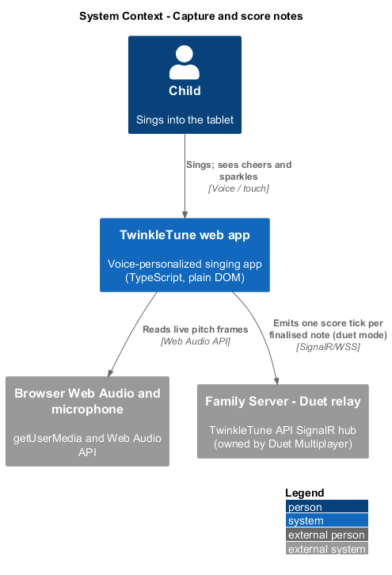
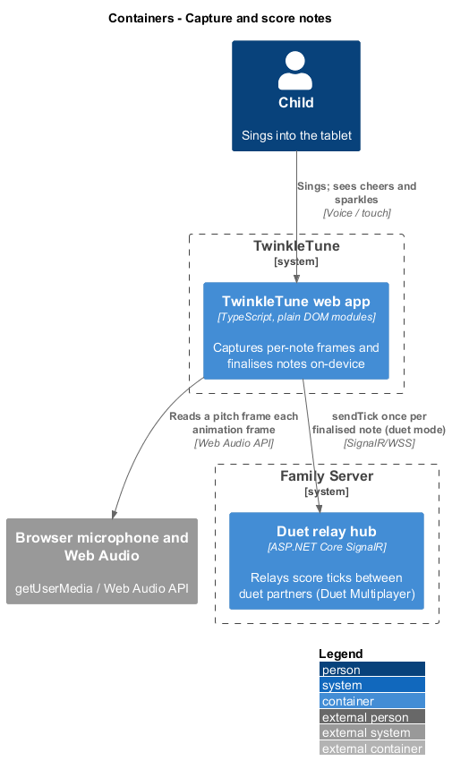
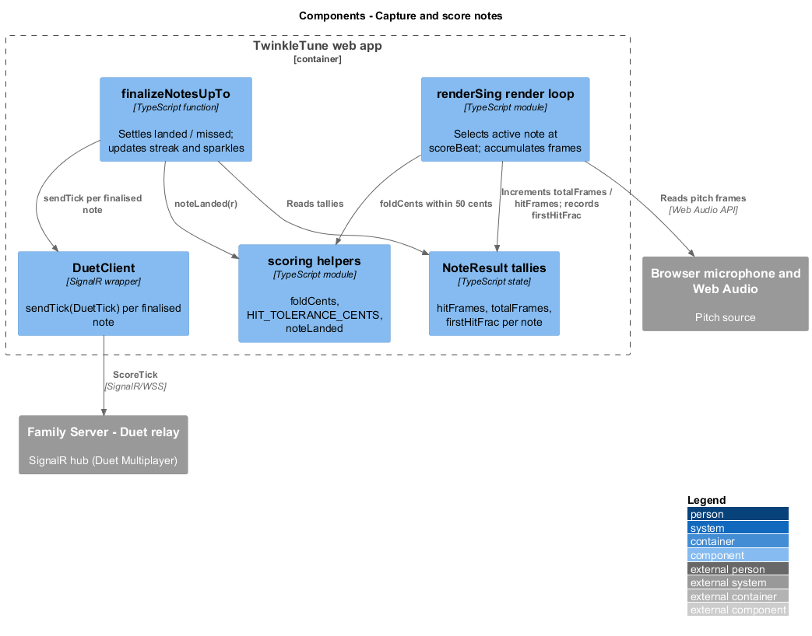
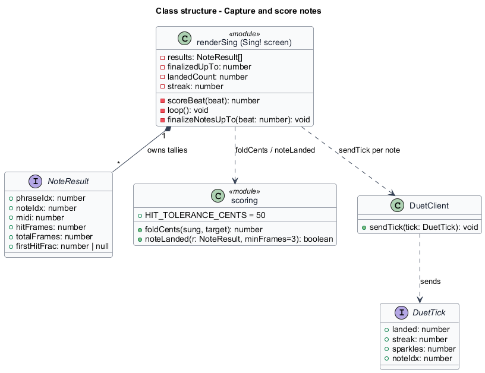
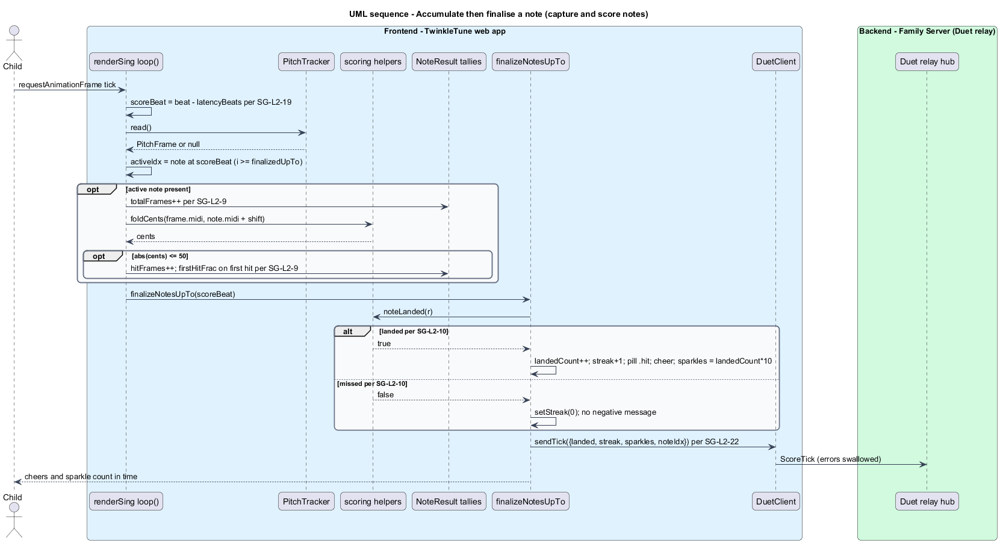

# Capture and score notes

## Overview

While a child sings, the Sing! screen watches each note and records how it went —
frame by frame — so the results screen can turn the performance into stars and
sparkles. This feature covers that live capture: choosing the note being sung,
tallying on-pitch frames against it, settling each note's outcome as its end
passes, compensating for microphone latency, and, in duet mode, reporting one
score tick per note.

*per-note capture* — running tally, held per note, of frames observed, frames
on-pitch, and where in the note the first on-pitch frame fell

*active note* — in-window note whose beat span currently contains the
latency-compensated score beat

*score beat* — latency-compensated beat position used only for scoring, computed
as the raw beat minus the mic-latency offset expressed in beats

*on-pitch frame* — frame whose sung pitch is within 50 cents of the note after
octave folding and the song shift are applied

*finalisation* — settling of a note's outcome, landed or missed, once its end beat
has passed

*landed note* — note that was on-pitch for at least half of at least 3 observed
frames, per the Scoring criterion

*duet score tick* — one-per-note message to the duet relay carrying the landed
count, streak, sparkles, and note index

Accurate, forgiving scoring depends on faithful per-note capture during play.
Budget tablets add audible input lag, so scoring reads a latency-compensated beat
while the visuals scroll on the raw beat, keeping cheers in time. The capture and
finalisation run on-device; the only outbound touch is the optional duet score
tick, whose relay is owned by Duet Multiplayer.

## Description

Capture and scoring live in the `loop()` and `finalizeNotesUpTo()` functions of
`frontend/src/screens/sing.ts`, over the `results` array of `NoteResult`.

- **`results`** — one `NoteResult` per `windowNotes` entry, holding `hitFrames`,
  `totalFrames`, and `firstHitFrac` (from `frontend/src/state/scoring.ts`).
- **`latencyBeats` / `scoreBeat`** — `latencyBeats = (profile.latencyMs / 1000) /
  player.secondsPerBeat()`; `scoreBeat = beat - latencyBeats`. Visuals use `beat`;
  scoring uses `scoreBeat`.
- **`activeIdx`** — the first `windowNotes` index with `i >= finalizedUpTo` and
  `scoreBeat >= n.start && scoreBeat < n.start + n.dur`. It selects the active
  note.
- **frame accumulation** — for the active note the code increments
  `r.totalFrames`; when a `frame` is present and `abs(foldCents(frame.midi, n.midi
  + shift)) <= HIT_TOLERANCE_CENTS` it increments `r.hitFrames`, sets `onNote`, and
  on the first such frame records `r.firstHitFrac = (scoreBeat - n.start) / n.dur`.
- **`foldCents(sung, target)`** — octave-folded cents difference in `(-600, 600]`,
  so any octave counts. **`HIT_TOLERANCE_CENTS`** is `50`.
- **`finalizeNotesUpTo(beat)`** — while the earliest unfinalised note has ended
  (`beat >= n.start + n.dur`), it finalises that note and advances `finalizedUpTo`.
- **`noteLanded(r)`** — the Scoring criterion: `totalFrames >= 3` and `hitFrames /
  totalFrames >= 0.5`. On a landed note, `landedCount++`, `setStreak(streak + 1)`,
  the pill gains `hit`, `cheerPop()` fires, and the sparkle pill is set to
  `landedCount * 10`. On a missed note, `setStreak(0)`; no negative message shows.
- **`duet?.client.sendTick(...)`** — after each finalised note, one `DuetTick`
  (`{ landed, streak, sparkles, noteIdx }`) is sent through the `DuetClient`
  (`frontend/src/api/duet.ts`). `sendTick` swallows delivery errors so play
  continues.

## Requirements

The feature realizes the following level-2 (L2) requirements, each refining the
cited level-1 (L1) requirement(s).

| L2 ID | Refines (L1) | Requirement |
|-------|--------------|-------------|
| `SG-L2-9` | `SG-L1-4` | For the currently active note (outside no-mic mode), each frame shall increment the observed-frame count; when the sung pitch is within ±50 cents of the note (octave-folded, shift applied) the on-pitch-frame count shall increment and, on the first such frame, the fractional position within the note shall be recorded. |
| `SG-L2-10` | `SG-L1-4, SG-L1-5` | As each note's end passes, the system shall finalise it: if it is landed (SR criteria), increment the landed count and streak, mark the pill, show a random cheer, and update the live sparkle count to `landedCount·10`; if it is missed, reset the streak to 0. No missed note shall produce a negative message. |
| `SG-L2-19` | `SG-L1-8` | Scoring shall use a latency-compensated beat position derived from the profile's mic latency offset, while visuals use the raw beat, so that a device with input lag still scores the note the child is actually singing. |
| `SG-L2-22` | `SG-L1-4` | In duet mode, the system shall emit a score tick once per finalised note (not per frame), carrying the landed count, streak, sparkles, and note index; tick delivery failures shall be swallowed so play is never interrupted. (Relay semantics: DM.) |

## Diagrams

### System context

The child sings into the tablet; the TwinkleTune web app scores on-device and, in
duet mode only, sends one score tick per note to the Family Server's duet relay.

### Containers

Capture and scoring run inside the web app container. The optional duet score tick
travels to the Family Server over SignalR; all other work is local.

### Components

The render loop accumulates frames onto `NoteResult`, `finalizeNotesUpTo` settles
each note with `noteLanded`, and `DuetClient.sendTick` reports the finalised note.

### Class structure

The render loop owns the `NoteResult` tallies, applies `foldCents` and
`noteLanded` from Scoring, and emits a `DuetTick` through `DuetClient`.

### Behaviour — accumulate then finalise a note

Each frame accumulates on the active note at the latency-compensated score beat;
as a note's end passes it is finalised, and a landed note raises the counts and
emits one duet tick. The alternate branch shows a missed note resetting the streak
with no negative message.

