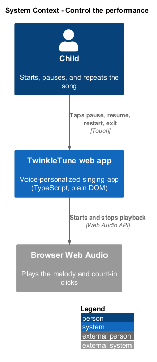
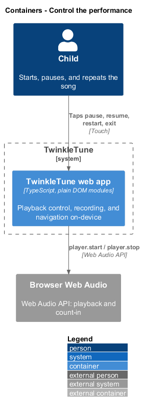
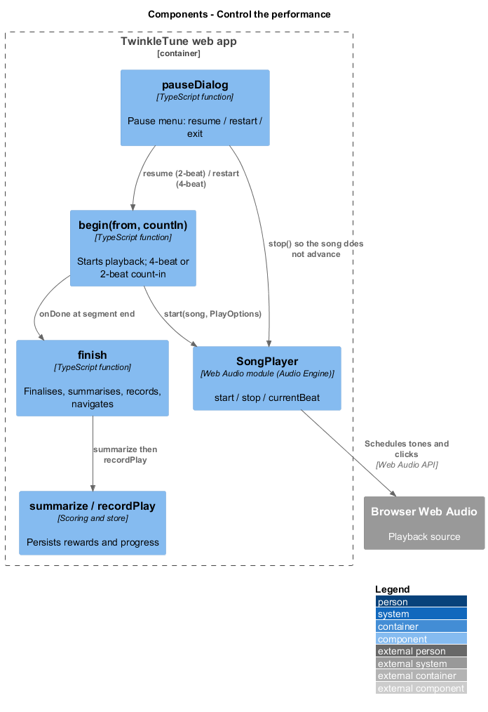
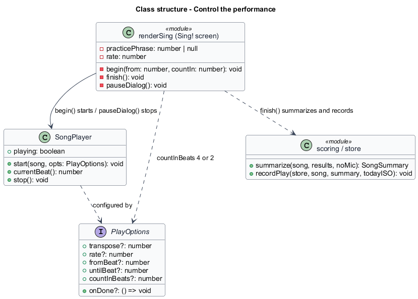
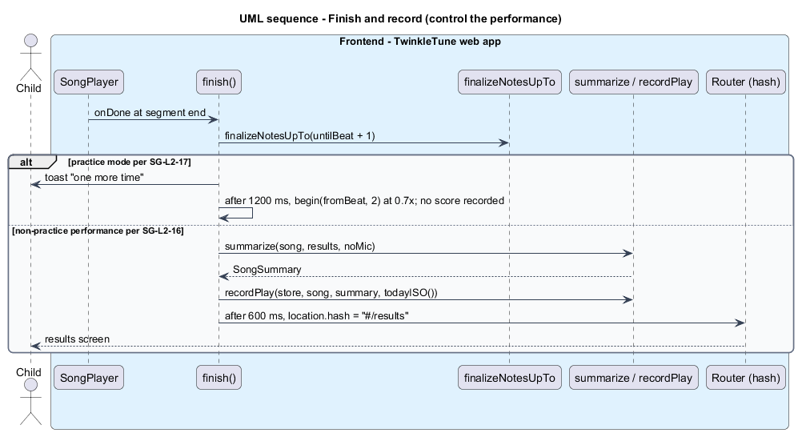
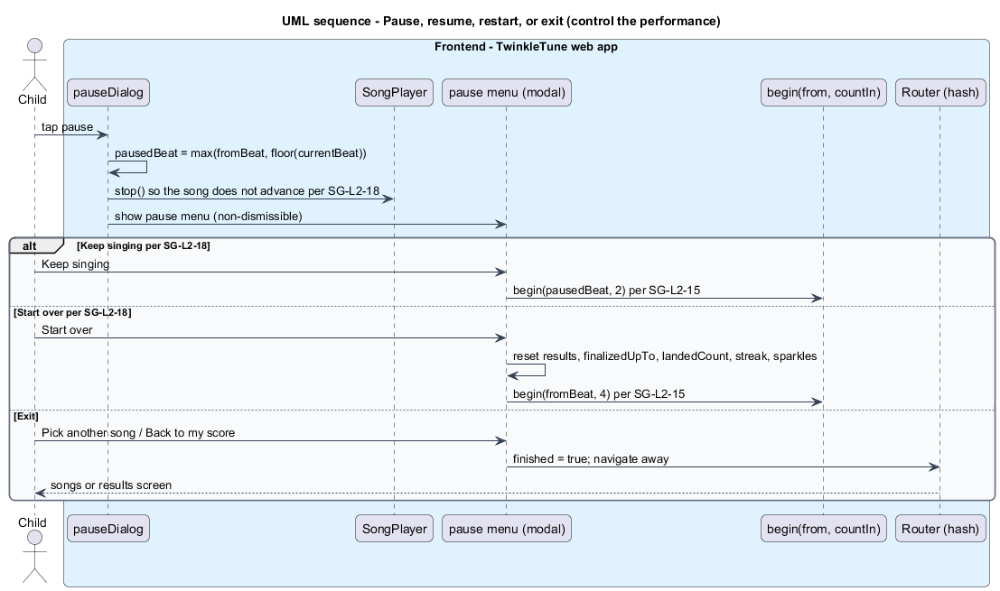

# Control the performance

## Overview

A performance on the Sing! screen is not a single uninterrupted take. This feature
covers the controls a child has within a song: the count-in that opens it, the
finish that records it and moves on, the practice loop that repeats one phrase,
and the pause menu that resumes, restarts, or exits.

*count-in* — run of metronome clicks before the melody; 4 beats on a fresh start
or restart, 2 beats on resume or a practice repeat

*finish* — end-of-performance settle that finalises remaining notes, summarises
the play, records it, and opens the results screen

*practice loop* — mode that repeats one chosen phrase at 0.7 times tempo without
recording a score

*pause menu* — dialog shown while paused, offering resume, restart, exit, and, in
practice mode, a return to the score

Control and low-stakes practice keep a child in flow and support mastery. A fresh
start opens with a longer count-in; resuming or repeating opens with a shorter
one. A normal performance ends by recording rewards and progress, then opening
results after a short celebratory pause; a practice run instead loops the phrase
and records nothing. The pause menu never advances the song and never dead-ends
the child. All of this runs on-device.

## Description

Performance control lives in `begin`, `finish`, and `pauseDialog` in
`frontend/src/screens/sing.ts`.

- **`begin(from = fromBeat, countIn = 4)`** — starts playback via `player.start`
  with `transpose`, `rate`, `fromBeat`, `untilBeat`, `countInBeats`, and
  `onDone: finish`. The default `countIn` of `4` covers fresh start and restart;
  callers pass `2` for resume and practice repeat.
- **`finish()`** — the end-of-performance settle. It calls
  `finalizeNotesUpTo(untilBeat + 1)`. In practice mode (`practicePhrase !== null`)
  it shows a "one more time" toast and re-calls `begin(fromBeat, 2)` after 1200 ms,
  recording nothing. Otherwise it stops the loop and tracker, computes
  `summarize(song, results, noMic)`, calls `recordPlay(store, song, summary,
  todayISO())`, and navigates to `#/results` after 600 ms.
- **`rate`** — `0.7` in practice or slow mode, `1` otherwise, applied to playback.
- **`pauseDialog()`** — pauses and opens the menu. It captures `pausedBeat =
  max(fromBeat, floor(player.currentBeat()))`, calls `player.stop()` so the song
  does not advance, and shows `showModal` with the options below.
- **resume** — "Keep singing" calls `begin(pausedBeat, 2)`, a 2-beat count-in from
  the paused position.
- **restart** — "Start over" clears each pill's `hit`/`now`, resets every
  `NoteResult` (`hitFrames`, `totalFrames`, `firstHitFrac`), sets `finalizedUpTo`
  and `landedCount` to 0, `setStreak(0)`, resets the sparkle pill to `✨ 0`, and
  calls `begin(fromBeat, 4)`.
- **back to score** — in practice mode, "Back to my score" sets `finished` and
  navigates to `#/results`.
- **exit** — "Pick another song" (or "Leave the duet") sets `finished` and
  navigates away.
- **`recordPlay` / `summarize` / `todayISO`** (`frontend/src/state/store.ts`,
  `scoring.ts`) — the consumed Scoring and store primitives that persist the run.

## Requirements

The feature realizes the following level-2 (L2) requirements, each refining the
cited level-1 (L1) requirement.

| L2 ID | Refines (L1) | Requirement |
|-------|--------------|-------------|
| `SG-L2-15` | `SG-L1-7` | A fresh start or restart shall use a 4-beat count-in; resuming from pause and a practice repeat shall use a 2-beat count-in. |
| `SG-L2-16` | `SG-L1-7` | When a non-practice performance ends, the system shall finalise any remaining notes, summarise the performance, record the play (rewards/progress), and navigate to the results screen after a brief celebratory pause. |
| `SG-L2-17` | `SG-L1-7` | In practice mode the system shall loop the chosen phrase at 0.7× tempo indefinitely (with an encouraging "one more time" between repeats), never recording a score, until the child chooses to leave; leaving via the pause menu shall return to the score. |
| `SG-L2-18` | `SG-L1-7` | During play the child shall be able to pause, then resume from where she left off (2-beat count-in), start the song over (resetting all captured note data, streak, and sparkles), or exit; a paused song shall not advance. |

## Diagrams

### System context

The child controls the performance through the tablet; the TwinkleTune web app
plays, records, and navigates on-device.

### Containers

Playback control and recording run inside the web app container, over the
browser's Web Audio engine for playback.

### Components

`begin` drives `SongPlayer`; `finish` calls `summarize` and `recordPlay` then
navigates; `pauseDialog` resumes, restarts, or exits.

### Class structure

The render module drives `SongPlayer` with `PlayOptions`, and `finish` uses the
Scoring `summarize` and store `recordPlay` to persist the run.

### Behaviour — finish and record

A non-practice performance finalises remaining notes, summarises, records the
play, and opens results after a short pause; a practice run instead loops the
phrase with a 2-beat count-in and records nothing.

### Behaviour — pause, resume, restart, or exit

Pausing stops the song so it does not advance; the menu resumes with a 2-beat
count-in, restarts with a full reset and a 4-beat count-in, or exits.

