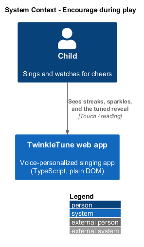
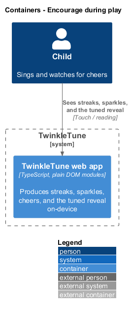
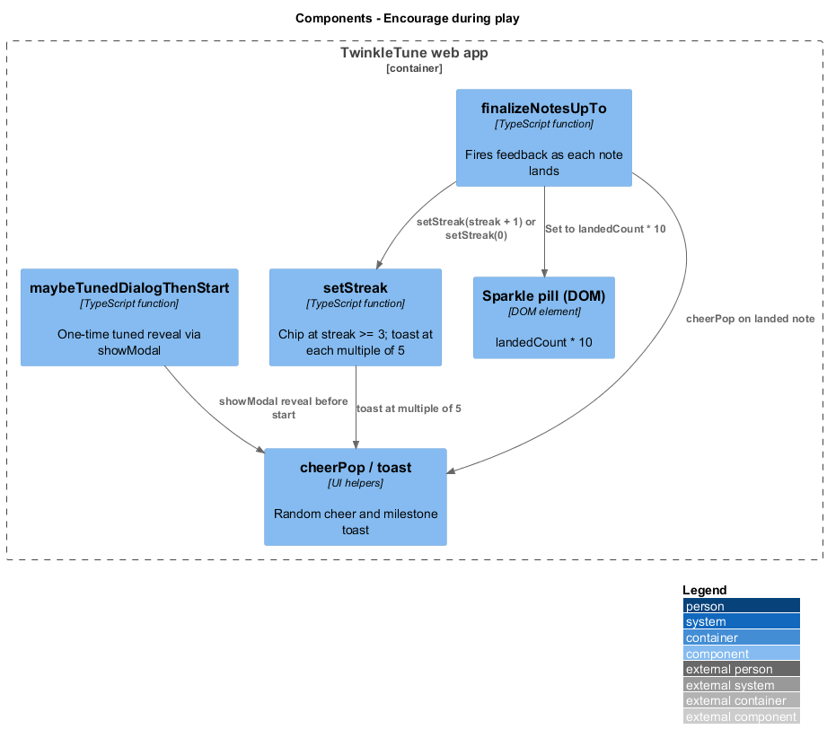
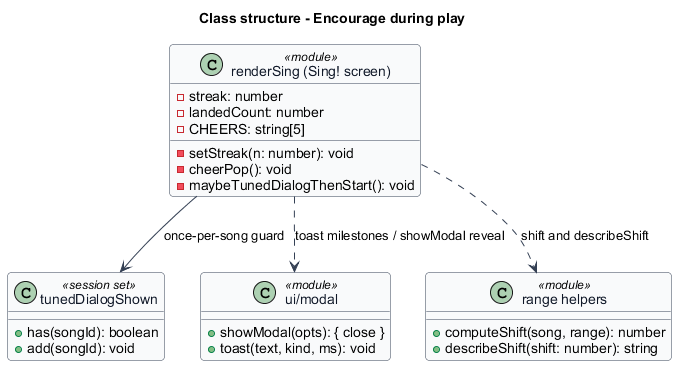
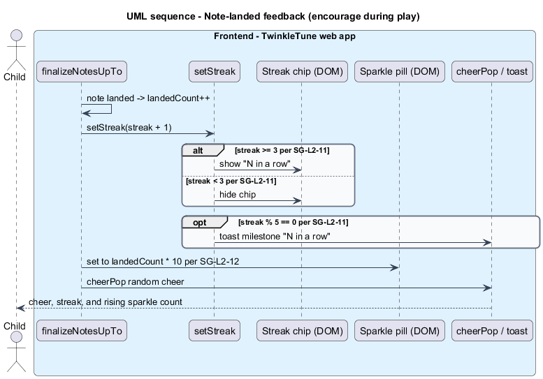
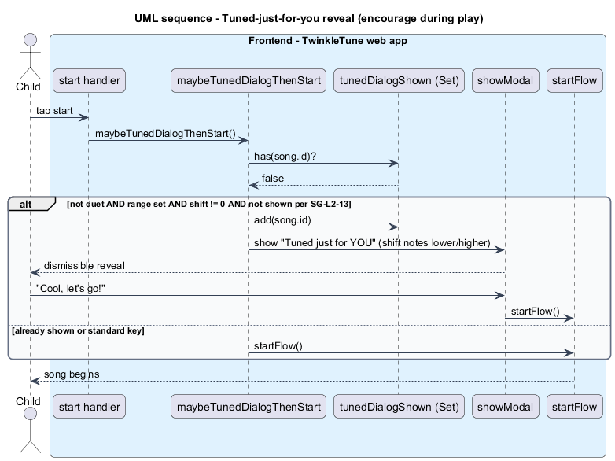

# Encourage during play

## Overview

TwinkleTune is encouragement-only: while a child sings, the Sing! screen shows
only positive feedback and never a failure signal. This feature covers the
in-play encouragement that surrounds scoring — the streak indicator, the running
sparkle count, and the once-per-song message that explains how the song was tuned
to the child's voice.

*streak* — count of consecutive landed notes

*streak chip* — badge on the stage that appears once the streak reaches 3

*milestone toast* — celebratory pop-up fired each time the streak reaches a
multiple of 5

*sparkle count* — live on-screen tally equal to ten times the number of landed
notes so far

*tuned reveal* — one-time, dismissible message that explains, in friendly terms,
how far the song was shifted to fit the child's voice

The joy of play is the retention loop, so feedback climbs but never scolds. The
streak chip stays hidden until a run is worth celebrating, then milestone toasts
mark each five in a row; the sparkle count rises as notes finalise. Before a
personalized song starts, the tuned reveal tells the child the song was moved to
fit her voice, so the personalization feels like a gift. All of this runs
on-device; the reveal reads only the computed song shift.

## Description

The encouragement lives in `setStreak`, `finalizeNotesUpTo`, and
`maybeTunedDialogThenStart` in `frontend/apps/game/src/screens/sing.ts`.

- **`setStreak(n)`** — sets `streak` and the chip. `streakEl` gains `show` and
  reads `🔥 N in a row!` only when `streak >= 3`; otherwise `show` is removed. When
  `streak > 0 && streak % 5 === 0`, a gold `toast` fires the milestone.
- **`streakEl`** (`[data-streak]`) — the streak chip element.
- **`sparklesEl`** (`[data-sparkles]`) — the sparkle pill. On each landed note it
  is set to `✨ ${landedCount * 10}`; in no-mic mode it stays at `✨ 0`.
- **`landedCount`** — running number of landed notes; the sparkle count is
  `landedCount * 10`.
- **`cheerPop()`** — spawns a short-lived `feedback-pop` from the `CHEERS` array
  above the star on a landed note.
- **`toast(...)`** (`frontend/apps/game/src/ui/modal.ts`) — the transient celebratory
  message used for milestones.
- **`maybeTunedDialogThenStart()`** — before the first start of a personalized
  song, shows the tuned reveal. It fires only when `!duet && range && shift !== 0
  && !tunedDialogShown.has(song.id)`.
- **`tunedDialogShown`** — module-level `Set<string>` of song ids already revealed
  this session, so the reveal shows at most once per song.
- **`describeShift(shift)`** / **`shift`** — the reveal text names
  `Math.abs(shift)` notes moved `lower` or `higher`; `describeShift` phrases the
  key chip. Dismissing with "Cool, let's go!" continues to `startFlow`.
- **`showModal(...)`** — renders the dismissible tuned-reveal dialog.

## Requirements

The feature realizes the following level-2 (L2) requirements, each refining the
cited level-1 (L1) requirement.

| L2 ID | Refines (L1) | Requirement |
|-------|--------------|-------------|
| `SG-L2-11` | `SG-L1-5` | The streak chip shall appear only once the current streak reaches 3, and a celebratory toast shall fire at every multiple of 5. |
| `SG-L2-12` | `SG-L1-5` | The on-screen sparkle count shall equal ten times the number of landed notes so far, updating as notes finalise. |
| `SG-L2-13` | `SG-L1-5` | The first time a personalized (non-zero shift) song is started in a session — outside duet mode — the system shall show a one-time, dismissible "Tuned just for YOU!" message explaining the shift in friendly terms before starting. |

## Diagrams

### System context

The child sees streaks, sparkles, and the tuned reveal on the tablet; the
TwinkleTune web app produces all of it on-device.

### Containers

All encouragement runs inside the web app container, with no server involved.

### Components

`finalizeNotesUpTo` drives `setStreak`, the sparkle pill, and the cheer pop;
`maybeTunedDialogThenStart` shows the tuned reveal through `showModal`.

### Class structure

The render loop updates the streak chip, sparkle pill, and toasts, and the tuned
reveal reads the song shift and the once-per-session `tunedDialogShown` set.

### Behaviour — note-landed feedback

On a landed note the streak advances, the chip appears at 3, a milestone toast
fires at each multiple of 5, and the sparkle count is set to ten times the landed
count.

### Behaviour — tuned-just-for-you reveal

The first time a personalized song is started outside duet mode, a one-time
dismissible reveal explains the shift before play begins.

