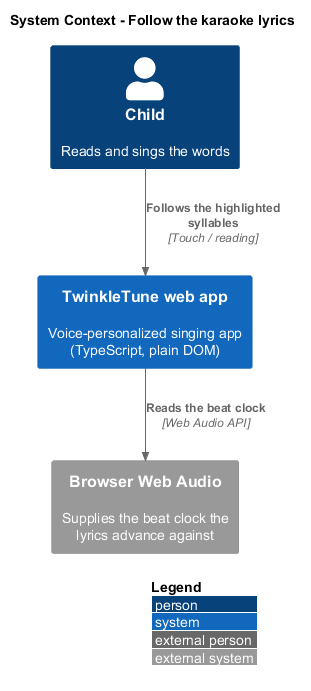
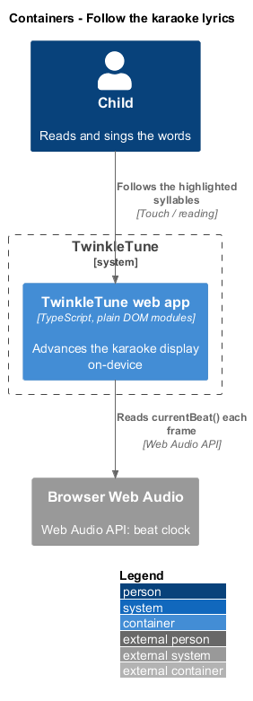
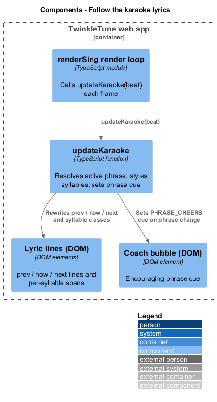
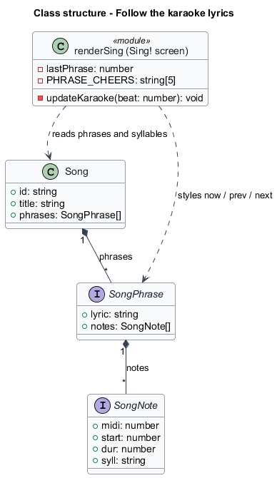
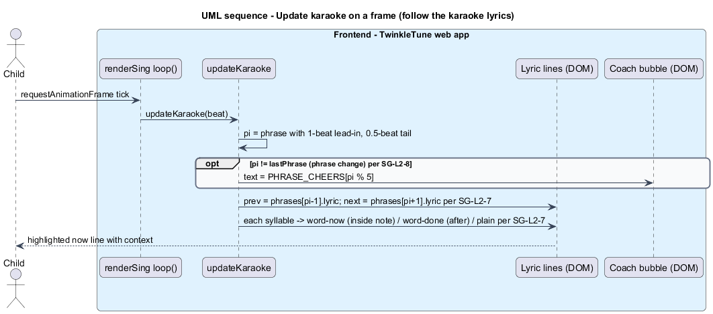

# Follow the karaoke lyrics

## Overview

The Sing! screen shows the words of the song as the child sings them, one
syllable at a time. This feature covers that karaoke display: highlighting the
current syllable, dimming syllables already sung, showing the surrounding phrases
for context, and cheering when a new phrase begins.

*karaoke display* — three-line lyric panel showing the previous phrase, the
current phrase syllable by syllable, and the next phrase

*syllable* — smallest sung unit, carried by one note as its `syll` label

*phrase* — one lyric line of the song, holding an ordered list of notes

*now line* — middle lyric line showing the active phrase with per-syllable styling

*phrase cue* — short encouraging line shown in the coach bubble when a new phrase
becomes active

Karaoke guidance lets a child who half-reads follow along and anticipate what is
coming. The now line marks each syllable as upcoming, active, or done so the child
always knows the current word; the previous and next lines give context without
crowding. On crossing into a new phrase the coach bubble shows a cue from a fixed
rotation, keeping encouragement flowing between phrases. The feature runs
on-device, driven by the beat clock, and reads only the song's own note and lyric
data.

## Description

The karaoke display is realized by `updateKaraoke(beat)` in
`frontend/apps/game/src/screens/sing.ts`, called each frame from `loop()`.

- **`updateKaraoke(beat)`** — resolves the active phrase index and repaints the
  three lyric lines and the coach cue for the current beat.
- **phrase resolution** — `pi` is the first phrase whose window contains the beat,
  using a 1-beat lead-in and a 0.5-beat tail: `beat >= first.start - 1 && beat <
  last.start + last.dur + 0.5`. When none matches, the last active phrase
  (`lastPhrase`) is retained.
- **`lastPhrase`** — the previously active phrase index. When `pi` differs from
  it, a phrase change has occurred.
- **`PHRASE_CHEERS`** — fixed array of 5 encouraging lines. On a phrase change the
  coach bubble text is set to `PHRASE_CHEERS[pi % PHRASE_CHEERS.length]`.
- **`coachEl`** (`[data-coach]`) — the coach bubble element that carries the phrase
  cue.
- **`prevEl` / `nowEl` / `nextEl`** (`[data-prev]`, `[data-now]`, `[data-next]`) —
  the three lyric-line elements. `prevEl` and `nextEl` show
  `song.phrases[pi - 1]?.lyric` and `song.phrases[pi + 1]?.lyric`.
- **now-line styling** — `nowEl.innerHTML` is rebuilt from the active phrase's
  notes. Each syllable is wrapped in a span classed `word-now` while `beat >=
  n.start && beat < n.start + n.dur`, `word-done` after `beat >= n.start + n.dur`,
  and unstyled while upcoming.
- **`SongPhrase` / `SongNote`** (`frontend/apps/game/src/songs/types.ts`) — the source data:
  a phrase carries a `lyric` line and its `notes`, each with a `syll`.

## Requirements

The feature realizes the following level-2 (L2) requirements, each refining the
cited level-1 (L1) requirement.

| L2 ID | Refines (L1) | Requirement |
|-------|--------------|-------------|
| `SG-L2-7` | `SG-L1-3` | The "now" lyric line shall mark each syllable as upcoming, active (while the beat is inside its note), or done (after its note ends); the previous and next phrase lyrics shall be shown as context. |
| `SG-L2-8` | `SG-L1-3, SG-L1-5` | On advancing to a new phrase, the coach bubble shall show an encouraging cue drawn from a fixed rotation. |

## Diagrams

### System context

The child reads the words on the tablet as the TwinkleTune web app advances the
lyrics against the browser's beat clock.

### Containers

The karaoke display runs inside the web app container, timed by the beat clock
read from the browser's Web Audio engine.

### Components

The render loop calls `updateKaraoke`, which repaints the three lyric lines and,
on a phrase change, updates the coach bubble.

### Class structure

`updateKaraoke` reads the song's `SongPhrase` and `SongNote` data and writes the
previous, now, and next line elements plus the coach bubble.

### Behaviour — update karaoke on a frame

Each frame the loop resolves the active phrase, styles each syllable of the now
line as upcoming, active, or done, shows the neighbouring phrases, and, when the
phrase changes, cheers with a fixed cue.

