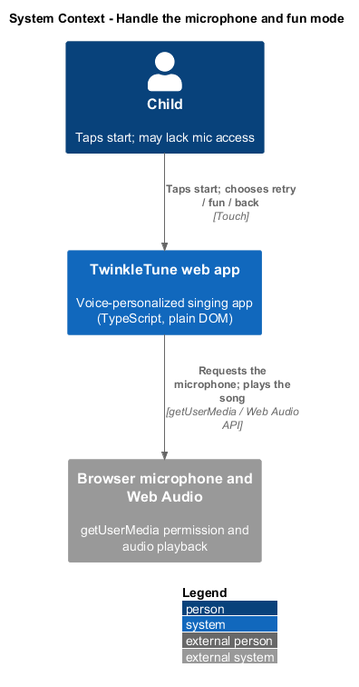
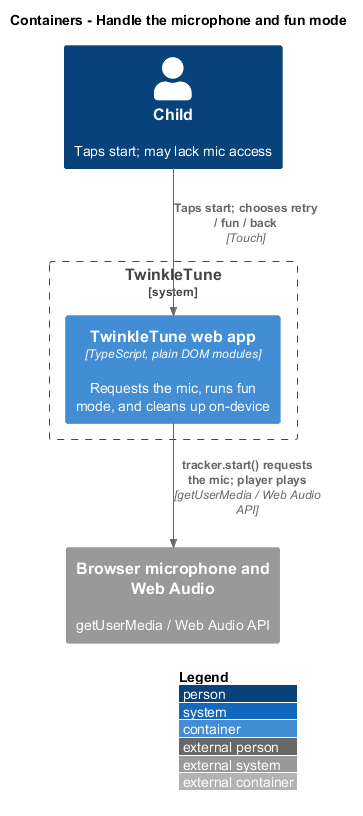
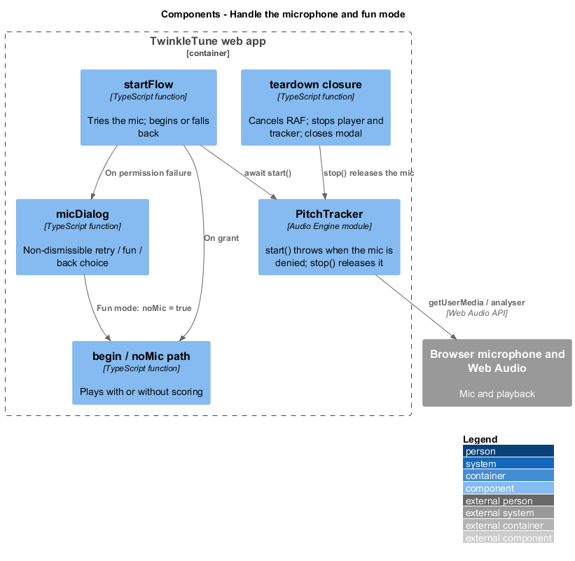
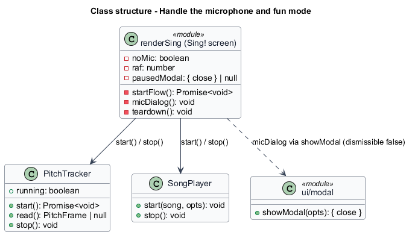
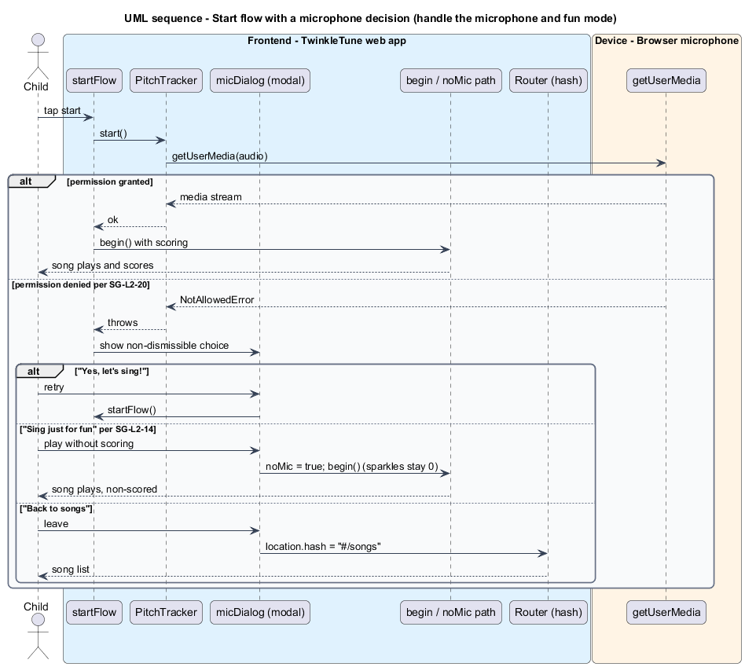
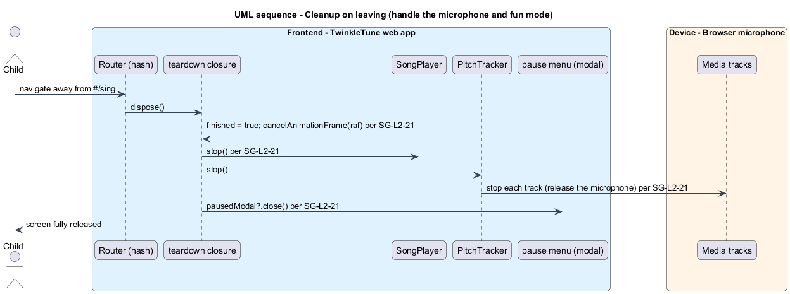

# Handle the microphone and fun mode

## Overview

Singing needs the microphone, and the moment a child taps start is the moment the
browser may deny it. This feature covers that moment gracefully: trying the
microphone, offering a clear choice when it is denied, running a no-microphone
"just for fun" mode, and tearing everything down cleanly when the child leaves.

*microphone permission* — browser grant that lets the app read the microphone
stream through `getUserMedia`

*just-for-fun mode* — no-microphone play mode that plays the song fully with pills
and karaoke, reads no pitch, and earns no scored rewards

*mic dialog* — non-dismissible choice shown when starting the microphone fails,
offering retry, play-without-scoring, or return to the song list

*cleanup* — teardown that runs on navigating away, releasing timers, audio, the
microphone, and any open dialog

The permission moment never dead-ends the child. A child without microphone
access, or who prefers not to be scored, can still play; fairness requires that
this mode earn no scored rewards. Leaving the screen releases the microphone and
stops all work so nothing keeps running in the background. The feature runs
on-device, reading the microphone through the Audio Engine's `PitchTracker`.

## Description

Microphone handling and cleanup live in `startFlow`, `micDialog`, the `noMic`
path, and the teardown closure of `frontend/src/screens/sing.ts`.

- **`startFlow()`** — `await tracker.start()`, sets the stage label to "SING TO
  MOVE YOUR STAR", and calls `begin()`. A thrown permission error is caught and
  routed to `micDialog()`.
- **`PitchTracker.start()`** (`frontend/src/audio/pitch.ts`) — requests the
  microphone; it throws `NotAllowedError` when the microphone is denied.
- **`micDialog()`** — a non-dismissible `showModal` (`dismissible: false`) with
  three actions: "Yes, let's sing!" retries `startFlow`; "Sing just for fun" sets
  `noMic = true`, sets the stage label to "SING ALONG AND HAVE FUN", and calls
  `begin()`; "Back to songs" navigates to `#/songs`.
- **`noMic`** — the fun-mode flag. When set, `loop()` reads no pitch (`frame =
  noMic ? null : tracker.read()`), accumulates no scoring frames, the star drifts
  to centre, and the sparkle pill stays `✨ 0`.
- **`summarize(song, results, noMic)`** — called with `noMic` so the resulting
  `SongSummary` is flagged as a non-scored run (`summary.noMic`); the results
  screen shows no scored rewards for it.
- **teardown closure** — the function `renderSing` returns. It sets `finished`,
  calls `cancelAnimationFrame(raf)`, `player.stop()`, `tracker.stop()` (which
  stops the media tracks and releases the microphone), and `pausedModal?.close()`.
- **`pausedModal`** — handle to any open pause dialog, closed during cleanup.

## Requirements

The feature realizes the following level-2 (L2) requirements, each refining the
cited level-1 (L1) requirement.

| L2 ID | Refines (L1) | Requirement |
|-------|--------------|-------------|
| `SG-L2-14` | `SG-L1-6` | In no-mic mode the song shall play fully with pills and karaoke, but no pitch shall be read, no scoring frames accumulated, the star shall drift to centre, and the live sparkle count shall remain 0; the resulting summary shall be flagged as a fun (non-scored) run. |
| `SG-L2-20` | `SG-L1-9` | If starting the microphone fails, the system shall present a non-dismissible choice to retry, to play without scoring, or to return to the song list. |
| `SG-L2-21` | `SG-L1-9` | On navigating away from the singing screen, the system shall cancel the render loop, stop playback, release the microphone, and dismiss any open dialog. |

## Diagrams

### System context

The child taps start; the TwinkleTune web app asks the browser for the
microphone and, on denial, offers a clear choice.

### Containers

Microphone handling runs inside the web app container against the browser's
microphone and Web Audio engine.

### Components

`startFlow` starts `PitchTracker`; a failure opens `micDialog`; the teardown
closure stops the loop, playback, and the microphone.

### Class structure

The render module drives `PitchTracker` and, on denial, the `micDialog`; the
teardown closure stops the tracker and player.

### Behaviour — start flow with a microphone decision

Starting tries the microphone; on grant the song begins, and on denial a
non-dismissible dialog offers retry, just-for-fun no-mic play, or a return to the
song list.

### Behaviour — cleanup on leaving

Navigating away cancels the render loop, stops playback, releases the microphone,
and dismisses any open dialog.

