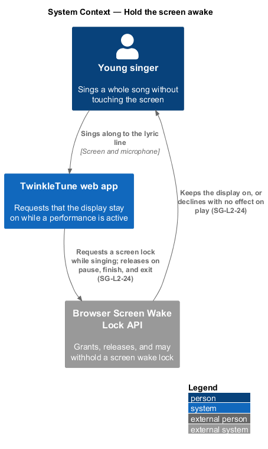
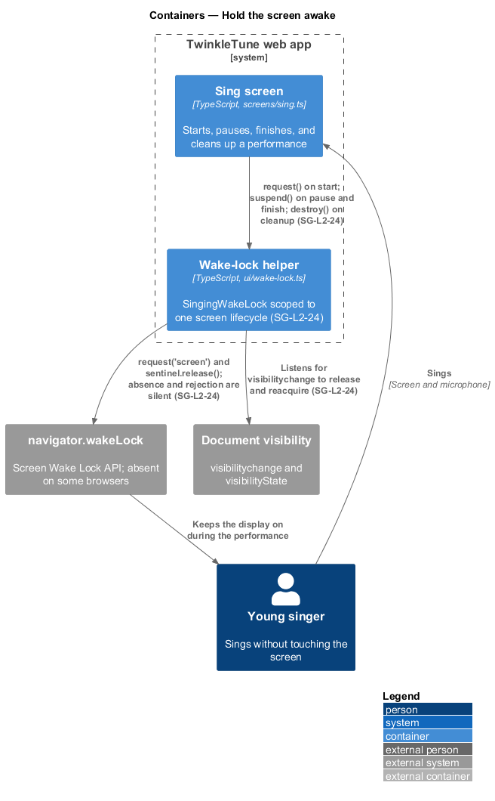
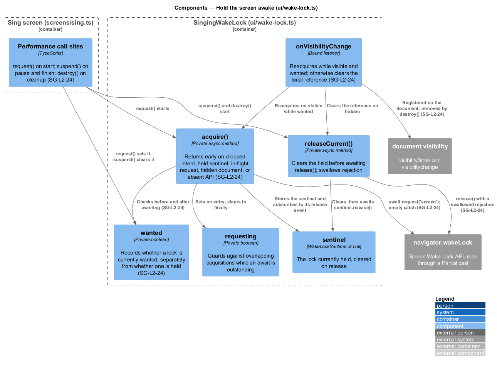
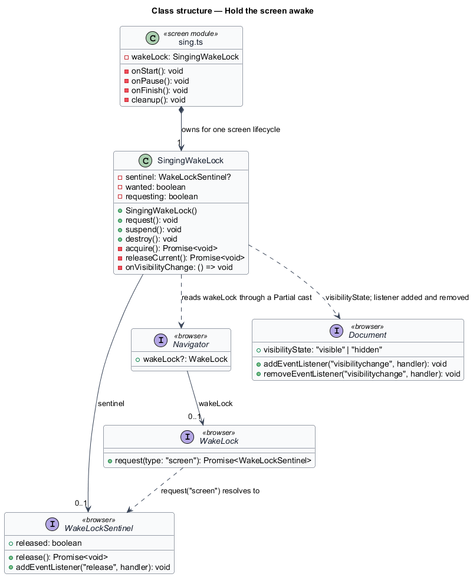
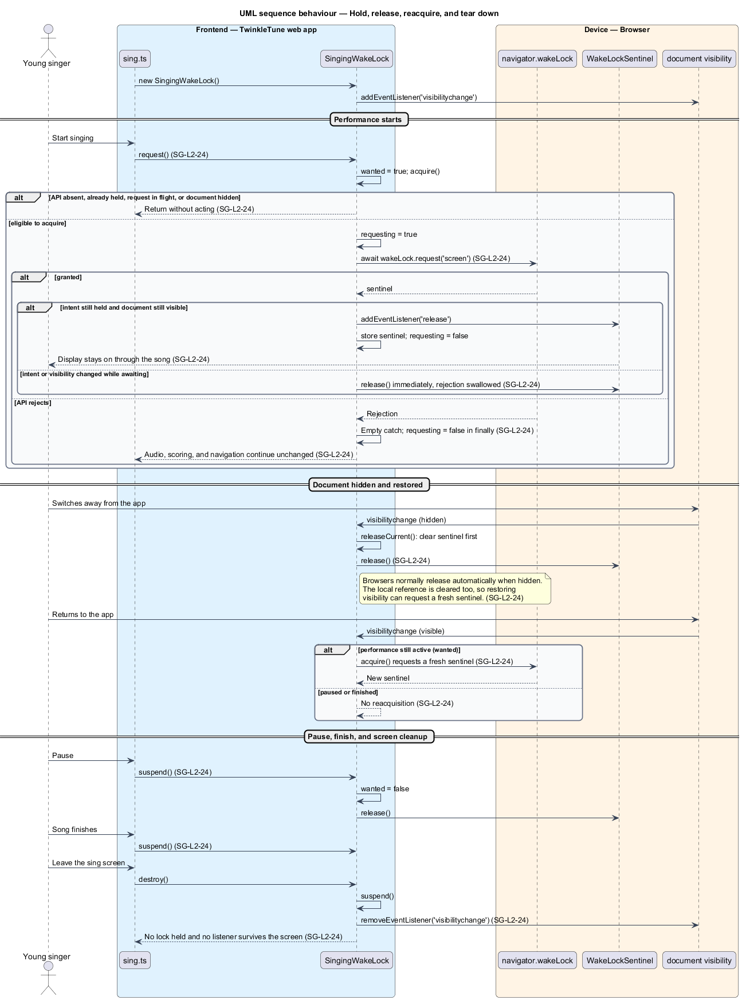

# Hold The Screen Awake

## Overview

A child singing along to a lyric line does not touch the screen, and a tablet that
dims or locks mid-verse interrupts the performance. This feature asks the platform
to keep the display on while a song is actually being sung, and to stop asking as
soon as it is not.

The request is best-effort by design. The Screen Wake Lock API is absent on some
browsers and may reject on others, and neither case is treated as a fault: audio,
scoring, and navigation continue exactly as they would have. The lock is scoped to
one singing screen lifecycle, so leaving the screen leaves nothing held and no
listener attached.

Platforms release a wake lock on their own when a document becomes hidden. The
design accounts for that by tracking intent separately from the held lock, so
returning to a still-running performance reacquires a fresh lock while returning to
a finished or paused one does not.

The terms below are used throughout.

- screen wake lock — platform request that the display stay on while a page holds it
- sentinel — handle representing one held wake lock, released through its `release()`
  method and emitting a `release` event when the platform drops it
- best-effort enhancement — capability whose absence or failure changes nothing else
  about the feature that requested it
- intent — record of whether a lock is currently wanted, held separately from
  whether one is actually held
- reacquisition — requesting a fresh sentinel after the platform released the
  previous one, permitted only while intent still holds
- screen lifecycle — span from entering the sing screen to leaving it, outside which
  no lock and no listener survives

## Description

The feature is realized by `frontend/src/ui/wake-lock.ts` and four call sites in
`frontend/src/screens/sing.ts`. No server participates.

- **`SingingWakeLock`** — the class owning one screen's wake-lock lifecycle. Its
  constructor registers `visibilitychange` on `document`.
- **`sentinel`** — the private field holding the current `WakeLockSentinel`, or
  `null` when none is held.
- **`wanted`** — the private boolean recording intent. It is the flag that separates
  "a lock is wanted" from "a lock is held", and it is what permits reacquisition
  after the platform releases.
- **`requesting`** — the private boolean guarding against overlapping acquisitions
  while an `await` is outstanding.
- **`request()`** — sets `wanted = true` and starts `acquire()`.
- **`suspend()`** — sets `wanted = false` and releases the current sentinel.
- **`destroy()`** — calls `suspend()` and removes the `visibilitychange` listener, so
  nothing survives the screen.
- **`acquire()`** — reads `navigator.wakeLock` through a
  `Partial<Pick<Navigator, 'wakeLock'>>` cast and returns without acting when intent
  has been dropped, a sentinel is already held, a request is in flight, the document
  is not `'visible'`, or the API is absent. Otherwise it awaits
  `wakeLock.request('screen')`. Should intent or visibility have changed while
  awaiting, it releases the new sentinel immediately rather than storing it.
  Otherwise it stores the sentinel and subscribes to its `release` event, clearing
  `sentinel` only when the released one is still the current one. The `catch` block
  is empty apart from the comment that the wake lock is a progressive enhancement,
  and `requesting` is cleared in `finally`.
- **`releaseCurrent()`** — clears `sentinel` before awaiting `release()`, and
  swallows a rejected release with `.catch(() => {})`.
- **`onVisibilityChange`** — the bound listener. On `'visible'` it calls `acquire()`
  when `wanted` still holds; otherwise it calls `releaseCurrent()` so a locally held
  reference does not block a later reacquisition.
- **Call sites in `sing.ts`** — the screen constructs `new SingingWakeLock()`, calls
  `wakeLock.request()` when a performance starts, `wakeLock.suspend()` on pause and
  again on finish, and `wakeLock.destroy()` during screen cleanup.

## Requirements

The feature realizes the following level-2 (L2) requirements. Each L2 requirement
refines a level-1 (L1) requirement, cited by identifier.

| L2 ID | Refines (L1) | Requirement |
|-------|--------------|-------------|
| `SG-L2-24` | `SG-L1-7, SG-L1-9` | The app shall request a best-effort screen wake lock when singing starts, release it on pause, finish, or screen cleanup, and reacquire it after returning to a visible document only if the performance is still active. API absence or rejection shall not interrupt play. |

## Diagrams

### System context

The singer sings without touching the screen; the app asks the platform to keep the
display on for the duration of the performance (`SG-L2-24`).

### Containers

The sing screen drives a wake-lock helper scoped to its own lifecycle, which reaches
the browser's Screen Wake Lock API where one exists (`SG-L2-24`).

### Components

`SingingWakeLock` separates intent from the held sentinel and guards acquisition on
visibility, an in-flight request, and the presence of the API (`SG-L2-24`).

### Class structure

`SingingWakeLock`, the sentinel it holds, and the sing screen that owns it for one
screen lifecycle.

### Behaviour — hold, release, reacquire, and tear down

Starting a performance requests a lock, with absence and rejection both silent.
Pause and finish release it, hiding the document drops the local reference, and
returning reacquires only while the performance is still active (`SG-L2-24`).

