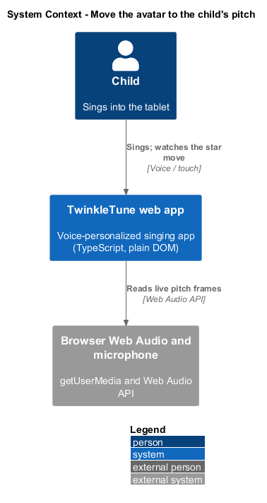
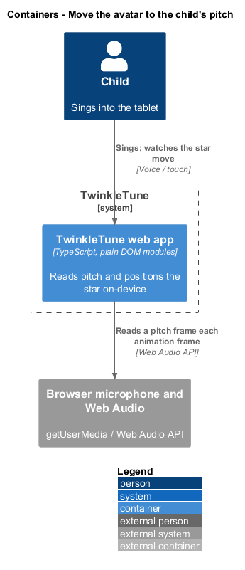
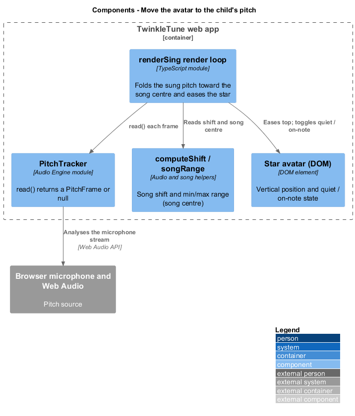
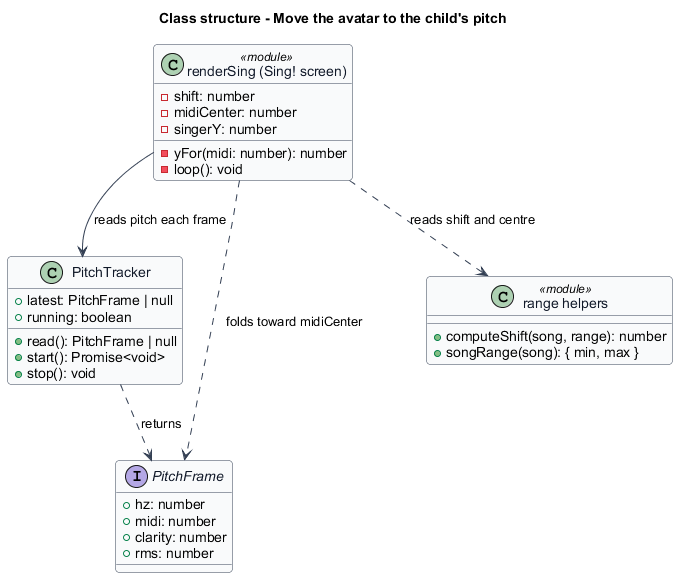
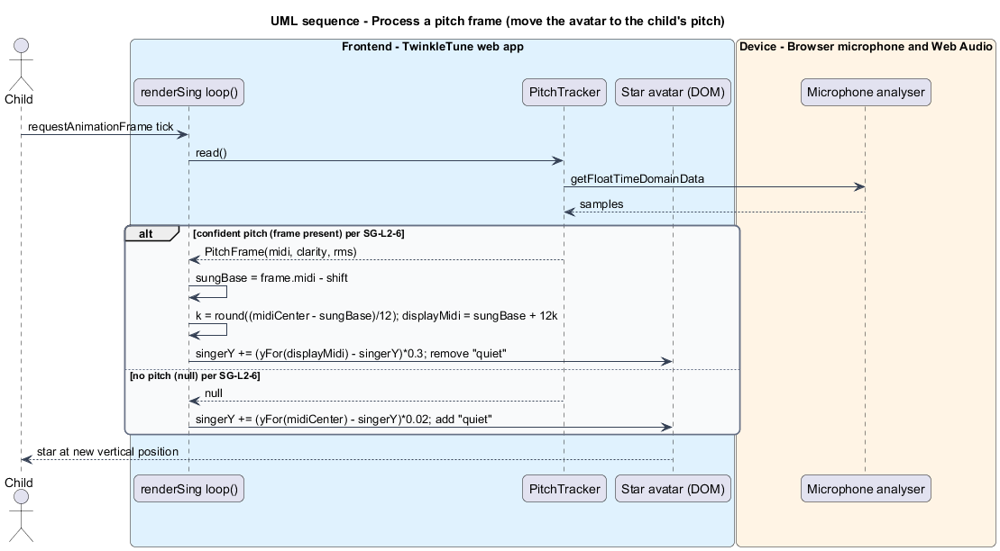

# Move the avatar to the child's pitch

## Overview

The Sing! screen shows the child a star avatar that rises and falls with the
pitch of the singing voice. This feature covers that mapping: turning each live
pitch reading into a vertical position for the star, in a way that rewards the
right note in any octave.

*star avatar* — on-screen character that represents the singer and moves
vertically to reflect the sung pitch

*pitch frame* — one microphone reading of the current pitch, carrying a MIDI note
number, a clarity score, and a loudness measure

*song shift* — number of semitones the whole song has been transposed so it fits
the child's voice, applied by Voice Personalization

*octave folding* — reduction of a pitch to the octave nearest a reference so that
the same note sung high or low maps to the same place

*song centre* — midpoint MIDI value of the song's note range, used as the fold
reference and the resting position

*quiet state* — visual state shown when no pitch is detected, during which the
star drifts gently toward centre

The star exists to give immediate, legible feedback that the child's voice moves
the star, without punishing a natural octave choice. A child who sings the target
note one octave down is still correct, so the mapping folds octaves toward the
song centre before positioning the star. When the microphone hears nothing, the
star eases toward centre and the stage indicates quiet rather than snapping or
freezing. The feature runs on-device, reading pitch from the Audio Engine's
`PitchTracker`.

## Description

The avatar movement lives in the `loop()` function of
`frontend/apps/game/src/screens/sing.ts`, in the block that runs each frame after the beat
is read.

- **`PitchTracker`** (`frontend/packages/audio-engine/src/pitch.ts`) — the consumed Audio Engine
  component. `read()` returns a `PitchFrame` or `null` once per frame; `null`
  means no confident pitch (loudness below `MIN_RMS`, clarity below `MIN_CLARITY`,
  or frequency out of range).
- **`PitchFrame`** — the reading: `hz`, `midi` (float MIDI, median-filtered),
  `clarity`, and `rms`.
- **`frame`** — the per-frame local, `noMic ? null : tracker.read()`. In no-mic
  mode no pitch is read.
- **`shift`** — the `song shift` from `computeShift(song, range)`. It is removed
  from the sung pitch before positioning, so the star reflects the note relative
  to the personalized key.
- **`midiCenter`** — `(min + max) / 2` from `songRange(song)`, the fold reference
  and quiet-state target.
- **`yFor(midi)`** — maps a MIDI value to a vertical stage position, normalising
  across the song range between `STAGE_PAD_TOP` and `STAGE_PAD_BOTTOM`.
- **positioning** — when a `frame` is present the code computes
  `sungBase = frame.midi - shift`, folds it with `k = round((midiCenter -
  sungBase) / 12)` to `displayMidi = sungBase + 12 * k`, and eases the star with
  `singerY += (yFor(displayMidi) - singerY) * 0.3`.
- **quiet drift** — when `frame` is `null` the star eases toward centre with a
  gentler factor: `singerY += (yFor(midiCenter) - singerY) * 0.02`, and the
  `quiet` class is applied to the `singer` element.
- **`singer`** (`[data-singer]`) — the star element. Its `top` is set to
  `singerY - 30` each frame; the `quiet` and `on-note` classes reflect its state.

## Requirements

The feature realizes the following level-2 (L2) requirement, refining the cited
level-1 (L1) requirement.

| L2 ID | Refines (L1) | Requirement |
|-------|--------------|-------------|
| `SG-L2-6` | `SG-L1-2` | When a pitch frame is present, the star shall move toward the vertical position of the sung pitch (after removing the song's shift and folding to the octave nearest the song's centre), eased for smoothness; when no pitch is present, the star shall drift gently toward centre and the stage shall show a "quiet" state. |

## Diagrams

### System context

The child sings into the tablet; the TwinkleTune web app reads pitch from the
browser's microphone and Web Audio engine and moves the star.

### Containers

Pitch reading and star positioning run inside the web app container, which reads
from the browser's microphone and Web Audio engine.

### Components

The render loop reads a `PitchFrame` from `PitchTracker`, folds it toward the song
centre with `yFor`, and eases the `singer` element.

### Class structure

The render loop depends on `PitchTracker` for `PitchFrame` readings and on
`computeShift` and `songRange` for the shift and the fold centre.

### Behaviour — process a pitch frame

Each frame the loop reads a pitch, and either folds it toward the song centre and
eases the star to the note position, or, when no pitch is present, drifts the star
toward centre and shows the quiet state.

