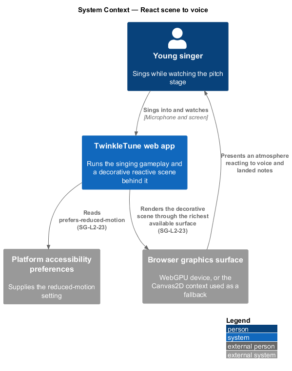
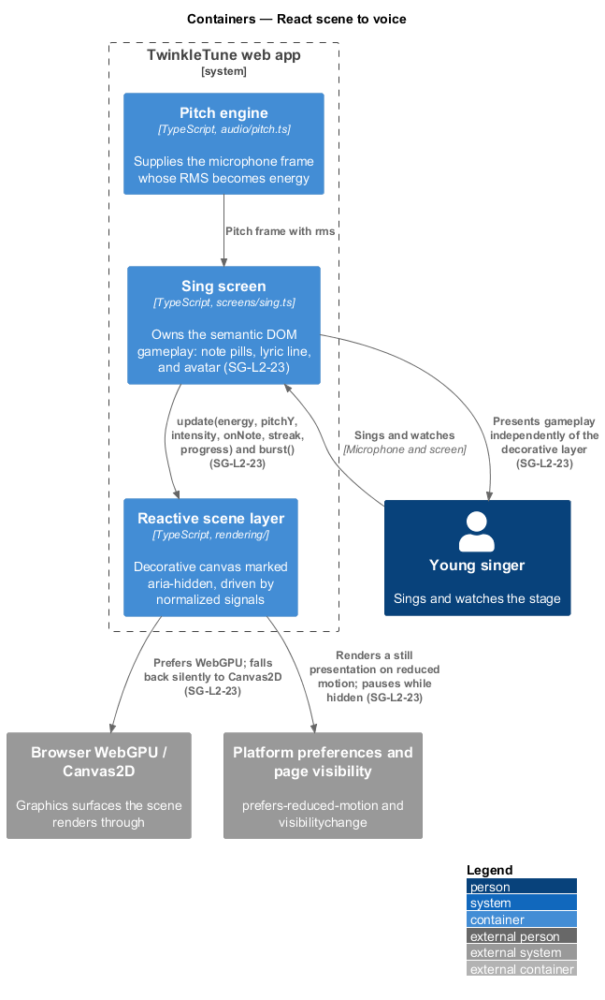
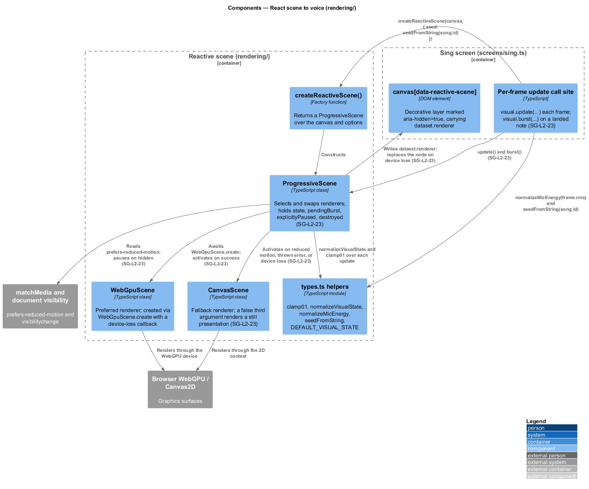
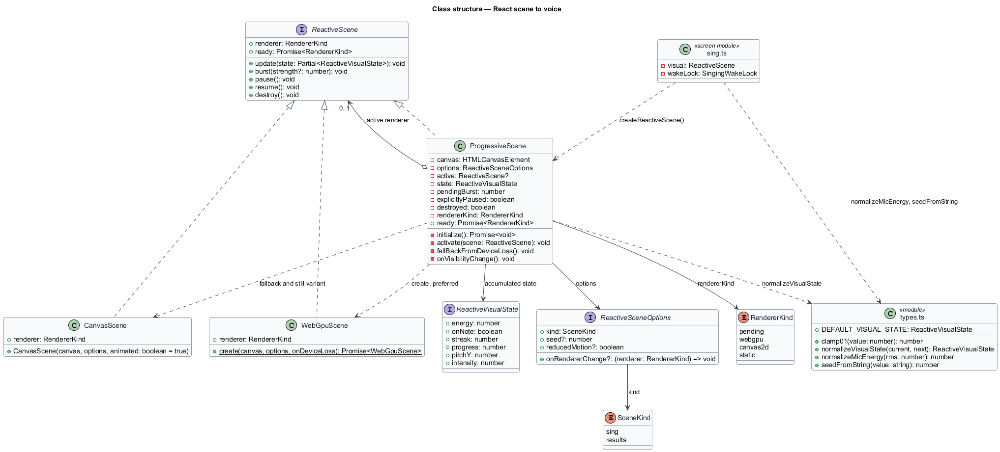
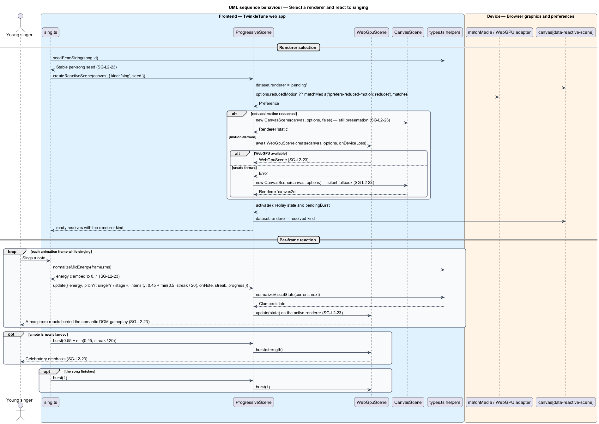
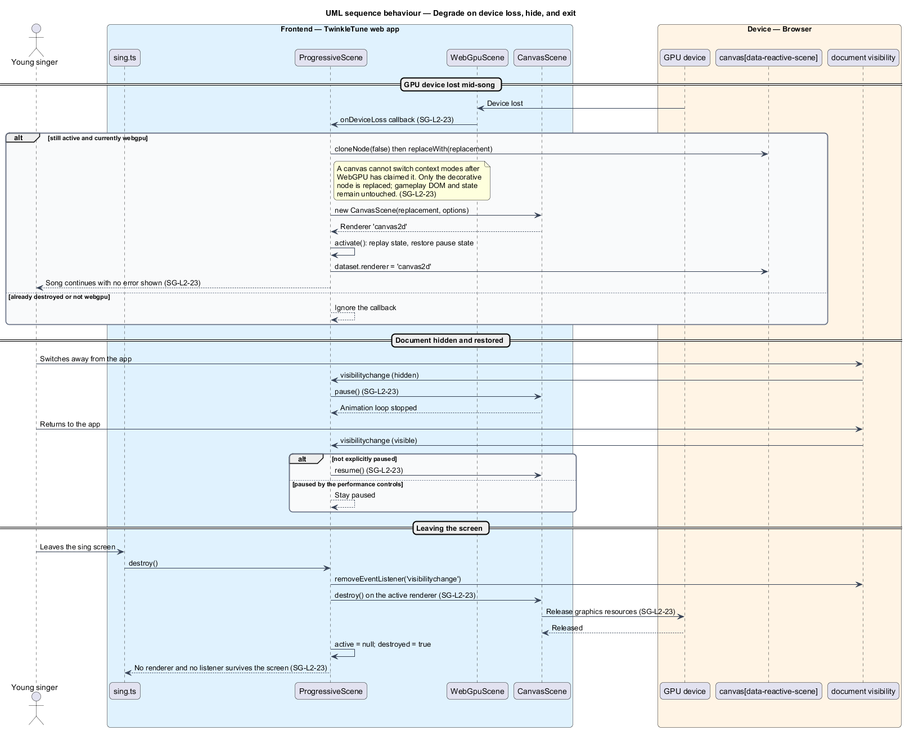

# React Scene To Voice

## Overview

While a child sings, the space behind the note pills comes alive: the atmosphere
brightens with the voice, drifts with the singer's pitch, and bursts when a note
lands. This is decoration, and the design keeps that boundary strict. The pitch
stage retains its semantic DOM gameplay — the pills, the lyric line, the avatar —
and the reactive scene paints only behind it on a canvas marked
`aria-hidden="true"`. Nothing the scene does changes scoring, controls, or what a
screen reader announces.

Hardware in a family varies, so the renderer is chosen progressively rather than
assumed. The scene prefers WebGPU, falls back to Canvas2D without surfacing an
error, and renders a still presentation when the singer's device asks for reduced
motion. A GPU device lost mid-song downgrades to Canvas2D while the song keeps
playing.

The terms below are used throughout.

- reactive scene — decorative canvas layer that animates in response to gameplay
  signals without participating in gameplay
- visual state — the six normalized signals the scene renders from: energy, on-note,
  streak, progress, pitch position, and intensity
- normalized signal — value constrained to the range 0 to 1, so a renderer needs no
  knowledge of the units it came from
- progressive renderer selection — choosing the richest renderer the device
  supports, and degrading silently rather than failing
- device loss — event in which the browser withdraws an acquired GPU device, leaving
  its canvas unusable
- reduced motion — platform preference asking that continuous animation be avoided
- burst — one-off celebratory emphasis triggered by an event rather than by a
  continuous signal
- seeded variation — deterministic per-song visual difference derived from the song
  identifier, so a song looks the same each time it is sung

## Description

The feature spans `frontend/src/screens/sing.ts` and four modules under
`frontend/src/rendering/`. No server participates.

- **`ReactiveVisualState`** — the interface in `rendering/types.ts` carrying
  `energy` (0 silent to 1 loud), `onNote`, `streak`, `progress`, `pitchY`
  (normalized from the top of the scene), and `intensity`.
- **`DEFAULT_VISUAL_STATE`** — the starting state: `energy: 0`, `onNote: false`,
  `streak: 0`, `progress: 0`, `pitchY: 0.5`, `intensity: 0.5`.
- **`RendererKind`** — the union `'pending' | 'webgpu' | 'canvas2d' | 'static'`,
  also written to the canvas as `dataset.renderer`.
- **`clamp01(value)`** — constrains a value to 0 to 1 and maps a non-finite value to
  `0`.
- **`normalizeVisualState(current, next)`** — folds a partial update over the current
  state, clamping each normalized field, flooring `streak` at `0`.
- **`normalizeMicEnergy(rms)`** — maps microphone RMS to `clamp01((rms - 0.01) / 0.13)`.
  The lower bound matches the `0.01` RMS at which `PitchTracker` starts accepting
  sound.
- **`seedFromString(value)`** — FNV-1a hash over the song identifier, normalized to 0
  to 1, giving each song a stable visual variation.
- **`ReactiveScene`** — the interface every renderer satisfies: `renderer`, `ready`,
  `update(state)`, `burst(strength)`, `pause()`, `resume()`, and `destroy()`.
- **`ProgressiveScene`** — the orchestrator in `rendering/reactive-scene.ts`
  implementing `ReactiveScene`. It holds the accumulated `state`, a `pendingBurst`,
  the `explicitlyPaused` and `destroyed` flags, and the currently `active` renderer.
- **`initialize()`** — reads `options.reducedMotion ?? window.matchMedia('(prefers-reduced-motion: reduce)').matches`.
  When reduced motion holds it activates `new CanvasScene(canvas, options, false)`,
  the still variant. Otherwise it awaits `WebGpuScene.create(...)` and, on any
  thrown error, activates `new CanvasScene(canvas, options)`.
- **`activate(scene)`** — destroys the previous renderer, records
  `rendererKind`, writes `canvas.dataset.renderer`, replays the accumulated state
  and any `pendingBurst`, pauses or resumes according to `explicitlyPaused` and
  `document.visibilityState`, calls `options.onRendererChange?.(...)`, and resolves
  `ready`.
- **`fallBackFromDeviceLoss()`** — the callback passed to `WebGpuScene.create`. A
  canvas cannot switch context modes after WebGPU has claimed it, so it clones the
  canvas node, calls `replaceWith`, and activates a `CanvasScene` on the
  replacement. Gameplay DOM and state are untouched.
- **`onVisibilityChange`** — document listener pausing the active renderer when
  `document.visibilityState === 'hidden'` and resuming it otherwise, unless the
  scene is explicitly paused.
- **`createReactiveScene(canvas, options)`** — the factory returning a
  `ProgressiveScene`.
- **`WebGpuScene` / `CanvasScene`** — the two renderers in
  `rendering/webgpu-scene.ts` and `rendering/canvas-scene.ts`. `CanvasScene` takes a
  third constructor argument that, when `false`, renders a still presentation
  without a continuous animation loop.
- **Wiring in `sing.ts`** — the canvas is declared as
  `<canvas class="reactive-scene" data-reactive-scene aria-hidden="true">`. The
  screen calls `createReactiveScene(...)` with `seed: seedFromString(song.id)`, then
  each frame calls `visual.update({ energy: frame ? normalizeMicEnergy(frame.rms) : 0,
  pitchY: singerY / stageH, intensity: 0.45 + Math.min(0.5, streak / 20) })`. A newly
  landed note calls `visual.burst(0.55 + Math.min(0.45, streak / 20))`, and finishing
  calls `visual.burst(1)`.

## Requirements

The feature realizes the following level-2 (L2) requirements. Each L2 requirement
refines a level-1 (L1) requirement, cited by identifier.

| L2 ID | Refines (L1) | Requirement |
|-------|--------------|-------------|
| `SG-L2-23` | `SG-L1-1, SG-L1-2, SG-L1-5` | The pitch stage shall retain its semantic DOM gameplay while a decorative scene reacts to normalized voice energy, singer position, on-note state, streak, and progress. The scene shall prefer WebGPU, fall back silently to Canvas2D, and render a still presentation when reduced motion is requested. It shall pause while the document is hidden and release all resources on exit. |

## Diagrams

### System context

The singer sings into the app; the decorative scene reacts on the device's GPU or
2D canvas while gameplay and scoring proceed independently (`SG-L2-23`).

### Containers

The sing screen keeps its semantic DOM gameplay and drives a separate decorative
canvas layer, which reaches the browser's WebGPU or Canvas2D surface (`SG-L2-23`).

### Components

`ProgressiveScene` selects between `WebGpuScene` and `CanvasScene`, normalizes the
signals `sing.ts` feeds it, and writes the resolved renderer onto the canvas
(`SG-L2-23`).

### Class structure

The `ReactiveScene` interface, its two renderers, the orchestrator that switches
between them, and the normalized visual state they all render from.

### Behaviour — select a renderer and react to singing

Renderer selection runs reduced-motion first, then WebGPU, then Canvas2D, with
every failure silent. Per-frame updates carry normalized energy, pitch position,
and intensity, and a landed note triggers a burst (`SG-L2-23`).

### Behaviour — degrade on device loss, hide, and exit

A lost GPU device replaces only the decorative canvas node and continues on
Canvas2D; hiding the document pauses the renderer, and leaving the screen destroys
it (`SG-L2-23`).

