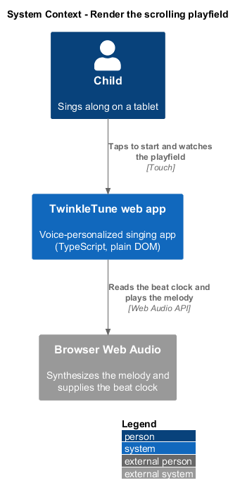
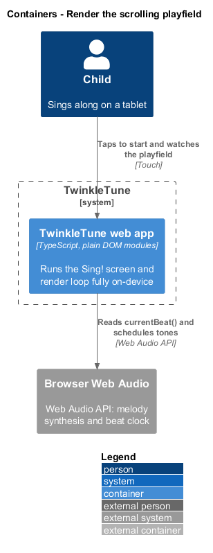
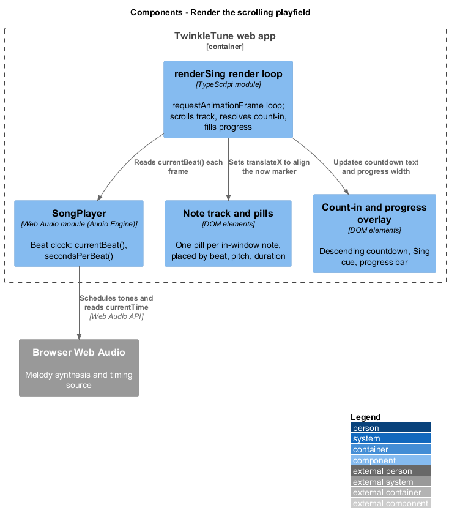
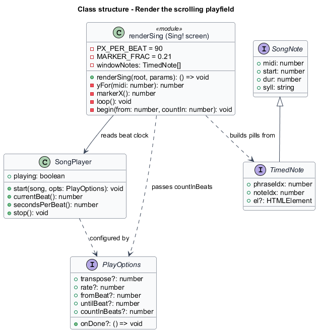
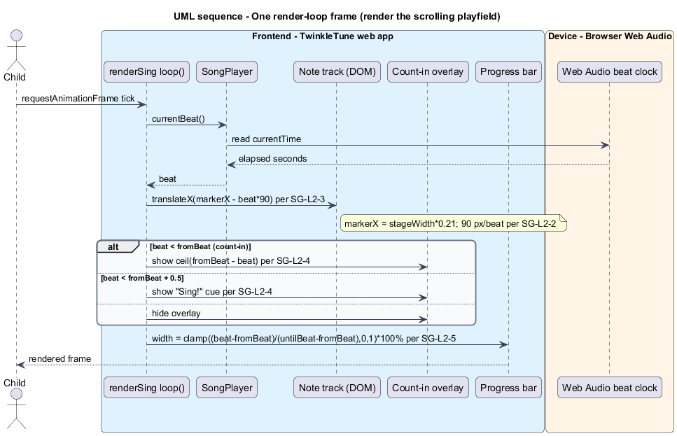
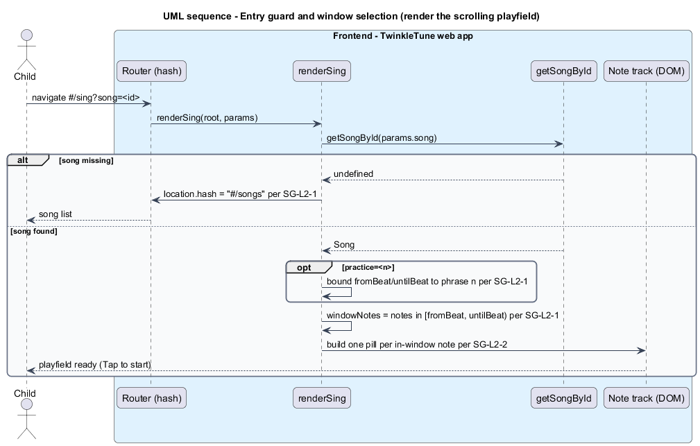

# Render the scrolling playfield

## Overview

TwinkleTune is a voice-personalized singing app for children. The Sing! screen is
the live surface where a child performs a song. This feature covers the visual
foundation of that screen: a synchronised, scrolling band of note pills that a
child sings along to.

*playfield* — horizontal band of note pills that scrolls past a fixed marker in
time with the music

*note pill* — rounded label representing one melody note, placed by its start
beat, pitch, and duration, and carrying the note's syllable

*now marker* — fixed vertical reference at 21 percent of the stage width that
marks the beat sounding at the current moment

*count-in* — run of metronome clicks before the melody that gives the child time
to prepare, during which the beat clock is negative

*beat clock* — audio-derived measure of elapsed time expressed in beats, read
from the Audio Engine each frame

*render loop* — `requestAnimationFrame` callback that repositions the playfield
once per animation frame

*active window* — half-open beat interval `[fromBeat, untilBeat)` whose notes are
the only pills rendered and the only notes scored

The playfield exists because a child needs one obvious action — a single tap —
and a clear, continuous sense of when to sing. The count-in and the progress bar
frame the performance; the scrolling pills and the now marker tell the child what
to sing and when. The feature runs fully on-device: it reads the beat clock from
the Audio Engine's `SongPlayer` and draws to the DOM, with no server involved.

## Description

The feature is realized by the `renderSing` module in `frontend/apps/game/src/screens/sing.ts`.

- **`renderSing(root, params)`** — entry function. It resolves the song with
  `getSongById`, redirects to `#/songs` when the song is missing, builds the
  screen markup, constructs the pills, and starts the render loop.
- **`PX_PER_BEAT`** — layout constant fixed at `90`. Every beat maps to 90 pixels
  of horizontal distance.
- **`MARKER_FRAC`** — constant `0.21`. `markerX()` returns `stage.clientWidth *
  MARKER_FRAC`, the horizontal position of the now marker.
- **`STAGE_PAD_TOP` / `STAGE_PAD_BOTTOM`** — vertical padding constants (`40` and
  `56`) that bound the pitch-to-pixel mapping.
- **`yFor(midi)`** — maps a MIDI note to a vertical position inside the stage,
  normalising against the song's `min`..`max` range from `songRange(song)`.
- **`practicePhrase` / `fromBeat` / `untilBeat`** — window selection. In practice
  mode `practicePhrase` selects one `song.phrases[i]`; `fromBeat` and `untilBeat`
  bound the window to that phrase, otherwise to the whole song via `songBeats`.
- **`windowNotes`** — the notes filtered to `n.start >= fromBeat && n.start <
  untilBeat`. These are the only notes turned into pills.
- **`TimedNote`** — a `SongNote` extended with `phraseIdx`, `noteIdx`, and an
  optional `el` handle to the pill element.
- **pill construction** — one `span.note` per `windowNotes` entry, with
  `left = n.start * PX_PER_BEAT`, `width = max(34, n.dur * PX_PER_BEAT - 8)`,
  `top = yFor(n.midi) - 17`, and text set to `n.syll`.
- **`loop()`** — the render loop. Each frame it reads `player.currentBeat()`, sets
  `track.style.transform = translateX(markerX() - beat * PX_PER_BEAT)`, updates the
  count-in overlay, and sets the progress-bar width.
- **`SongPlayer`** (`frontend/packages/audio-engine/src/player.ts`) — the consumed Audio Engine
  playback voice. `currentBeat()` supplies the beat clock (negative during the
  count-in) and `start(song, opts)` begins playback with a `countInBeats` option.
- **`countdown`** (`[data-countdown]`) — the overlay element. It shows
  `ceil(fromBeat - beat)` while `beat < fromBeat`, a brief "Sing!" cue for the
  first 0.5 beat, then hides.
- **`progressEl`** (`[data-progress]`) — the progress-bar fill. Its width is
  `clamp((beat - fromBeat) / (untilBeat - fromBeat), 0, 1) * 100%`.

## Requirements

The feature realizes the following level-2 (L2) requirements. Each refines a
level-1 (L1) requirement, cited by identifier.

| L2 ID | Refines (L1) | Requirement |
|-------|--------------|-------------|
| `SG-L2-1` | `SG-L1-1` | The screen shall resolve the requested song and redirect to the song list if it is missing; in practice mode it shall bound play to the requested phrase; the set of pills and scored notes shall be exactly the notes within the active window. |
| `SG-L2-2` | `SG-L1-1` | Each in-window note shall render as a pill positioned horizontally by its start beat (90 px/beat) and sized by its duration, positioned vertically by its pitch, and labelled with its syllable. |
| `SG-L2-3` | `SG-L1-1` | Each frame the note track shall scroll so that the pill for the current beat aligns with the "now" marker at 21% of the stage width. |
| `SG-L2-4` | `SG-L1-1` | During the count-in (negative/pre-start beats) the screen shall show a descending numeric countdown; at the segment start it shall briefly show a "Sing!" cue, then clear the overlay. |
| `SG-L2-5` | `SG-L1-1` | The screen shall show a progress bar that fills from 0% to 100% across the active window as the song plays. |

## Diagrams

### System context

The child performs a song through the TwinkleTune web app, which synthesizes the
melody and derives its beat clock from the browser's Web Audio engine.

### Containers

The Sing! screen runs entirely inside the web app container. The only external
dependency is the browser's Web Audio engine, which the beat clock is read from.

### Components

Inside the web app, the `renderSing` render loop reads `currentBeat()` from
`SongPlayer` and drives the note track, the count-in overlay, and the progress
bar each frame.

### Class structure

`renderSing` builds `TimedNote` pills, drives a `SongPlayer` for its beat clock,
and configures playback through `PlayOptions`.

### Behaviour — one render-loop frame

Each animation frame reads the beat clock, scrolls the track so the current beat
aligns with the now marker, resolves the count-in overlay, and fills the progress
bar.

### Behaviour — entry guard and window selection

On mount the screen resolves the song, redirects when it is missing, bounds the
window to a practice phrase when requested, and builds one pill per in-window note.

