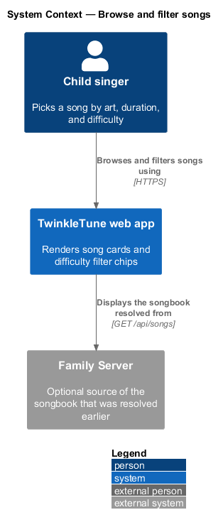
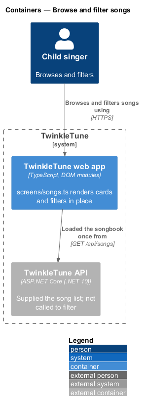
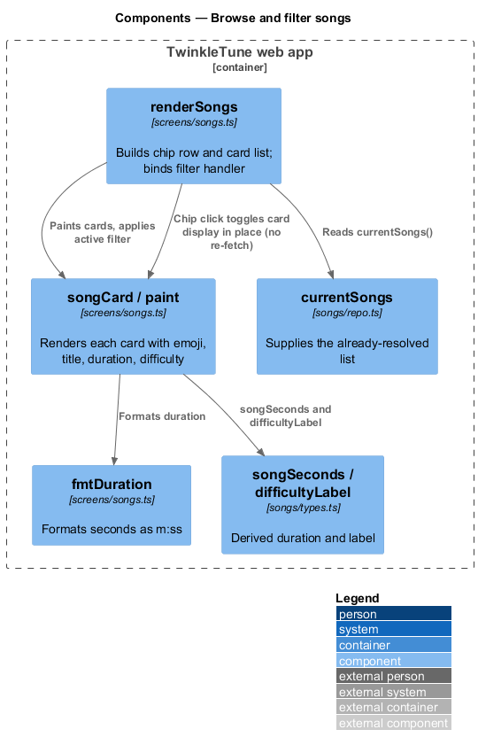
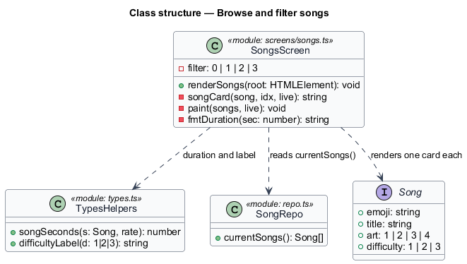
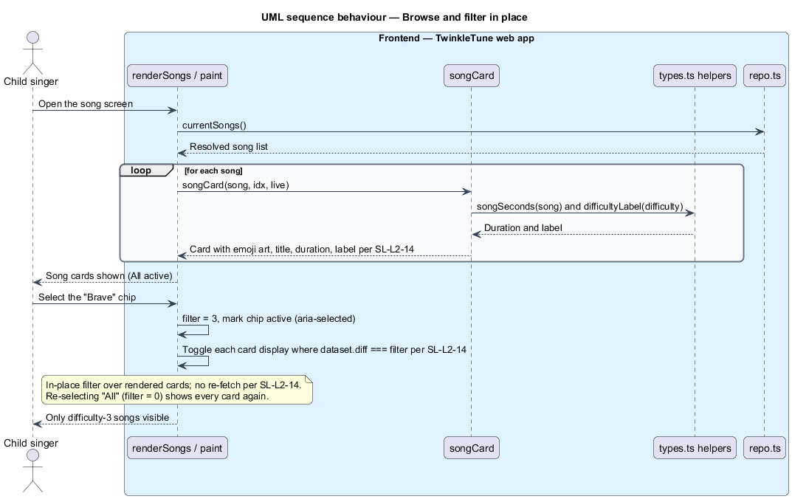

# Browse and filter songs

## Overview

A young child picking a song cannot read a long scrolling list. This feature is
the song screen: a set of song cards a child can recognize by art and duration,
with difficulty chips that narrow the list in place.

- **song card** — one row showing a song's emoji art, title, estimated duration,
  and difficulty label, with a play button
- **difficulty chip** — filter control for one difficulty tier: All, Easy,
  Medium, or Brave
- **difficulty label** — star-prefixed text for a difficulty value: `⭐ Easy`,
  `⭐⭐ Medium`, `⭐⭐⭐ Brave`
- **estimated duration** — a song's length in minutes and seconds, derived from
  its note data
- **in-place filter** — narrowing that shows or hides already-rendered cards
  without fetching the songbook again

The screen renders the current songbook as cards. Four chips filter by
difficulty: All shows every song, and Easy, Medium, and Brave show only songs of
difficulty 1, 2, and 3. Selecting a chip toggles card visibility over the cards
already on the page; no network request is made to filter.

## Description

Frontend — TwinkleTune web app (`frontend/apps/game/src/screens/songs.ts`):

- **`renderSongs`** — builds the screen: a chip row (`data-filter` values 0–3,
  where 0 is All) and a list container. It paints `currentSongs()` first, then
  refreshes from `loadSongs()`.
- **`songCard`** — renders one card: an `art-{n}` tile with the song `emoji`, the
  `title`, a `song-meta` row with `⏱ ${fmtDuration(songSeconds(song))}` and
  `difficultyLabel(song.difficulty)`, and a play button. The card carries
  `data-diff="${song.difficulty}"` for filtering.
- **`fmtDuration`** — formats seconds as `m:ss`.
- **`paint`** — writes the cards and applies the active filter by setting each
  card's `display` from `filter === 0 || Number(card.dataset.diff) === filter`.
- The chip click handler updates `filter`, marks the active chip
  (`aria-selected`), and re-applies the visibility rule to the existing
  `.song` cards — no re-fetch.

Frontend — derived helpers (`frontend/apps/game/src/songs/types.ts`):

- **`songSeconds`** — length in seconds from note data, feeding `fmtDuration`.
- **`difficultyLabel`** — the star-prefixed label shown on each card.

Frontend — songbook source (`frontend/apps/game/src/songs/repo.ts`):

- **`currentSongs`** — supplies the list the screen renders; its resolution is
  covered by the resolve-songbook feature.

## Requirements

The feature realizes the following level-2 (L2) requirement. It refines a
level-1 (L1) requirement, cited by identifier.

| L2 ID | Refines (L1) | Requirement |
|-------|--------------|-------------|
| `SL-L2-14` | `SL-L1-5` | The song list shall present each song with its emoji art, title, estimated duration, and difficulty label, and shall offer filter chips — All, Easy, Medium, Brave — that show only the matching songs without re-fetching. |

## Diagrams

### System context

The child browses and filters songs in the web app; the songbook it displays was
resolved earlier from the Family Server, cache, or bundle.

### Containers

Browsing and filtering run entirely in the web app over the already-resolved
song list; the TwinkleTune API only supplied that list.

### Components

`renderSongs` builds the chip row and cards; `songCard` reads `songSeconds` and
`difficultyLabel`, and the chip handler toggles card visibility in place.

### Class structure

The song screen module and the derived helpers it uses to render and filter each
card.

### Behaviour — browse and filter in place

The screen renders each song as a card, then a chip selection shows only the
matching difficulty by toggling display over the rendered cards, with no fetch.

