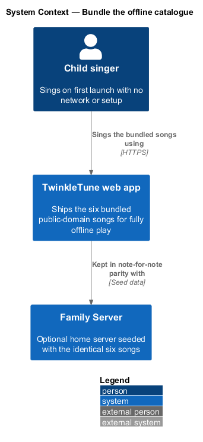
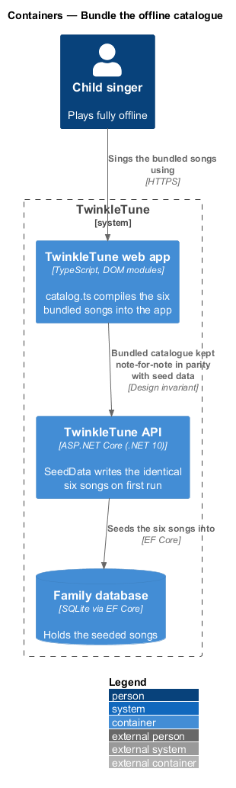
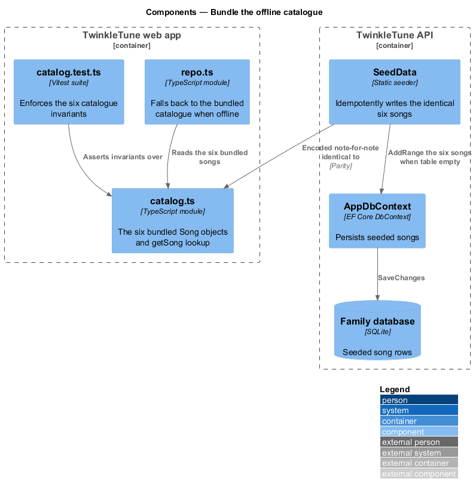
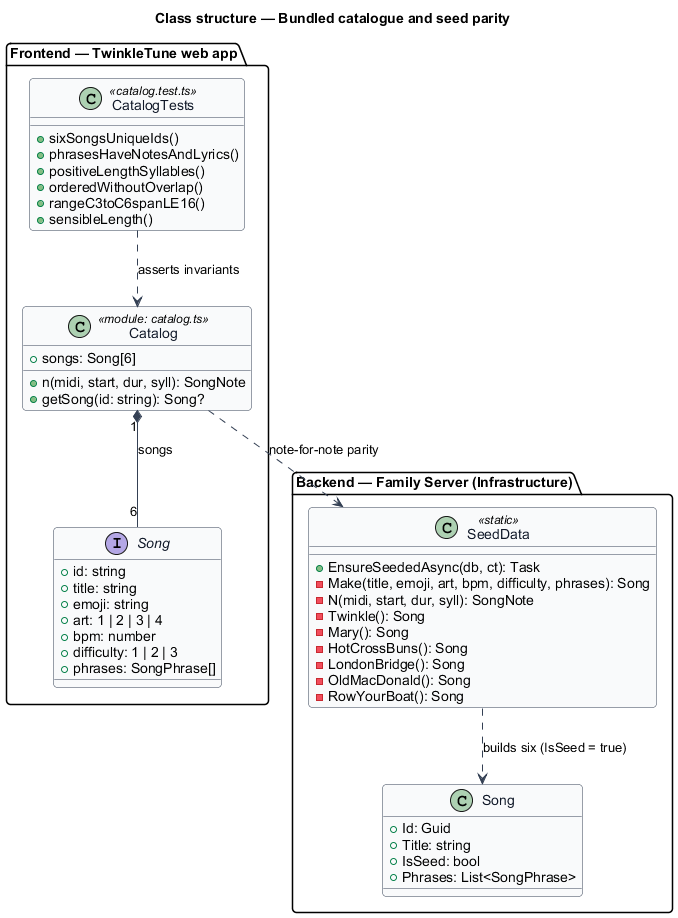
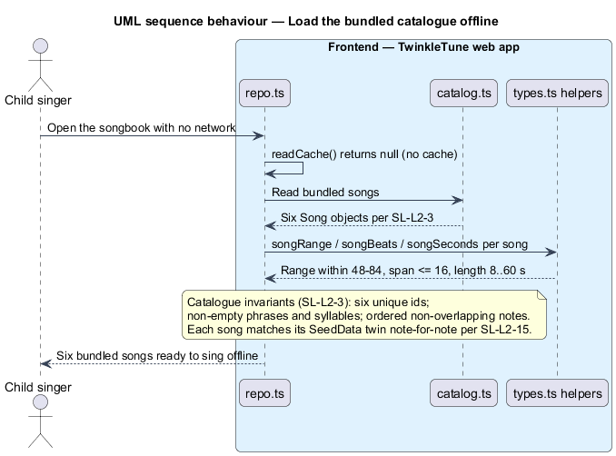

# Bundle the offline catalogue

## Overview

TwinkleTune is offline-first: a child can open the app with no network and no
setup and start singing at once. That promise rests on a catalogue of songs
shipped inside the app itself. This feature covers that bundled catalogue and
its agreement with the family server's starting content.

- **bundled catalogue** — fixed set of songs compiled into the web app and
  available with zero configuration and zero network
- **public-domain song** — song whose melody and words carry no copyright, so it
  ships freely inside the product
- **catalogue invariant** — property every bundled song holds: unique id,
  non-empty phrases and syllables, ordered non-overlapping notes, a
  child-singable range, and a sensible length
- **seed data** — the family server's initial song rows, written to the database
  the first time it starts
- **seed parity** — note-for-note agreement between the bundled catalogue and the
  seed data, so the seven songs are identical online or offline

The catalogue holds exactly seven public-domain songs. The same seven are
seeded into the family server on first run, encoded note-for-note the same way.
Parity means a family switching between offline and server-backed play sees one
unchanging set of starter songs.

## Description

Frontend — TwinkleTune web app (`frontend/apps/game/src/songs/catalog.ts`):

- **`songs`** — exported array of seven `Song` objects: `twinkle` (Twinkle Twinkle
  Little Star), `mary` (Mary Had a Little Lamb), `hotcrossbuns` (Hot Cross Buns),
  `londonbridge` (London Bridge), `oldmacdonald` (Old MacDonald),
  `rowyourboat` (Row, Row, Row Your Boat), and `jesuslovesme` (Jesus Loves Me).
  Each id is a slug.
- **`n`** — local helper `n(midi, start, dur, syll)` that builds one `SongNote`,
  keeping the hand-encoded melodies compact.
- **`getSong`** — resolves a bundled song by id from the array.
- Every melody is written at a C-major base key (MIDI 60 = C4); the player
  transposes per voice at run time.

Frontend — catalogue invariant tests
(`frontend/apps/game/src/songs/catalog.test.ts`):

- Asserts `songs.length` is `7` with seven distinct ids.
- Per song: every phrase has a non-empty lyric and at least one note; every note
  has positive `dur` and a non-empty `syll`; notes stay in order without overlap
  (`notes[i].start + 1e-6 >= notes[i-1].start + notes[i-1].dur`).
- Per song: `songRange` stays within MIDI 48–84 with span ≤ 16; `songBeats` is
  greater than 8 and `songSeconds` is under 60.

Backend — Family Server, Infrastructure
(`backend/src/TwinkleTune.Infrastructure/Persistence/SeedData.cs`):

- **`EnsureSeededAsync`** — idempotent seeding. It guards on
  `db.Songs.AnyAsync` and only adds songs to an empty table, so re-running never
  duplicates content.
- **`Make`** and **`N`** — builders mirroring the frontend `n` helper; `Make`
  sets `IsSeed = true` and a fresh `Guid` id.
- **`Twinkle`**, **`Mary`**, **`HotCrossBuns`**, **`LondonBridge`**,
  **`OldMacDonald`**, **`RowYourBoat`**, **`JesusLovesMe`** — one builder per
  song, encoded note-for-note identical to `frontend/apps/game/src/songs/catalog.ts` per
  the file's own header comment.

## Requirements

The feature realizes the following level-2 (L2) requirements. Each refines one or
more level-1 (L1) requirements, cited by identifier.

| L2 ID | Refines (L1) | Requirement |
|-------|--------------|-------------|
| `SL-L2-3` | `SL-L1-2, SL-L1-7` | The product shall bundle exactly seven public-domain songs — Twinkle Twinkle Little Star, Mary Had a Little Lamb, Hot Cross Buns, London Bridge, Old MacDonald, Row Row Row Your Boat, and Jesus Loves Me — each with unique id and each satisfying the catalogue invariants. |
| `SL-L2-15` | `SL-L1-7` | The server's seed songs shall match the bundled catalogue note-for-note, so the seven songs are identical whether served online or bundled offline. |

## Diagrams

### System context

The bundled catalogue makes the child singer independent of the network; the
Family Server holds the same seven songs as its seed data.

### Containers

The seven songs are compiled into the web app and, separately, seeded into the
family database on the server's first run; the two sources are kept in parity.

### Components

`catalog.ts` supplies the seven `Song` objects to the offline repository, while
`SeedData` writes the identical seven into the family database through
`AppDbContext`.

### Class structure

The catalogue is an array of the shared `Song` type; `SeedData` builds the same
`Song` shape server-side, and the invariant tests read the derived helpers.

### Behaviour — load the bundled catalogue offline

With no network and no cache, the repository serves the seven bundled songs
directly; the catalogue invariants hold and each song matches its seed twin
note-for-note.

