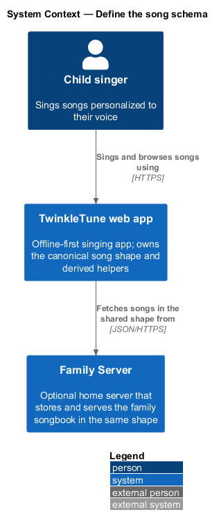
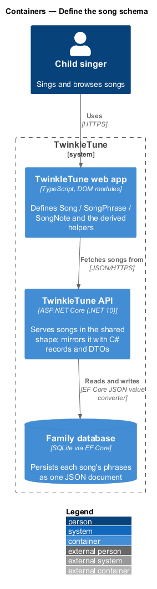
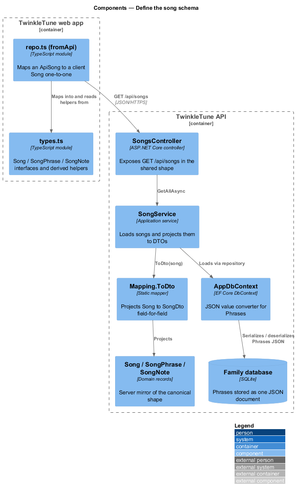
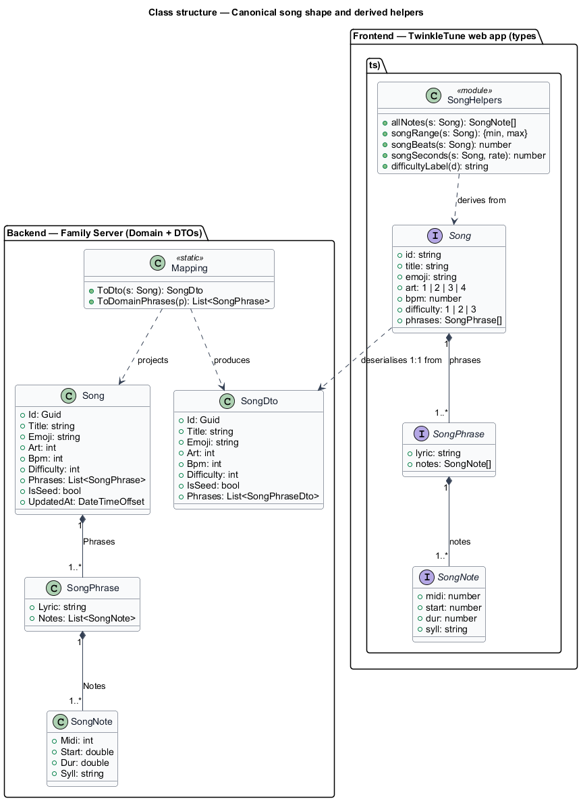
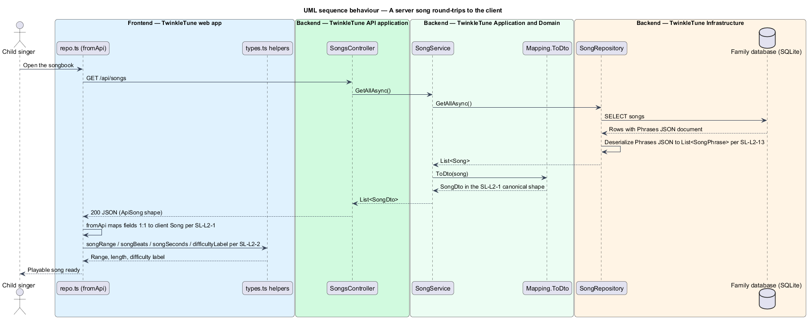

# Define the song schema

## Overview

TwinkleTune is a singing app for children that personalizes each song to the
young singer's voice. A *song* in TwinkleTune is not a recording; it is
structured note data that the app renders, transposes, and synthesizes on the
device. This feature defines the one canonical shape that data takes, and the
helpers that read facts back out of it.

- **canonical song shape** — single object structure `{ id, title, emoji, art,
  bpm, difficulty, phrases[] }` used unchanged on the client and the family
  server
- **phrase** — one lyric line paired with the notes that carry it
- **note** — one sung syllable, given as a MIDI pitch at the base key, a start
  time in beats, a duration in beats, and its syllable text
- **base key** — reference tuning where MIDI 60 is middle C (C4), against which
  every stored pitch is written before per-voice transposition
- **derived helper** — pure function that computes a fact from note data alone,
  such as a song's pitch range, its length, or its difficulty label

The shape exists once and is shared. A song fetched from the family server
deserializes field-for-field into the client type with no translation layer, so
the same object round-trips through synthesis, transposition, scoring, the
server's JSON column, and the offline cache. Because the representation is
identical everywhere, a song authored in one place is playable in every other.

## Description

The schema lives in the frontend as TypeScript interfaces and in the backend as
C# records and one entity, with a mapping layer that proves the two are the same
shape.

Frontend — TwinkleTune web app (`frontend/src/songs/types.ts`):

- **`SongNote`** — interface with `midi`, `start`, `dur`, and `syll`. `midi` is
  the pitch at the base key (60 = C4); `start` and `dur` are in beats.
- **`SongPhrase`** — interface with a `lyric` string and a `notes` array.
- **`Song`** — interface with `id`, `title`, `emoji`, `art` (`1 | 2 | 3 | 4`),
  `bpm`, `difficulty` (`1 | 2 | 3`), and `phrases`.
- **`allNotes`** — flattens a song's phrases into a single ordered note list.
- **`songRange`** — returns the minimum and maximum note MIDI across the song.
- **`songBeats`** — returns the end beat of the last note (`start + dur`).
- **`songSeconds`** — converts length to seconds, rate-aware:
  `songBeats / bpm · 60 / rate`.
- **`difficultyLabel`** — maps `1`, `2`, `3` to `⭐ Easy`, `⭐⭐ Medium`,
  `⭐⭐⭐ Brave`.

Backend — Family Server, Application and Domain
(`backend/src/TwinkleTune.Domain/Entities/Song.cs`):

- **`SongNote`** — record `(int Midi, double Start, double Dur, string Syll)`,
  mirroring the client note field-for-field.
- **`SongPhrase`** — record `(string Lyric, List<SongNote> Notes)`.
- **`Song`** — entity with `Id` (`Guid`), `Title`, `Emoji`, `Art`, `Bpm`,
  `Difficulty`, `Phrases`, plus the server-only `IsSeed` and `UpdatedAt`.
- **`SongDto`**, **`SongPhraseDto`**, **`SongNoteDto`**
  (`backend/src/TwinkleTune.Application/Dtos/Dtos.cs`) — the wire shape returned
  to the client; the note and phrase DTOs carry the same four and two fields.
- **`Mapping.ToDto`** (`backend/src/TwinkleTune.Application/Mapping.cs`) —
  projects a `Song` to a `SongDto` one field at a time, with no reshaping.

Backend — Family Server, Infrastructure
(`backend/src/TwinkleTune.Infrastructure/Persistence/AppDbContext.cs`):

- The `Song.Phrases` property persists through a JSON value converter:
  `JsonSerializer.Serialize` on write and `Deserialize<List<SongPhrase>>` on
  read, stored as one JSON document rather than note-per-row tables. A
  `ValueComparer` over the serialized form drives change tracking.

Frontend — mapping across the boundary
(`frontend/src/songs/repo.ts`, `frontend/src/api/client.ts`):

- **`ApiSong`** / **`ApiSongPhrase`** / **`ApiSongNote`** — TypeScript types for
  the server response, structurally equal to `Song` aside from the server-only
  `isSeed` flag.
- **`fromApi`** — maps an `ApiSong` to a `Song`, copying `phrases` straight
  through and clamping `art` and `difficulty` into their unions.

## Requirements

The feature realizes the following level-2 (L2) requirements. Each refines a
level-1 (L1) requirement, cited by identifier.

| L2 ID | Refines (L1) | Requirement |
|-------|--------------|-------------|
| `SL-L2-1` | `SL-L1-1` | A song shall be `{ id, title, emoji, art (1–4), bpm, difficulty (1–3), phrases[] }`, each phrase `{ lyric, notes[] }`, each note `{ midi, start, dur, syll }` with times in beats and MIDI at the base key (60 = C4). Client and server shall use this identical shape. |
| `SL-L2-2` | `SL-L1-1` | The library shall derive, from note data alone, a song's flattened note list, its MIDI range (min/max), its length in beats and seconds (rate-aware), and a difficulty label. |
| `SL-L2-13` | `SL-L1-1` | A song's phrases/notes shall persist as a single JSON document mirroring the client shape, rather than as note-per-row tables, so the server and client representations remain identical. |

## Diagrams

### System context

A child singer plays songs through the TwinkleTune web app, which optionally
draws additional songs from the Family Server. Both tiers hold the same song
shape.

### Containers

The song shape is defined in the web app and mirrored by the TwinkleTune API,
whose Infrastructure persists a song's phrases as one JSON document in the
family database.

### Components

The schema types and derived helpers sit in the web app; the API projects a
stored `Song` to a `SongDto` through `Mapping.ToDto`, and the JSON value
converter round-trips `Phrases`.

### Class structure

The class diagram is central to this feature. It shows `Song` composed of
`SongPhrase`, each composed of `SongNote`, on both tiers, alongside the derived
helpers and the DTO mirror that keeps the shapes identical.

### Behaviour — a server song round-trips to the client

The Infrastructure deserializes the phrases JSON, `Mapping.ToDto` projects the
shape unchanged, `fromApi` maps it one-to-one into the client `Song`, and the
derived helpers read range, length, and difficulty label from note data.

