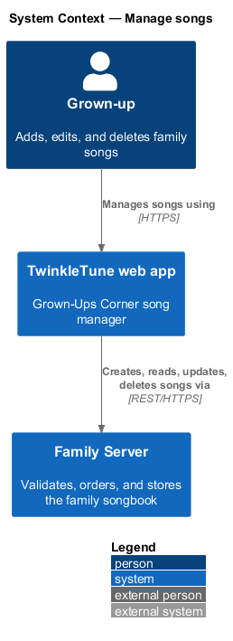
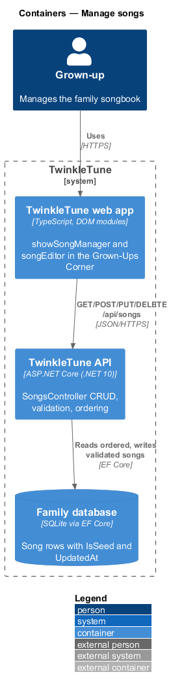
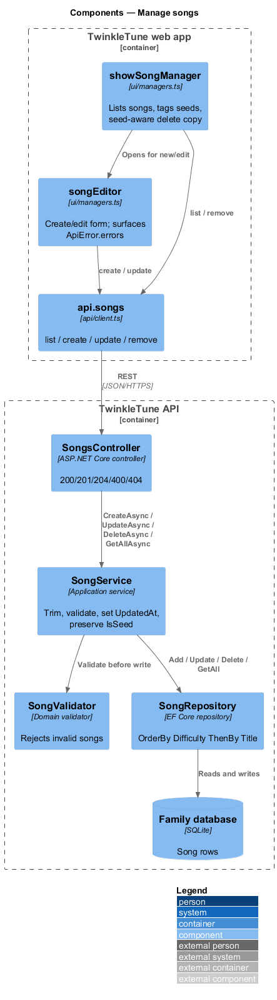
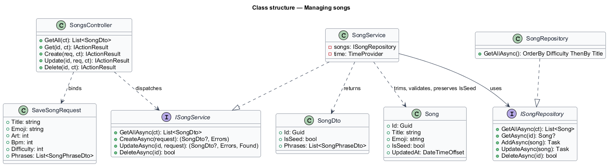
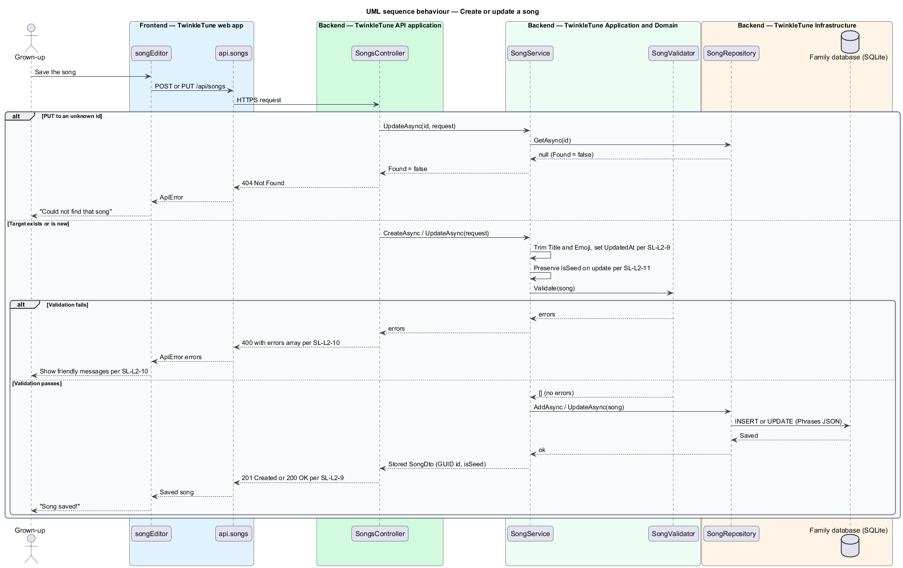
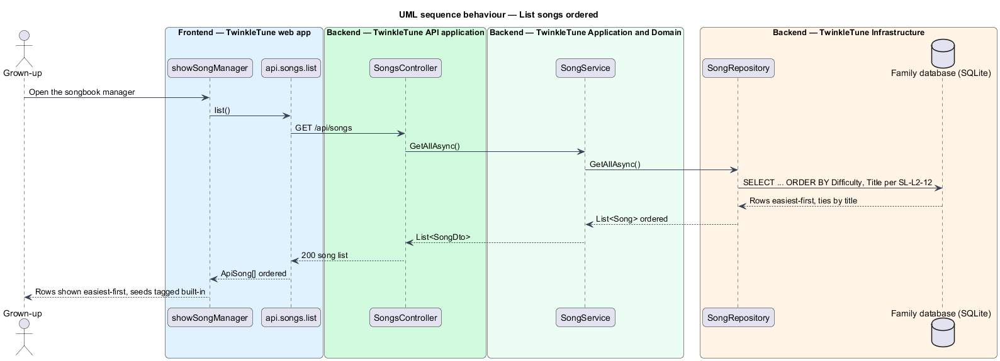
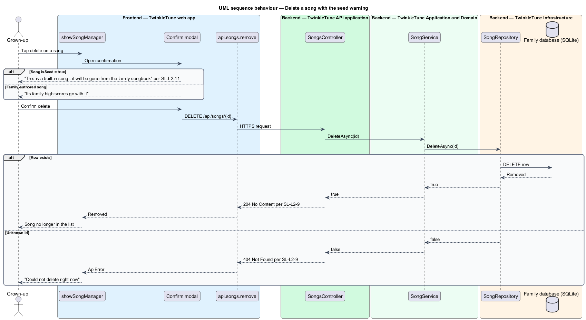

# Manage songs

## Overview

Families that run the optional Family Server can grow their own songbook. This
feature is the server-side create, read, update, and delete (CRUD) of songs,
together with how the app surfaces validation feedback, protects built-in songs,
and orders the list.

- **CRUD** — the four lifecycle operations on a song: create, read, update,
  delete
- **Grown-Ups Corner** — the app area where an adult manages songs, gated away
  from the child-facing screens
- **seed song** — built-in public-domain song written by seeding and flagged
  `IsSeed`, distinct from a family-authored song
- **validation feedback** — the `errors` array a failed save returns, rendered to
  the grown-up as friendly messages
- **stored song** — song persisted on the server, identified by a GUID and
  carrying an `UpdatedAt` timestamp

A grown-up adds a song through the editor; the server trims the title and emoji,
validates the song, assigns a GUID, records `UpdatedAt`, and stores it. Editing
a song preserves whether it is a seed. Deleting a seed song is surfaced with a
warning that a built-in song will leave the family songbook. The list is served
easiest-first so a child meets simpler songs before braver ones.

## Description

Backend — Family Server, API
(`backend/src/TwinkleTune.Api/Controllers/SongsController.cs`):

- **`GetAll`** — `GET /api/songs`, returns the ordered `SongDto` list.
- **`Get`** — `GET /api/songs/{id}`, `200` or `404`.
- **`Create`** — `POST /api/songs`; `Created` (`201`) with the stored song, or
  `BadRequest(new { errors })` (`400`).
- **`Update`** — `PUT /api/songs/{id}`; `404` when the id is unknown, `400` on
  validation failure, else `200`.
- **`Delete`** — `DELETE /api/songs/{id}`; `204` or `404`.

Backend — Family Server, Application
(`backend/src/TwinkleTune.Application/Services/SongService.cs`):

- **`CreateAsync`** — builds a `Song` with a new `Guid`, `Title` and `Emoji`
  trimmed, `IsSeed = false`, and `UpdatedAt = time.GetUtcNow()`; validates, then
  adds.
- **`UpdateAsync`** — loads the existing song, returns `Found = false` when
  absent, rebuilds with `IsSeed = song.IsSeed` preserved and a fresh
  `UpdatedAt`, validates, then copies fields and saves.
- **`DeleteAsync`** — delegates to the repository, which reports whether a row
  was removed.

Backend — ordering and persistence:

- **`SongRepository.GetAllAsync`**
  (`backend/src/TwinkleTune.Infrastructure/Repositories/Repositories.cs`) —
  `OrderBy(s => s.Difficulty).ThenBy(s => s.Title)`.
- **`SeedData`** — sets `IsSeed = true` on the six built-in songs.

Frontend — Grown-Ups Corner (`frontend/src/ui/managers.ts`):

- **`showSongManager`** — lists songs, tagging each seed row `built-in`, with
  edit and delete controls.
- **`songEditor`** — create or edit form; on save it calls
  `api.songs.create`/`update` and renders `ApiError.errors` when the server
  responds `400`.
- The delete confirmation shows seed-specific copy: a built-in song will be gone
  from the family songbook, versus a family song whose high scores go with it.

Frontend — REST client (`frontend/src/api/client.ts`):

- **`ApiError`** — carries the `errors` array parsed from a `400` body.
- **`api.songs`** — `list`, `create`, `update`, `remove`.

## Requirements

The feature realizes the following level-2 (L2) requirements. Each refines a
level-1 (L1) requirement, cited by identifier.

| L2 ID | Refines (L1) | Requirement |
|-------|--------------|-------------|
| `SL-L2-9` | `SL-L1-6` | The server shall expose `GET /api/songs`, `GET /api/songs/{id}`, `POST /api/songs`, `PUT /api/songs/{id}`, `DELETE /api/songs/{id}`, returning 200/201/204 on success and 404 when a targeted song does not exist; title and emoji shall be trimmed on save and `UpdatedAt` set. |
| `SL-L2-10` | `SL-L1-6` | When a create or update fails validation, the server shall respond 400 with an `errors` array of friendly messages; the client shall surface these messages to the grown-up. |
| `SL-L2-11` | `SL-L1-6` | Built-in songs shall be marked as seed content; updating a seed song shall preserve its seed flag; deletion of a seed song shall be surfaced with a warning that a built-in song will be removed from the family songbook. |
| `SL-L2-12` | `SL-L1-6` | The server song list shall be ordered by ascending difficulty then title, so easier songs appear first. |

## Diagrams

### System context

The grown-up manages the family songbook through the web app, which persists
changes on the Family Server.

### Containers

The Grown-Ups Corner calls the TwinkleTune API, which validates, orders, and
persists songs in the family database.

### Components

`SongsController` dispatches to `SongService`, which validates and delegates to
`SongRepository`; the manager UI surfaces returned errors and seed-aware delete
copy.

### Class structure

The controller, service, repository, and DTOs that carry a song through CRUD,
including the `IsSeed` flag and `UpdatedAt` timestamp.

### Behaviour — create or update a song

The server trims the title and emoji, validates, sets `UpdatedAt`, preserves
`IsSeed` on update, and returns `201`/`200`; a validation failure returns `400`
with errors and an unknown id returns `404`.

### Behaviour — list songs ordered

`GET /api/songs` returns the songs ordered by ascending difficulty then title.

### Behaviour — delete a song with the seed warning

Deleting a song confirms first; a seed song shows the built-in warning before the
`DELETE` call removes it.

