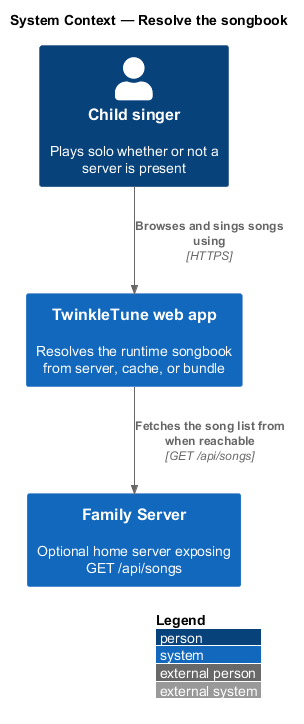
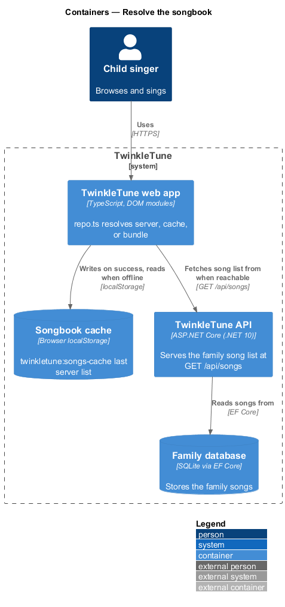
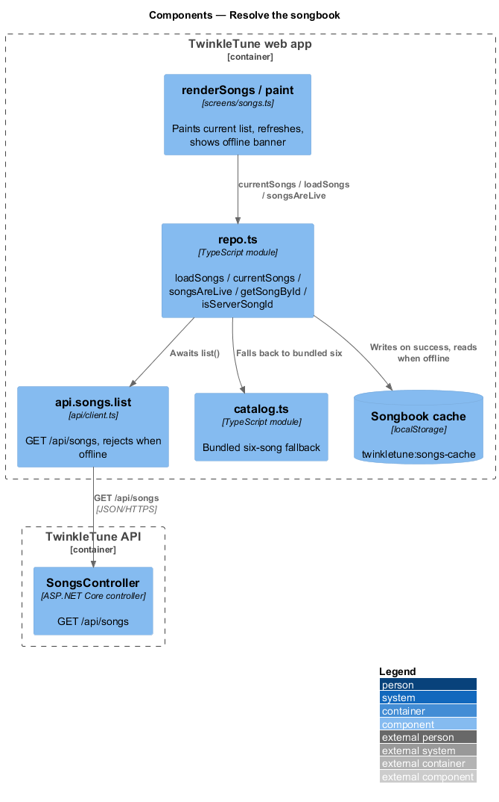
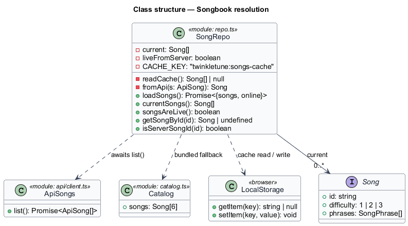
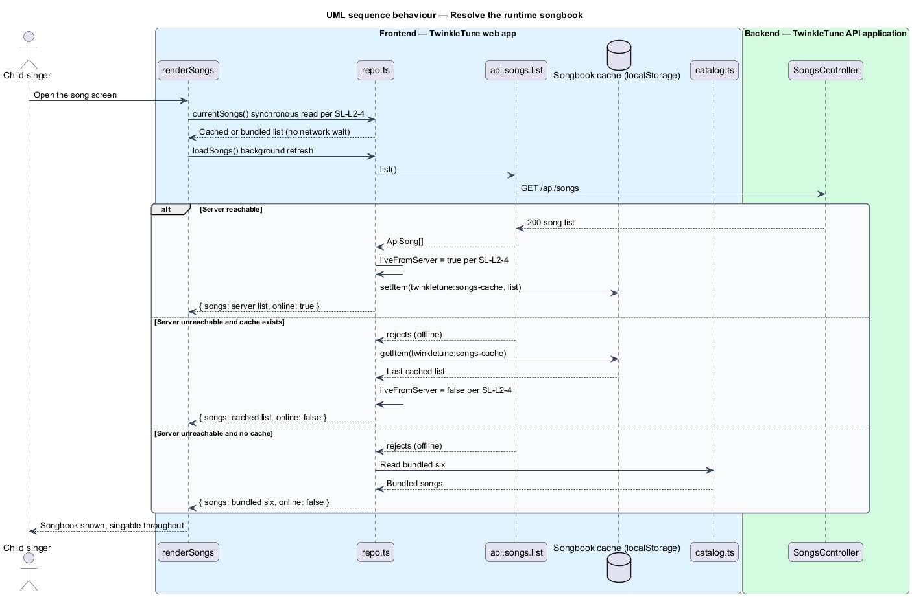
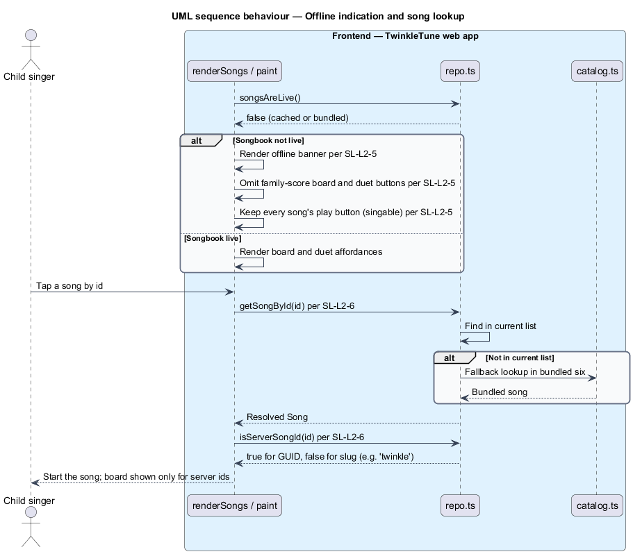

# Resolve the songbook

## Overview

TwinkleTune runs with or without a home server. When a family runs the optional
Family Server, it adds and edits songs there; when no server is present, the app
still plays. This feature decides, at run time, which list of songs the app
serves — and guarantees that solo play never waits on the network.

- **runtime songbook** — list of songs the app serves for the current session,
  chosen from three sources by a fixed priority
- **family server** — optional home server exposing the family's songs at
  `GET /api/songs`
- **songbook cache** — last server list saved in `localStorage` under the key
  `twinkletune:songs-cache`, so a previously seen songbook survives going offline
- **live songbook** — state in which the current list came from the server this
  session, as opposed to cache or bundle
- **server-originated id** — song id in GUID form, marking a song that came from
  the server, versus a bundled slug id such as `twinkle`

Resolution follows one order: the family-server list when reachable (and then
cached), otherwise the last cached list, otherwise the seven bundled songs. A
synchronous read always returns a usable list immediately; the network refresh
happens in the background. When the list is not live, the song screen shows an
offline notice and hides server-only affordances while keeping every song
singable.

## Description

Frontend — TwinkleTune web app (`frontend/apps/game/src/songs/repo.ts`):

- **`CACHE_KEY`** — the constant `'twinkletune:songs-cache'`.
- **`current`** — module-level list initialized to `readCache() ?? bundledSongs`,
  so the first synchronous read is already usable.
- **`liveFromServer`** — module-level flag, true only after a successful fetch.
- **`readCache`** — reads and parses the cached list, returning `null` on any
  error.
- **`fromApi`** — maps an `ApiSong` to a client `Song`, clamping `art` and
  `difficulty`.
- **`loadSongs`** — awaits `api.songs.list()`; on success it replaces `current`,
  sets `liveFromServer = true`, writes the cache (best-effort), and returns
  `{ songs, online: true }`; on failure it sets `liveFromServer = false` and
  returns the existing `current` with `online: false`.
- **`currentSongs`** — synchronous accessor returning `current`.
- **`songsAreLive`** — returns `liveFromServer`.
- **`getSongById`** — resolves an id from `current`, falling back to the bundled
  catalogue.
- **`isServerSongId`** — tests an id against a GUID regular expression.

Frontend — REST client (`frontend/apps/game/src/api/client.ts`):

- **`api.songs.list`** — issues `GET /api/songs` and returns `ApiSong[]`; any
  network or non-2xx result rejects, which `loadSongs` treats as offline.

Frontend — song screen (`frontend/apps/game/src/screens/songs.ts`):

- **`renderSongs`** — paints `currentSongs()` immediately, then calls
  `loadSongs()` and repaints with the resolved list and its `online` flag.
- **`paint`** — when `live` is false, renders an offline banner and omits the
  per-card high-score board and duet buttons; every song keeps its play button.
- **`showBoard`** — guarded by `isServerSongId`, so only server-originated songs
  open a family-score board.

## Requirements

The feature realizes the following level-2 (L2) requirements. Each refines a
level-1 (L1) requirement, cited by identifier.

| L2 ID | Refines (L1) | Requirement |
|-------|--------------|-------------|
| `SL-L2-4` | `SL-L1-3` | The runtime songbook shall be the family-server list when `GET /api/songs` succeeds (which is then cached), otherwise the last cached list, otherwise the bundled catalogue. A synchronous read shall always return a usable list without awaiting the network. |
| `SL-L2-5` | `SL-L1-3` | When the songbook is not live (server unreachable), the song list shall show an offline notice and shall omit server-only affordances (family-score board, duet), while keeping all songs singable. |
| `SL-L2-6` | `SL-L1-3` | The library shall resolve a song by id from the current songbook (falling back to the bundled catalogue) and shall classify an id as server-originated (GUID) versus bundled (slug). |

## Diagrams

### System context

The child singer plays through the web app, which draws its songbook from the
Family Server when reachable and from its own cache or bundle otherwise.

### Containers

The web app resolves its list against the TwinkleTune API and the browser's
`localStorage` cache, falling back to the compiled-in bundle.

### Components

`repo.ts` orchestrates resolution across `api.songs.list`, the `localStorage`
cache, and the bundled `catalog.ts`, and exposes lookup and id-origin helpers to
the song screen.

### Class structure

The repository module holds the `current` list and `liveFromServer` flag and the
functions that read, refresh, and classify the songbook.

### Behaviour — resolve the runtime songbook

The synchronous read returns immediately; the background refresh then resolves
across the three sources — server success caches and goes live, an unreachable
server with a cache serves cached content, and no cache falls back to the bundle.

### Behaviour — offline indication and song lookup

When the list is not live the screen shows the offline banner and hides
server-only affordances; a lookup resolves a song by id and classifies whether
the id is server-originated or bundled.

