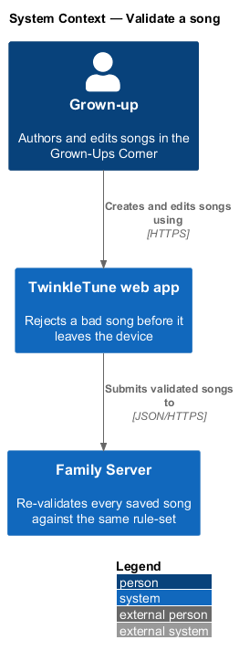
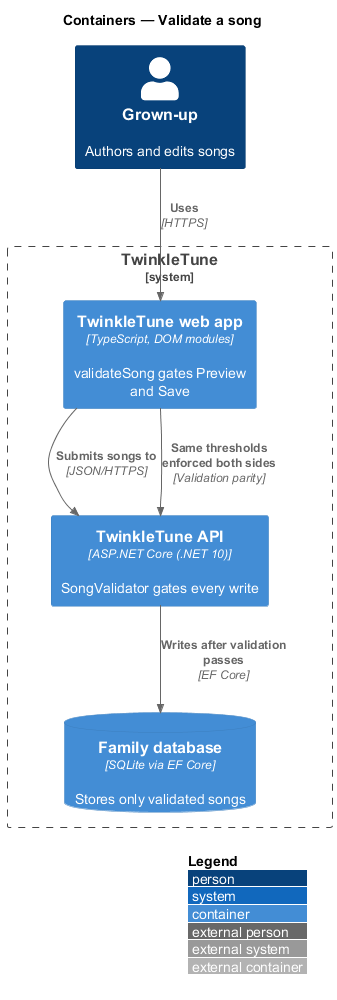
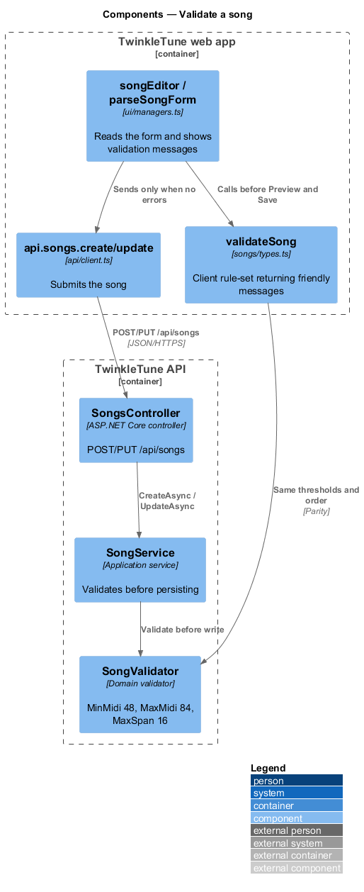
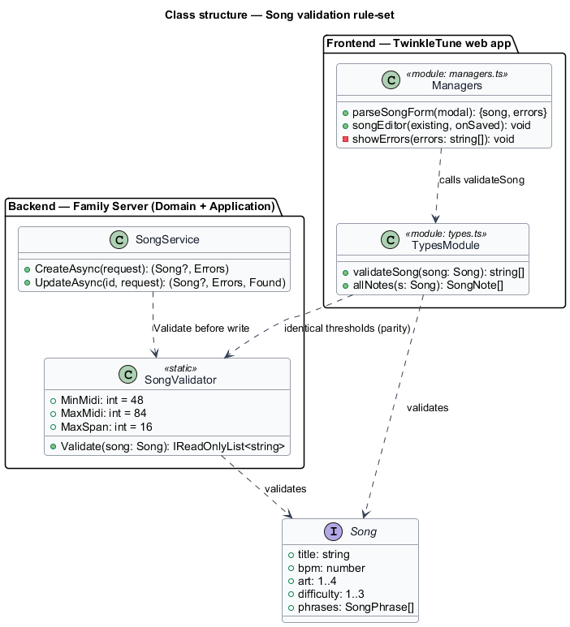
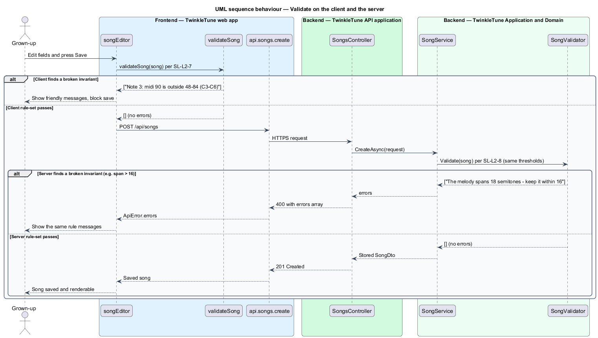

# Validate a song

## Overview

A song that saves in TwinkleTune is one a child can sing. This feature is the
rule-set that keeps every stored song well-formed and child-singable, enforced
identically on the client and on the family server.

- **song invariant** — rule a song holds to be renderable and singable, such as
  a pitch within the child range or notes that do not overlap
- **child-singable range** — MIDI 48 to 84 (C3 to C6), the band a young voice can
  reach after transposition
- **melody span** — distance in semitones between a song's lowest and highest
  note, capped at 16
- **friendly message** — short, plain-language string naming one broken rule, fit
  to show a grown-up in the song editor
- **validation parity** — property that the client and server apply the same
  thresholds, so the server never accepts a song the client cannot render

The rule-set is deliberately duplicated: once in the frontend so the editor
rejects a bad song before it leaves the device, and once in the backend so a
song that reaches the server is checked against the same thresholds. The
thresholds are the contract between the two: title length, tempo, art index,
difficulty, per-note pitch, melody span, note ordering, and non-empty lyrics and
syllables.

## Description

Frontend — TwinkleTune web app (`frontend/src/songs/types.ts`):

- **`validateSong`** — returns a `string[]` of friendly messages, empty when the
  song is well-formed. It checks: missing or over-long title (> 80), missing
  emoji, `art` outside 1–4, `bpm` outside 40–220, `difficulty` outside 1–3, zero
  phrases (returning early), a phrase with no lyric or no notes, a note with
  non-positive `dur`, a note with an empty `syll`, a note `midi` outside 48–84,
  a note overlapping the previous note (`n.start + 1e-6 < prev.start + prev.dur`),
  and a melody `span` exceeding 16 semitones.

Frontend — song editor (`frontend/src/ui/managers.ts`):

- **`parseSongForm`** — reads the editor fields, parses the phrases JSON, then
  appends `validateSong(song)` to the error list.
- **`songEditor`** — gates both Preview and Save on an empty error list;
  `showErrors` renders the messages inline.

Backend — Family Server, Domain
(`backend/src/TwinkleTune.Domain/Validation/SongValidator.cs`):

- **`MinMidi = 48`**, **`MaxMidi = 84`**, **`MaxSpan = 16`** — the named
  thresholds.
- **`Validate`** — returns an `IReadOnlyList<string>` built from the same checks
  in the same order as `validateSong`, using the same 40–220 BPM, 1–4 art, 1–3
  difficulty, 48–84 MIDI, and 16-semitone-span limits, the same
  `+ 1e-6` overlap tolerance, and the same early return on zero phrases.

Backend — Family Server, Application
(`backend/src/TwinkleTune.Application/Services/SongService.cs`):

- **`CreateAsync`** and **`UpdateAsync`** — call `SongValidator.Validate` before
  any write and abandon the save when the error list is non-empty.

## Requirements

The feature realizes the following level-2 (L2) requirements. Each refines a
level-1 (L1) requirement, cited by identifier.

| L2 ID | Refines (L1) | Requirement |
|-------|--------------|-------------|
| `SL-L2-7` | `SL-L1-4` | The client shall reject a song that violates any invariant, returning a list of friendly messages: missing/over-long title (>80), missing emoji, art outside 1–4, BPM outside 40–220, difficulty outside 1–3, zero phrases, a phrase with no lyric or no notes, a note with non-positive duration, a note with an empty syllable, a note MIDI outside 48–84, a note overlapping the previous note, or a melody span exceeding 16 semitones. |
| `SL-L2-8` | `SL-L1-4` | The server shall enforce the same invariants as the client (same thresholds: title ≤ 80, BPM 40–220, art 1–4, difficulty 1–3, MIDI 48–84, span ≤ 16, ordered non-overlapping notes, non-empty lyrics and syllables), so any song the server accepts the client can render. |

## Diagrams

### System context

The grown-up authors songs in the web app; both the app and the Family Server
apply the one rule-set so the two agree on what is singable.

### Containers

`validateSong` guards saves in the web app, and `SongValidator` guards writes in
the TwinkleTune API, against the same thresholds.

### Components

The editor calls `validateSong` before sending, and `SongService` calls
`SongValidator` before persisting; the two rule-sets carry identical thresholds.

### Class structure

`validateSong` and `SongValidator` expose the same checks; the diagram names the
shared thresholds and the shape they validate.

### Behaviour — validate on the client and the server

The editor rejects a bad song before it leaves the device; a song that reaches
the server is validated again against the same thresholds, so both tiers accept
and reject the same songs.

