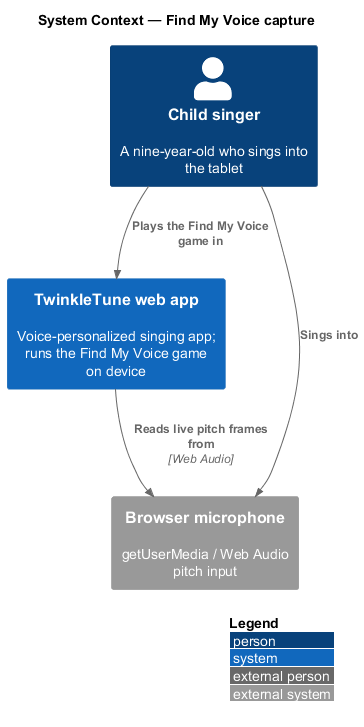
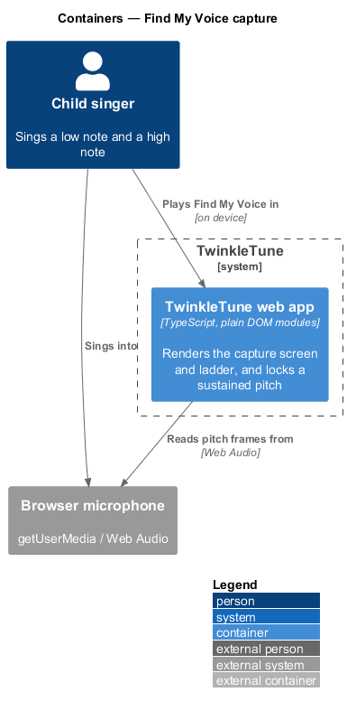
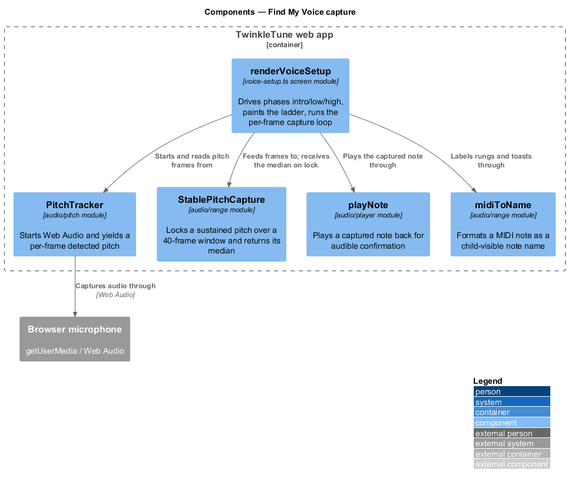
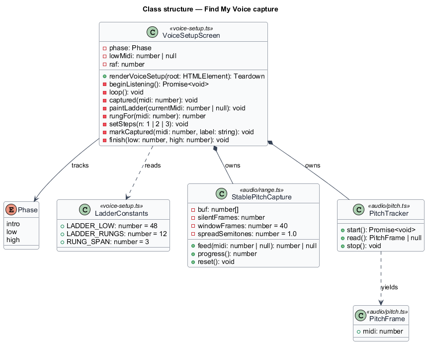
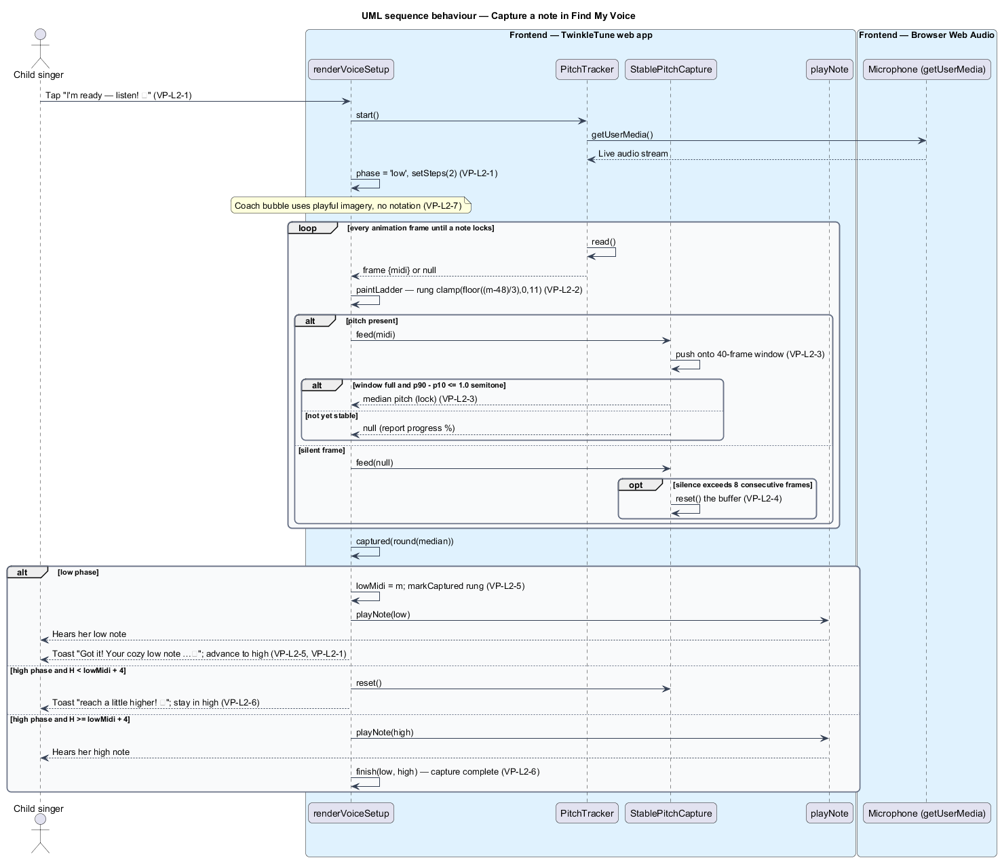

# Capture a singer's vocal range

## Overview

TwinkleTune is a voice-personalized singing app for children. Its central promise is that every
song is re-keyed to the individual singer, so a melody never sits too high or too low for her.
That promise rests on one input: the singer's comfortable vocal range. This feature captures that
range through a short, playful game a child can complete unaided.

**Find My Voice** — short, guided, game-like flow that captures a singer's comfortable low note and
high note

**vocal range** — pair of MIDI note numbers, a comfortable low note and a comfortable high note,
that bound where a singer sings without strain

**MIDI note number** — integer pitch identifier in which 60 denotes C4 and each step of 1 is one
semitone

**pitch ladder** — vertical strip of 12 rungs spanning C3 to C6, 3 semitones per rung, that
visualises the currently detected pitch

**detection window** — rolling buffer of 40 frames, about 0.7 s at 60 fps, over which pitch
stability is measured

**stable-pitch lock** — acceptance of a note once the detection window is full and the spread
between its 10th and 90th percentile detected pitches is at most 1.0 semitone

**separation guard** — rejection rule that declines a high note fewer than 4 semitones above the
captured low note

The flow presents three visible steps: an introduction, a low-note capture, and a high-note
capture. In each capture step the child sings a sustained note; the screen watches the detected
pitch until it holds steady, locks the note, plays it back so the child hears it, and moves on.
The low note is stored first, the high note second. A high note that fails the separation guard is
rejected with a gentle prompt rather than an error.

Capture runs fully on device and offline. The browser microphone supplies audio; the
`PitchTracker` in the Audio Engine turns it into per-frame pitch; the rest is screen logic and a
small stability filter. No server takes part. This feature is the front door to Voice
Personalization: `compute-transposition` consumes the captured range to re-key songs, and
`persist-and-sync-range` stores it against the singer. Denied-microphone handling and the
standard-key fallback live in `fall-back-without-range`; local persistence and server sync live in
`persist-and-sync-range`.

## Description

The feature is a frontend vertical slice inside the TwinkleTune web app, from the capture screen to
the browser microphone.

- **`renderVoiceSetup`** — screen module in `frontend/apps/game/src/screens/voice-setup.ts`. It builds the
  capture DOM, holds `phase` and `lowMidi`, and runs the animation-frame `loop`.
- **`Phase`** — union type `'intro' | 'low' | 'high'` naming the three steps.
- **`setSteps`** — advances the three-dot progress indicator to step 1, 2, or 3.
- **`LADDER_LOW = 48`, `LADDER_RUNGS = 12`, `RUNG_SPAN = 3`** — ladder constants spanning C3 to C6
  at 3 semitones per rung.
- **`rungFor`** — maps a MIDI note to a rung index, `clamp(floor((midi − 48) / 3), 0, 11)`.
- **`paintLadder`** — marks the current rung, lights the rungs below it, and places the singer's
  avatar marker on the current rung; shows no current rung when no pitch is detected.
- **`PitchTracker`** — pitch primitive in `frontend/packages/audio-engine/src/pitch.ts`. Its `start` opens the
  microphone, `read` returns the current frame with a `midi` value or `null`, and `stop` releases
  the microphone.
- **`StablePitchCapture`** — stability filter in `frontend/packages/audio-engine/src/range.ts`. `feed(midi | null)`
  accumulates a 40-frame window (`windowFrames = 40`), tolerates silent frames, and returns the
  median once the 10th-to-90th-percentile spread is within `spreadSemitones = 1.0`; `progress`
  reports 0..1 toward a lock; `reset` clears the buffer.
- **`beginListening`** — starts the tracker, routes a denied microphone to the mic-denied dialog
  (see `fall-back-without-range`), enters the `low` phase, and starts the loop.
- **`loop`** — per animation frame, reads a frame, paints the ladder, feeds the capture, and
  updates the "Keep holding it… n%" text from `progress`.
- **`captured`** — on lock, stores the low note and advances, or applies the separation guard and
  finishes the high note.
- **`markCaptured`** — marks a rung captured and labels it with `midiToName`.
- **`playNote`** — note synthesiser in `frontend/packages/audio-engine/src/player.ts`; plays the captured note back.
- **`midiToName`** — formatter in `range.ts` turning a MIDI number into a note name for the child.
- **`finish`** — stops the tracker, persists the range, and shows the completion modal (persistence
  detailed in `persist-and-sync-range`).

## Requirements

The feature realizes the following level-2 (L2) requirements. Each L2 requirement refines one or
more level-1 (L1) requirements, cited by identifier.

| L2 ID | Refines (L1) | Requirement |
|-------|--------------|-------------|
| `VP-L2-1` | `VP-L1-1` | The "Find My Voice" screen shall present exactly three visible steps — an introduction, a low‑note capture, and a high‑note capture — and shall advance a three‑dot progress indicator as the singer moves through them. |
| `VP-L2-2` | `VP-L1-1` | The screen shall display a ladder of 12 rungs spanning C3 to C6 (3 semitones per rung) and shall highlight the rung corresponding to the singer's currently detected pitch, filling in lower rungs to visualise how high she is singing. |
| `VP-L2-3` | `VP-L1-1, VP-L1-4` | Capture shall lock onto a note only after the singer holds a steady pitch for a full detection window (40 frames, ≈0.7 s at 60 fps) during which the spread between the 10th and 90th percentile of detected pitches is at most 1.0 semitone; on lock it shall return the median pitch and reset for the next capture. |
| `VP-L2-4` | `VP-L1-4` | A capture in progress shall survive brief detector dropouts (silent frames) but shall reset its buffer once silence exceeds 8 consecutive frames, so that a genuinely abandoned attempt does not produce a stale reading. |
| `VP-L2-5` | `VP-L1-1` | When the low note locks, the system shall store it as the range low, play the captured note back so the child hears it, mark the ladder rung as captured, confirm with an encouraging message, and advance to the high phase. |
| `VP-L2-6` | `VP-L1-4` | In the high phase, a captured pitch that is fewer than 4 semitones above the stored low note shall be rejected with a gentle "reach a little higher" prompt and shall not be accepted as the high note; only a pitch at least 4 semitones above the low note shall complete capture. |
| `VP-L2-7` | `VP-L1-1, VP-L1-7` | Each phase shall guide the child with playful, imagery‑based instructions ("a big cozy laaa", "squeak up high like a baby bird") and shall explain the benefit ("tunes every song to fit YOUR voice — never too high, never too low") without requiring the child to understand notes, octaves, or MIDI. |

## Diagrams

### System context

The child plays the Find My Voice game inside the TwinkleTune web app and sings into the browser
microphone, from which the app reads live pitch. No server participates.

### Containers

The capture screen is one container, the TwinkleTune web app; the browser microphone is the only
external it depends on.

### Components

Inside the web app, `renderVoiceSetup` drives the loop: `PitchTracker` supplies frames,
`StablePitchCapture` locks a sustained pitch, and `playNote` and `midiToName` confirm the result.

### Class structure

`VoiceSetupScreen` owns a `PitchTracker` and a `StablePitchCapture`, reads the ladder constants,
and tracks the current `Phase`.

### Behaviour — capture a note

The loop paints the ladder each frame and feeds the capture. An `opt` block shows the dropout
tolerance from `VP-L2-4`; the closing `alt` shows the low-note confirmation, the `VP-L2-6`
separation guard rejection, and high-note acceptance.

