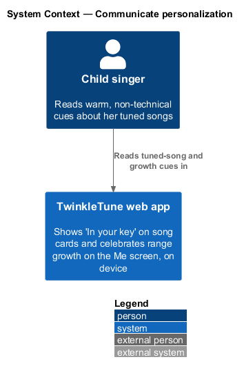
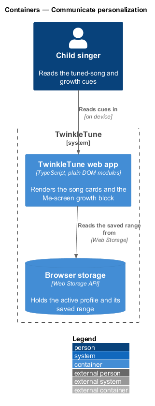
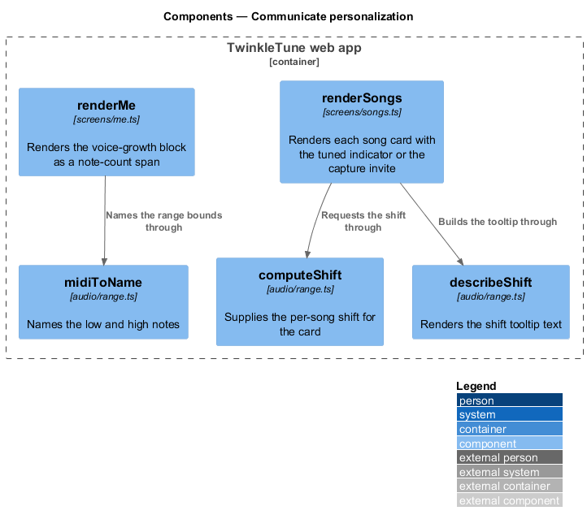
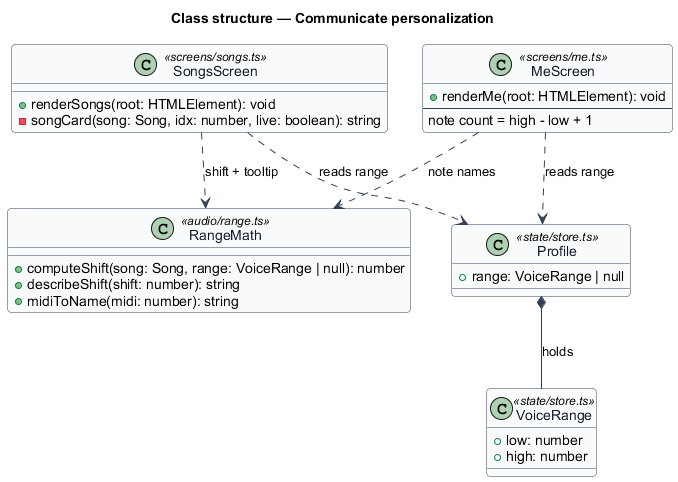
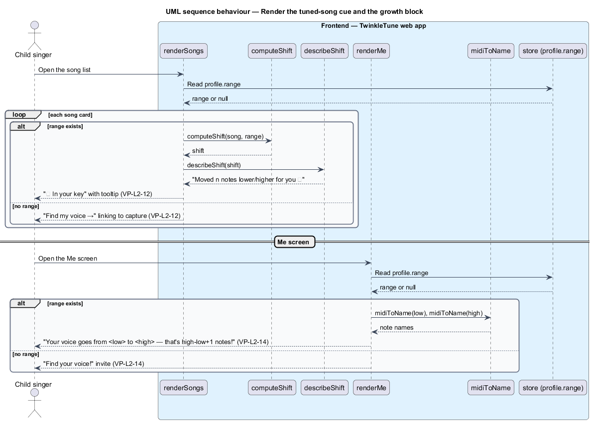

# Communicate the personalization

## Overview

Personalization only reassures a child if she can see it, and only in language she understands. The
app never asks a nine-year-old to read a key signature or a MIDI number to proceed. This feature
turns the stored range and the per-song shift into warm, non-technical cues: a per-song "in your
key" badge with a friendly tooltip, and a Me-screen block that celebrates the width of her voice as
a note count.

**tuned indicator** — per-song badge reading "✓ In your key" that marks a song re-keyed to the
singer

**shift tooltip** — kid-friendly phrase describing a song's shift, such as "Moved 2 notes lower for
you 💙"

**capture invite** — call to action reading "Find my voice →" shown on a song card when no range is
stored, linking to the capture screen

**growth block** — Me-screen panel that states the range in words and reports its width as a
note-count span, `high − low + 1`

When a range exists, each song card shows the tuned indicator, and its tooltip is the words
`describeShift` produces for that song's shift. When no range exists, the card shows the capture
invite instead, so the path to personalization is always one tap away. The Me screen reads the same
stored range: with a range it names the low and high notes and reports the note count; without one it
invites capture. A wider range captured later shows a larger count, which is how re-tuning becomes a
visible "your voice grew" moment.

The feature is frontend-only and reads the stored range that `persist-and-sync-range` maintains and
the shift that `compute-transposition` computes. It carries the kid-first, encouragement-only tone
into every surface where the shift appears. The completion summary shown immediately after capture
("You sing from <low> up to <high>") is produced by the `finish` step described in
`capture-vocal-range`.

## Description

The feature spans two screen modules in the TwinkleTune web app.

- **`renderSongs`** — screen module in `frontend/apps/game/src/screens/songs.ts`. Its inner `songCard` reads
  the profile range once; when a range exists it renders `✓ In your
  key` with the tooltip from `describeShift(computeShift(song, range))`, and when it does not
  it renders `<a class="tuned tuned-cta" href="#/voice">Find my voice →</a>`.
- **`renderMe`** — screen module in `frontend/apps/game/src/screens/me.ts`. Its `growthHTML` block, when a
  range exists, states "Your voice goes from <low> to <high> — that's <high − low + 1> notes!" using
  `midiToName`; otherwise it renders a "Find your voice!" link to `#/voice`.
- **`computeShift`** — function in `frontend/packages/audio-engine/src/range.ts` supplying the per-song shift (see
  `compute-transposition`).
- **`describeShift`** — function in `range.ts` rendering a shift as "Already a perfect fit!" at 0 or
  "Moved n notes lower/higher for you 💙" otherwise.
- **`midiToName`** — function in `range.ts` naming a MIDI note for the growth block.
- **`Profile.range`** — the stored `VoiceRange | null` both screens read from the state store.

## Requirements

The feature realizes the following level-2 (L2) requirements. Each L2 requirement refines one or more
level-1 (L1) requirements, cited by identifier.

| L2 ID | Refines (L1) | Requirement |
|-------|--------------|-------------|
| `VP-L2-12` | `VP-L1-2, VP-L1-6, VP-L1-7` | After capture, the system shall confirm the discovered range in words ("You sing from <low> up to <high>"). Song cards shall indicate, per song, that it is tuned to the singer ("✓ In your key", with a tooltip describing the shift) when a range exists, or invite capture ("Find my voice →") when it does not. |
| `VP-L2-14` | `VP-L1-5, VP-L1-7` | The progress ("Me") screen shall express the singer's range as a friendly note‑count span so a re‑captured, wider range is visibly celebrated. |

## Diagrams

### System context

The child reads tuned-song and growth cues in the TwinkleTune web app; no external system takes part.

### Containers

One container, the TwinkleTune web app, renders the cues; it reads the saved range from browser
storage.

### Components

`renderSongs` builds the tuned indicator from `computeShift` and `describeShift`; `renderMe` names
the range bounds through `midiToName`.

### Class structure

`SongsScreen` and `MeScreen` read the `Profile` range and call `RangeMath` for the shift, tooltip,
and note names.

### Behaviour — render the tuned cue and the growth block

The song-card loop shows the `VP-L2-12` tuned-versus-invite branch; the divider to the Me screen
shows the `VP-L2-14` note-count span against its no-range invite.

