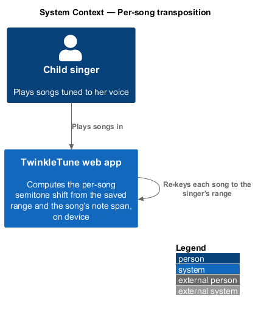
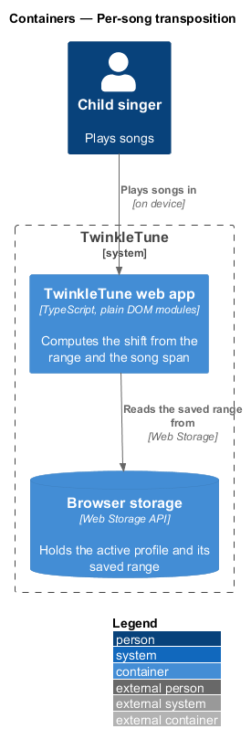
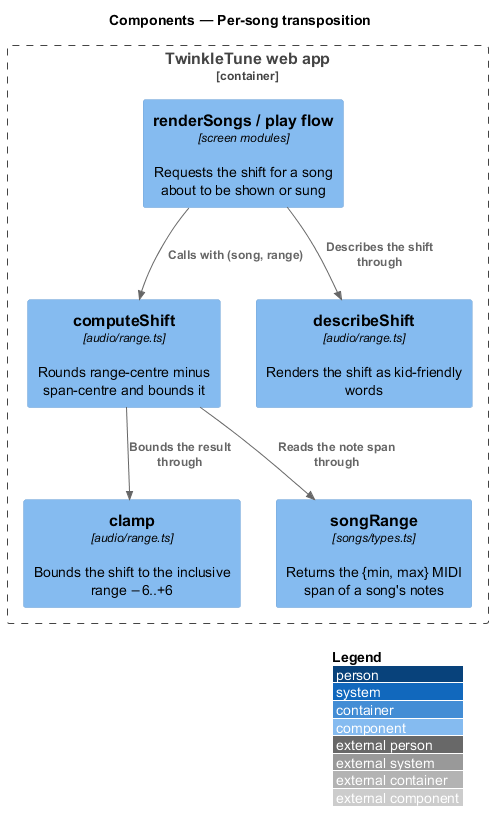
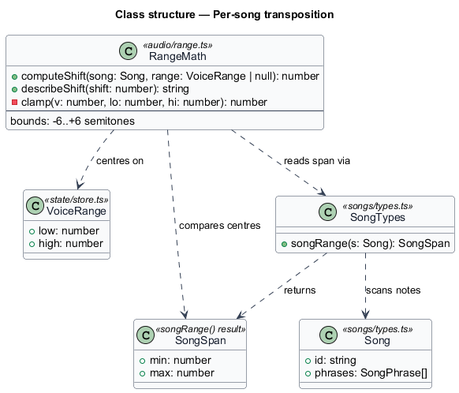
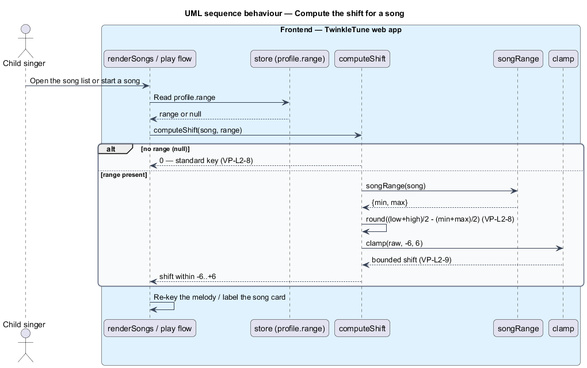

# Compute the per-song transposition

## Overview

TwinkleTune re-keys every song to the singer rather than asking the singer to reach the song's
written key. The amount of re-keying is a single number per song: the transposition, or shift. This
feature computes that number from the singer's saved range and the song's note span.

**transposition (shift)** — signed count of semitones by which a song is moved up or down so its
note span sits centred within the singer's range

**note span** — pair of the lowest and highest MIDI notes a song contains, returned as `{min, max}`

**range centre** — midpoint of the singer's range, `(low + high) / 2`

**span centre** — midpoint of a song's note span, `(min + max) / 2`

**standard key** — the song's own written key, used when no range is known, expressed as a shift of 0

The shift is the rounded difference between the range centre and the span centre. Moving the song so
its centre meets the voice centre keeps the melody as close to the middle of the child's comfortable
range as the song's own width allows. The result is bounded to −6..+6 semitones: beyond six
semitones, octave-folded scoring (owned by Scoring & Results) means a different octave already fits
better, so a larger shift adds no value. When no range is stored the shift is 0, which is how the
standard-key fallback in `fall-back-without-range` keeps solo play unblocked.

The computation is a pure function. It runs on device, takes a song and a range, and returns an
integer; it reads no microphone and calls no server. The captured range comes from
`capture-vocal-range` and is read from the saved profile that `persist-and-sync-range` maintains.
The rendered, artefact-free re-keying of the melody itself is owned by the Audio Engine; this
feature supplies only the shift value that the Audio Engine applies.

## Description

The feature is a frontend computation in the TwinkleTune web app, centred on one module.

- **`computeShift`** — function in `frontend/packages/audio-engine/src/range.ts`. It takes a `Song` and a
  `VoiceRange | null`. With a null range it returns 0. Otherwise it reads the song's span through
  `songRange`, computes `round(voiceCenter − songCenter)`, and bounds the result through `clamp`.
- **`clamp`** — private helper in `range.ts`, `clamp(v, lo, hi)`, applied as `clamp(raw, −6, 6)` so
  the shift stays within −6..+6 semitones inclusive.
- **`songRange`** — function in `frontend/apps/game/src/songs/types.ts`. It flattens a song's notes and
  returns `{ min, max }`, the lowest and highest MIDI notes.
- **`describeShift`** — function in `range.ts`. It renders a shift as kid-friendly words ("Already a
  perfect fit!" at 0, "Moved n notes lower/higher for you 💙" otherwise) for the song-card tooltip;
  the tooltip surface is detailed in `communicate-personalization`.
- **`VoiceRange`** — type in `frontend/apps/game/src/state/store.ts` with integer `low` and `high` MIDI notes.
- **`Song`** — type in `songs/types.ts` whose `phrases` hold the notes `songRange` scans.

`frontend/packages/audio-engine/src/range.test.ts` fixes the behaviour: 0 when the range is null, 0 when the song
already sits centred, a negative shift for a lower voice, and exactly +6 or −6 at the clamp bounds.

## Requirements

The feature realizes the following level-2 (L2) requirements. Each L2 requirement refines one or
more level-1 (L1) requirements, cited by identifier.

| L2 ID | Refines (L1) | Requirement |
|-------|--------------|-------------|
| `VP-L2-8` | `VP-L1-2, VP-L1-6` | For a given song and range, the system shall compute the shift as the rounded difference between the range centre and the song's note‑span centre — `round(((low+high)/2) − ((min+max)/2))` — and shall return 0 when no range is known. |
| `VP-L2-9` | `VP-L1-2` | The computed shift shall be clamped to the inclusive range −6..+6 semitones. |

## Diagrams

### System context

The child plays songs in the TwinkleTune web app, which re-keys each one to her range on device
without any external system.

### Containers

One container, the TwinkleTune web app, computes the shift; it reads the saved range from browser
storage.

### Components

`computeShift` reads a song's span through `songRange`, bounds the result through `clamp`, and
`describeShift` renders it in words for the caller.

### Class structure

`RangeMath` computes over a `VoiceRange` and a `Song`, comparing the range centre against the
`SongSpan` that `songRange` returns.

### Behaviour — compute the shift for a song

The caller reads the saved range and calls `computeShift`. The `alt` block shows the null-range path
returning 0 (`VP-L2-8`) and the computed path applying the clamp (`VP-L2-9`).

