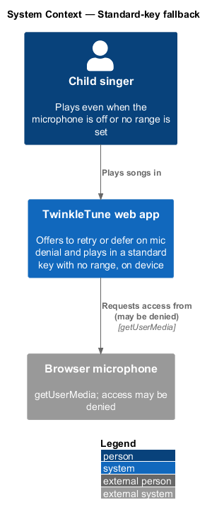
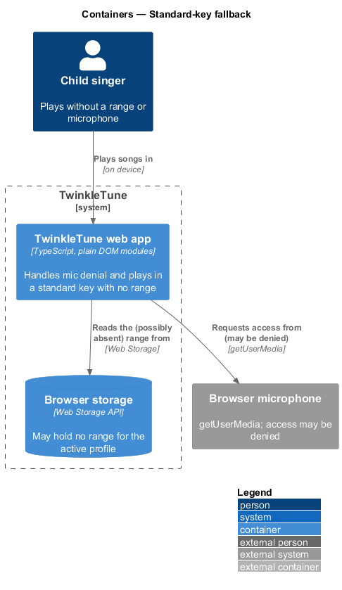
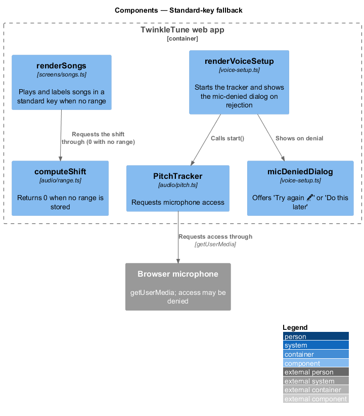
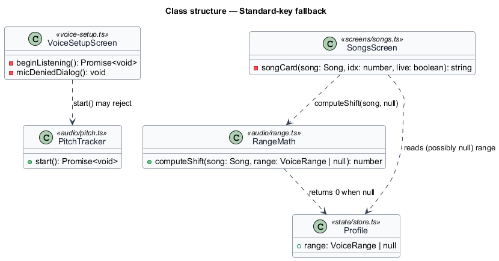
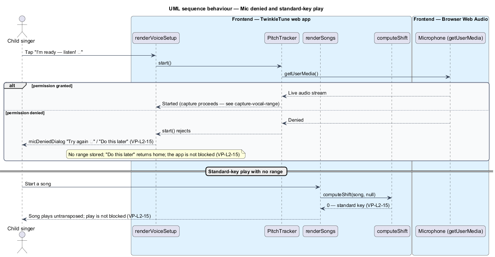

# Fall back without a range

## Overview

Personalization enhances play, but it never gates it. A child with the microphone switched off, or
one who has not yet played Find My Voice, still sings every song. This feature keeps solo play
unblocked in both cases: it handles a denied microphone gently, and it plays songs in a standard key
whenever no range is stored.

**standard key** — song's own written key, used when no range is known, expressed as a shift of 0

**mic-denied dialog** — gentle prompt shown when microphone access is refused, offering to retry or
to defer

**offline-first** — design principle (P2) under which personalization enhances play but never blocks
it

When capture starts, the screen asks the browser for microphone access. A refusal is caught and
turned into the mic-denied dialog rather than an error: the child sees "Try again 🎤" and "Do this
later", and no range is stored either way. Deferring returns home. Separately, whenever a song is
about to play with no range stored, the shift computation returns 0, so the song plays untransposed
in its standard key. Neither the missing microphone nor the missing range blocks play.

The feature is frontend-only and runs on device. It draws the zero-shift behaviour from
`compute-transposition` and the capture entry from `capture-vocal-range`; retrying capture from the
dialog re-enters that game. Latency compensation for a working microphone is a device property owned
by Grown-Ups Corner and is out of scope here.

## Description

The feature spans the capture screen and the song list in the TwinkleTune web app.

- **`beginListening`** — capture starter in `frontend/src/screens/voice-setup.ts`. It awaits
  `tracker.start()` inside a `try/catch`; on rejection it calls `micDeniedDialog` and returns without
  entering a capture phase.
- **`micDeniedDialog`** — modal in `voice-setup.ts`. Its "Try again 🎤" button re-runs
  `beginListening`; its "Do this later" button sets the hash to `#/home`. No range is written.
- **`PitchTracker`** — pitch primitive in `frontend/src/audio/pitch.ts`; its `start` rejects when
  `getUserMedia` is denied.
- **`computeShift`** — function in `frontend/src/audio/range.ts` that returns 0 when its range
  argument is `null`.
- **`renderSongs`** — song list in `frontend/src/screens/songs.ts`. With no range it labels cards
  "Standard key" and plays each song at shift 0; play is never gated on a range.
- **`Profile.range`** — the `VoiceRange | null` field read before each shift; `null` selects the
  fallback.

## Requirements

The feature realizes the following level-2 (L2) requirement. It refines a level-1 (L1) requirement,
cited by identifier.

| L2 ID | Refines (L1) | Requirement |
|-------|--------------|-------------|
| `VP-L2-15` | `VP-L1-6` | If the microphone is denied during capture, the system shall offer to try again or defer, without blocking the app; with no range stored, songs shall play in a standard key (shift 0) so solo play continues unimpeded. |

## Diagrams

### System context

The child plays songs in the TwinkleTune web app, which requests microphone access that may be
denied; play continues either way.

### Containers

One container, the TwinkleTune web app, handles mic denial and reads the possibly-absent range from
browser storage.

### Components

`renderVoiceSetup` shows `micDeniedDialog` when `PitchTracker.start` rejects; `renderSongs` requests
a shift that `computeShift` returns as 0 with no range.

### Class structure

`VoiceSetupScreen` depends on `PitchTracker`, whose `start` may reject; `SongsScreen` reads a null
`Profile` range and calls `computeShift`, which returns 0.

### Behaviour — mic denied and standard-key play

The opening `alt` contrasts a granted microphone against the denied path that shows the dialog; the
divider shows a song playing at shift 0 with no range (`VP-L2-15`).

