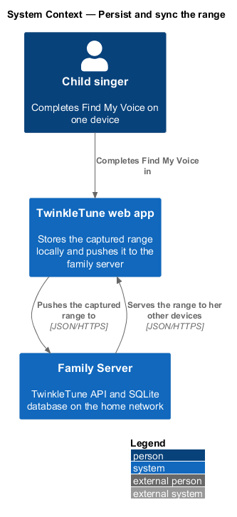
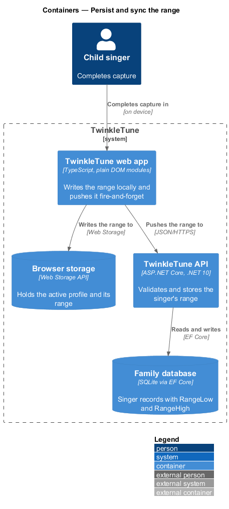
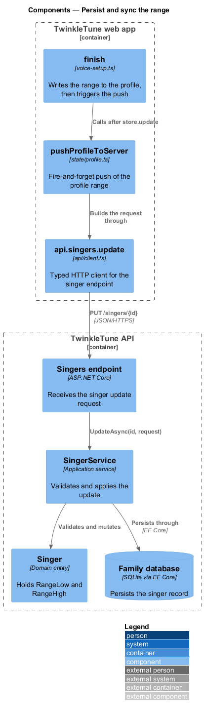
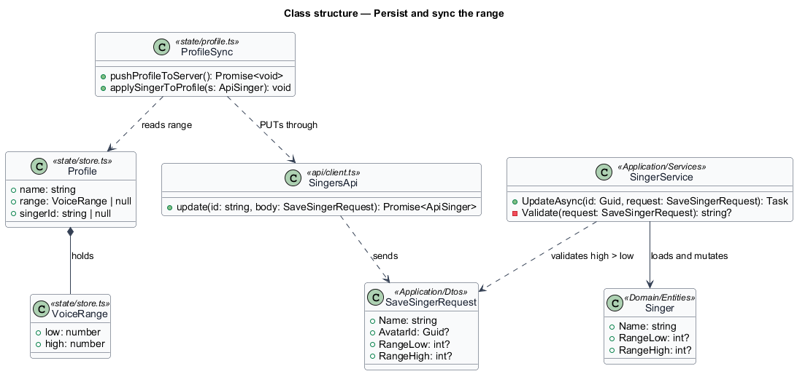
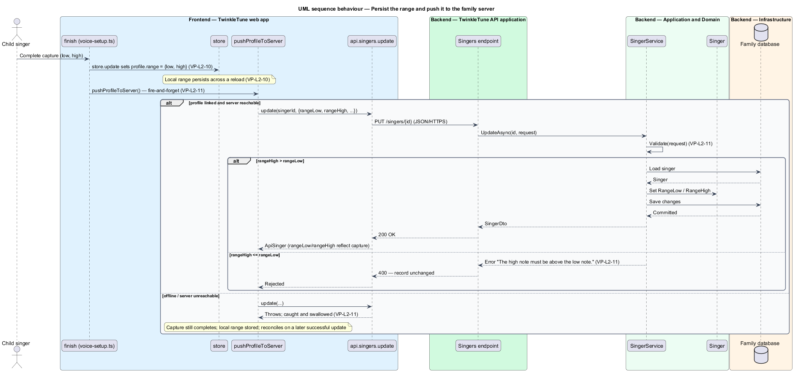

# Persist and sync the range

## Overview

A captured vocal range is a property of the person, not of the device she happened to use. A child
should tune her voice once and have every tablet in the home know it. This feature stores the
captured range against the singer's local profile and, when the family server is reachable, pushes
it to the singer's server record so the range follows her across devices.

**profile** — local record of the active singer held in browser storage, carrying her name, avatar,
range, and, when linked, a server singer id

**family server** — TwinkleTune API and SQLite database on the home network that hold the shared
singer records

**singer record** — server-side `Singer` entity carrying `RangeLow` and `RangeHigh`, the durable
home for a range that follows the singer between devices

**fire-and-forget push** — server update issued without awaiting or surfacing its result, so a
failure never blocks the child

**range validation** — server rule that rejects a range whose high note is not above its low note

On completing capture, the range is written to the local profile first, so subsequent play is tuned
even with no server present. The push follows: when the profile is linked to a family server, the
range is sent to the singer record. The server validates that the high note exceeds the low note and
rejects the update otherwise. A push that fails because the server is unreachable is swallowed;
capture still completes with the local range stored, and the server copy reconciles on a later
successful update.

This feature spans the full stack: the TwinkleTune web app writes the local range and issues the
push, and the Family Server validates and stores it. It sits downstream of `capture-vocal-range`,
which supplies the values, and upstream of `compute-transposition` and `communicate-personalization`,
which read the stored range. Switching and storage of the profile record itself are owned by Player
Profiles; this feature writes the range field.

## Description

The feature is a vertical slice from the capture screen to the family database.

- **`finish`** — completion step in `frontend/apps/game/src/screens/voice-setup.ts`. It calls `store.update`
  to set `profile.range` to `{ low, high }`, then calls `pushProfileToServer`.
- **`store`** — state container in `frontend/apps/game/src/state/store.ts`; it persists the profile to browser
  storage so the local range survives a reload.
- **`VoiceRange`** — type in `store.ts` with integer `low` and `high` MIDI notes.
- **`pushProfileToServer`** — function in `frontend/apps/game/src/state/profile.ts`. It returns early when the
  profile has no `singerId`, and otherwise PUTs the profile through `api.singers.update` inside a
  `try/catch` that swallows offline errors.
- **`api.singers.update`** — typed client in `frontend/apps/game/src/api/client.ts`. It sends a body with
  `rangeLow` and `rangeHigh` (and `name`, `avatarId`).
- **`SaveSingerRequest`** — request DTO carrying `Name`, `AvatarId`, `RangeLow`, `RangeHigh`.
- **`SingerService`** — application service in
  `backend/src/TwinkleTune.Application/Services/SingerService.cs`. Its `UpdateAsync` loads the
  singer, applies the fields, and saves; its private `Validate` returns "The high note must be above
  the low note." when `RangeHigh <= RangeLow`.
- **`Singer`** — domain entity in `backend/src/TwinkleTune.Domain/Entities/Singer.cs` with nullable
  `RangeLow` and `RangeHigh`. Its documentation records that the range lives on the person, while mic
  latency belongs to the device.

## Requirements

The feature realizes the following level-2 (L2) requirements. Each L2 requirement refines a level-1
(L1) requirement, cited by identifier.

| L2 ID | Refines (L1) | Requirement |
|-------|--------------|-------------|
| `VP-L2-10` | `VP-L1-3` | On completing capture, the system shall persist `{ low, high }` to the active singer's local profile so that subsequent play is tuned without re‑capture. |
| `VP-L2-11` | `VP-L1-3` | When the active profile is linked to a family server, the captured range shall be pushed to the singer record (fire‑and‑forget) so it follows the singer across devices; the server shall reject a range whose high note is not above its low note. A failed push (offline) shall not block capture and shall reconcile on a later successful update. |

## Diagrams

### System context

The child completes capture in the web app, which pushes her range to the Family Server; the server
later serves that range to her other devices.

### Containers

The web app writes the range to browser storage and pushes it to the TwinkleTune API, which persists
it in the family database.

### Components

`finish` writes the range then calls `pushProfileToServer`, which reaches the Singers endpoint;
`SingerService` validates and mutates the `Singer` entity and persists it.

### Class structure

`ProfileSync` reads the `Profile` range and PUTs it through `SingersApi`; `SingerService` validates
`SaveSingerRequest` and mutates the `Singer` entity.

### Behaviour — persist and push

The range is stored locally first. The outer `alt` shows the linked-and-reachable path against the
offline path; the inner `alt` shows server acceptance against the `VP-L2-11` high-above-low
rejection.

