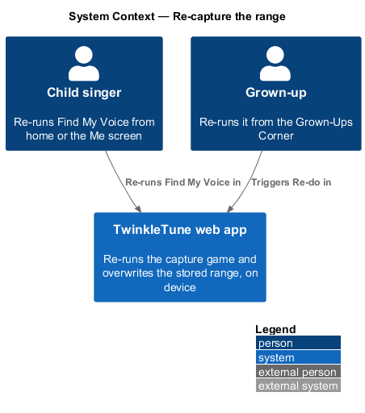
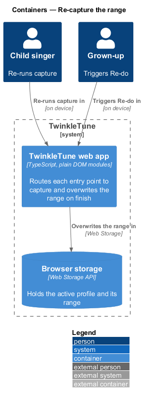
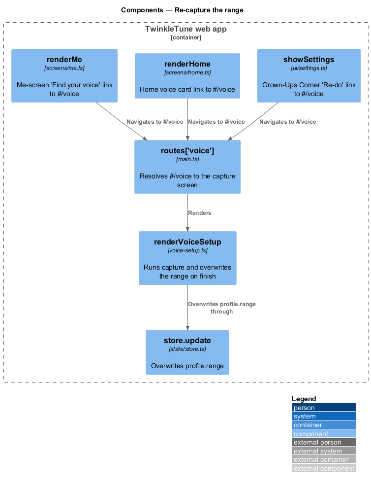
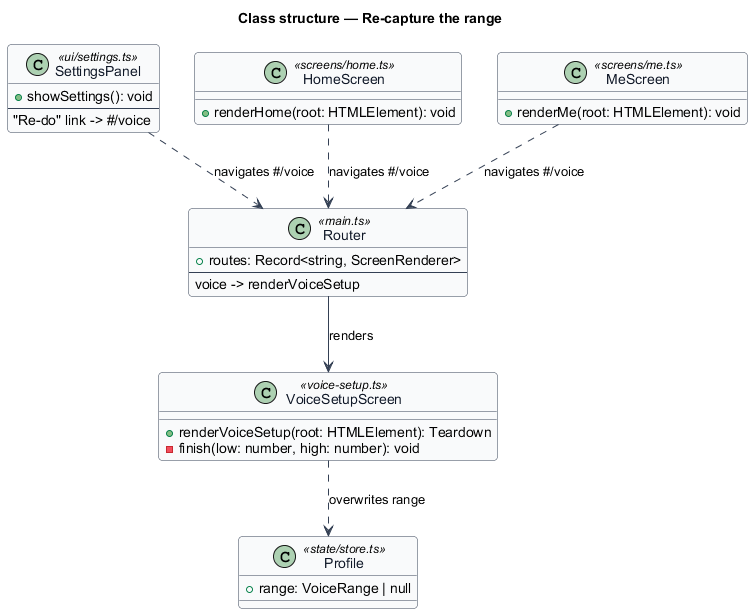
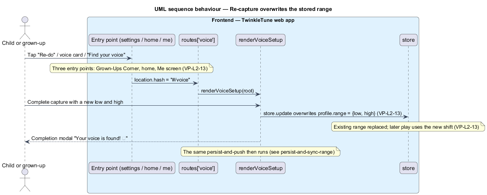

# Re-capture the range

## Overview

Children's voices grow. A range captured last term may sit too tight this term, so re-tuning stays
reachable at any time, from wherever the child or a grown-up happens to be. This feature routes
three entry points into the same capture game and replaces the stored range with the new capture.

**re-capture** — repeat run of Find My Voice that overwrites the stored range with a fresh low and
high note

**entry point** — screen affordance that navigates to the capture route `#/voice`

**Grown-Ups Corner** — settings surface reached through a parent gate, one of the three entry points

The three entry points are the Grown-Ups Corner "Re-do" control, the home-screen voice card, and the
Me-screen "Find your voice" link. Each sets the location hash to `#/voice`, which the router resolves
to the same `renderVoiceSetup` screen that first-time capture uses. Because the completion step
writes the range unconditionally, re-running capture overwrites any existing range; later play then
uses the new shift.

The feature is frontend-only for its own concern — routing and overwrite. The capture game itself is
detailed in `capture-vocal-range`, and the local persistence and server push that follow completion
are detailed in `persist-and-sync-range`; the same push reconciles the new range to the family
server. Surfacing the widened range as a "your voice grew" moment on the Me screen is detailed in
`communicate-personalization`.

## Description

The feature wires three screens to one route in the TwinkleTune web app.

- **`showSettings`** — Grown-Ups Corner in `frontend/src/ui/settings.ts`. Its voice-range row holds a
  "Re-do" link to `#/voice` and shows the current range label (`midiToName` low to high, or "not set
  yet").
- **`renderHome`** — home screen in `frontend/src/screens/home.ts`. Its voice card links to `#/voice`
  with the copy "Find my voice".
- **`renderMe`** — Me screen in `frontend/src/screens/me.ts`. Its growth block links to `#/voice`
  with "Find your voice!" when appropriate.
- **`routes['voice']`** — route table in `frontend/src/main.ts` mapping `voice` to `renderVoiceSetup`.
- **`renderVoiceSetup`** — capture screen in `frontend/src/screens/voice-setup.ts`. Its `finish`
  calls `store.update` to set `profile.range`, overwriting any prior value.
- **`store.update`** — mutation in `frontend/src/state/store.ts` that persists the overwritten
  `profile.range` to browser storage.

## Requirements

The feature realizes the following level-2 (L2) requirement. It refines a level-1 (L1) requirement,
cited by identifier.

| L2 ID | Refines (L1) | Requirement |
|-------|--------------|-------------|
| `VP-L2-13` | `VP-L1-5` | The system shall allow re‑running "Find My Voice" at any time from the Grown‑Ups Corner ("Re‑do"), from the home screen, and from the progress ("Me") screen; re‑running shall overwrite the stored range with the new capture. |

## Diagrams

### System context

A child re-runs Find My Voice from home or the Me screen, and a grown-up re-runs it from the
Grown-Ups Corner; both land in the same TwinkleTune web app.

### Containers

One container, the TwinkleTune web app, routes every entry point to capture and overwrites the range
in browser storage.

### Components

The settings, home, and Me screens each navigate to `routes['voice']`, which renders
`renderVoiceSetup`; on finish the screen overwrites `profile.range`.

### Class structure

`SettingsPanel`, `HomeScreen`, and `MeScreen` navigate to the `Router` voice route, which renders
`VoiceSetupScreen`; the screen overwrites the `Profile` range.

### Behaviour — re-capture overwrites the range

The single flow shows any of the three entry points reaching `#/voice`, capture completing, and
`store.update` overwriting the range so later play uses the new shift (`VP-L2-13`).

