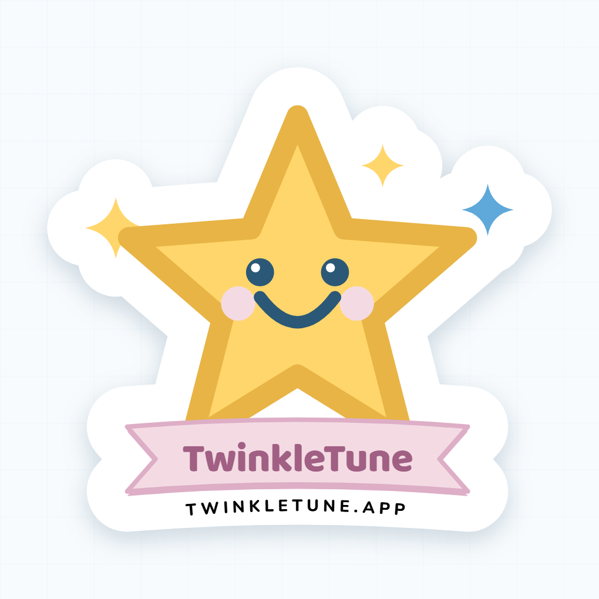
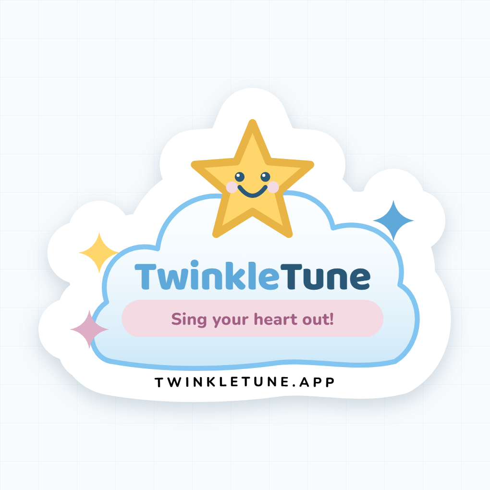
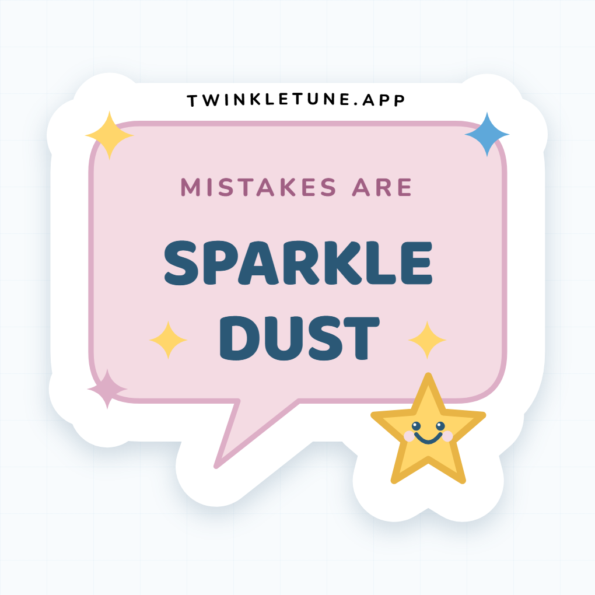
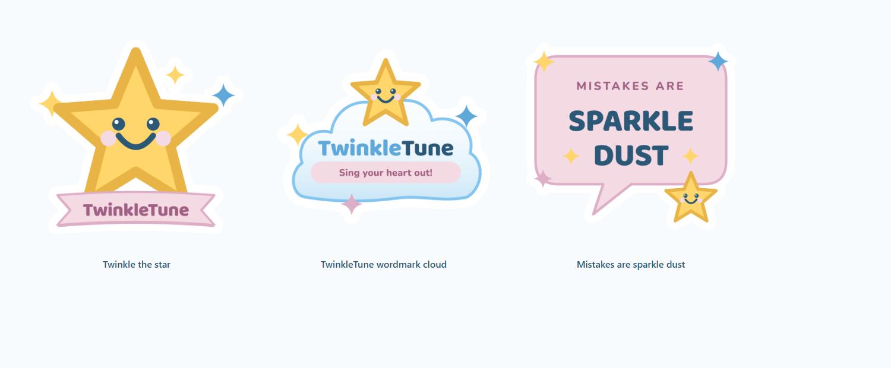

# TwinkleTune promotional stickers

Three die-cut vinyl stickers for giveaways — laptops, water bottles, the lid of
a keyboard case. Every shape, colour and glyph is derived from the app's own
assets rather than redrawn by eye, so a sticker on a laptop and the app on a
phone read as the same product.

| Source of truth | Reused for |
|---|---|
| `frontend/apps/game/src/styles/twinkle.css` | the whole palette and the 28px/999px radius language |
| `mascotSVG()` in `frontend/apps/game/src/ui/parts.ts` | Twinkle's star path, face, blush and happy mouth |
| `frontend/apps/game/public/icon.svg` | the app-icon star on the cloud sticker |
| `.logo` / `.logo .tw` in `frontend/apps/game/src/styles/screens.css` | the blue/ink wordmark split |

## The three designs

### 1 — Twinkle the star



The mascot at badge scale on a pink ribbon banner. The star is `mascotSVG()`
mapped onto the 900px canvas with `x' = 5.5x + 120, y' = 5.5y + 70`, so the
gold edge stays at its in-app 6.5%-of-width weight. The banner carries the app's
chunky-toy-button idiom: a `#DDAEC6` underlay offset 8px below the `#F4DBE3`
face.

### 2 — TwinkleTune wordmark cloud



The wordmark in Baloo 2 800 — `Twinkle` in `#5EA8DA`, `Tune` in `#2B5876`,
exactly as `.logo .tw` sets it — on a cloud filled with a pale sky gradient. The
app-icon star breaks the top of the outline so the die cut is not just a blob,
and `Sing your heart out!` sits in the app's pink chip.

### 3 — Mistakes are sparkle dust



The line from Twinkle's Tips, in a speech bubble, with Twinkle peeking over the
bottom-right corner. Nunito 800 for the kicker, Baloo 2 800 for the payload.

All three together:



## Print spec

| | |
|---|---|
| Canvas | 900 × 900 px = 3″ × 3″ at 300 DPI |
| Actual cut size | 2.87″ on the long edge (see the render output for exact px) |
| Background | fully transparent (`omitBackground`), RGBA |
| Colour | sRGB — Jukebox converts to CMYK, and their proof is the check |
| Keyline | 65px of white outside the artwork on every edge (0.217″) |
| Cut line | the alpha edge of the PNG; Jukebox traces it automatically |
| Finish | designed for Super Matte; the pastels stay truer without the gloss |

Every silhouette is one connected piece. Sparkles that appear to float always
overlap the main shape's white keyline, so nothing can be cut loose.

### How the keyline is built

Each sticker draws its shapes twice. The first pass paints them white with a fat
round-joined stroke and `paint-order: stroke`, which puts the stroke entirely
*outside* the path; the overlapping white pieces union into one continuous
outline. The second pass paints the artwork on top. Stroke widths are the
shape's own art stroke plus `--cut-extra`, so exactly 65px of white shows past
the edge — see the `.cut-*` classes in `src/stickers.css`.

`--cut-extra` is in art-space units and each sticker overrides it on its `<svg>`
element, because all three scale their artwork to the canvas by a different
factor. Setting one shared value would make the rim visibly thicker on the
stickers that scale up more; dividing 130px by each sticker's own scale lands all
three on the same 65px. The edge type is sized the same way.

### The edge URL

All three carry `TWINKLETUNE.APP` in black Nunito 800 tracked caps, curved along
the white rim — below the banner on the star, below the cloud, and *above* the
bubble. The bubble is the odd one out on purpose: its tail and the star peeking
over the corner leave only ~250px of clean bottom run, where the top edge is
straight and clear from x 160 to x 740.

## Regenerating

```bash
node docs/stickers/render-stickers.mjs
```

Playwright is borrowed from `e2e/node_modules` (the same indirection
`.codex/skills/create-twinkletune-design-book/scripts/render_pdf.mjs` uses), so
there is nothing to install as long as `cd e2e && npm install` has been run.
Point `TWINKLETUNE_MODULE_ROOT` elsewhere if it lives somewhere else.

The script writes the print PNGs, the preview PNGs, the standalone SVGs and the
contact sheet, and fails loudly if:

- Baloo 2 or Nunito silently fell back to a system font,
- a PNG is not 900 × 900 RGBA,
- any corner pixel is opaque (`omitBackground` did not take), or
- the artwork touches the canvas edge, which would clip the die cut.

It also prints each sticker's measured alpha bounding box — the die cut — in px
and inches, with its margins.

## Files

```
docs/stickers/
  sticker-N-*.png            print-ready, transparent, 900 × 900
  sticker-N-*-preview.png    on paper, with a drop shadow — for review only
  sticker-N-*.svg            standalone editable vector (generated)
  contact-sheet.png          all three at review size
  render-stickers.mjs        the renderer
  src/
    sticker-N-*.html         the artwork — edit these
    stickers.css             palette, stage, keyline rules, @font-face
    fonts/                   Baloo2 + Nunito variable TTFs, OFL licences
```

Edit the HTML, never the SVG — the SVG is regenerated from it on every run.

## Sending these to a printer

Reference product: [Jukebox die-cut stickers](https://www.jukeboxprint.com/custom-stickers/die-cut).

1. Choose **Die Cut → Custom shape → 3″ × 3″ → Super Matte**.
2. Upload the print PNG (not the preview, not the SVG). Their sticker maker
   generates the cut line from the transparent edge, which is what the white
   keyline was sized for.
3. Check the free digital proof — specifically that the cut line follows the
   outside of the white border and does not clip the star points.

The SVGs are there for editing and for printers who want vector. They contain a
hidden `#cutline` layer tracing the artwork outline in magenta (the cut itself
runs 65px outside it), and their text is **live** — outline the type before
sending the SVG to a printer that is not rasterising the PNG.

## Fonts

`src/fonts/` carries Baloo 2 and Nunito as variable TTFs with their SIL Open
Font Licence texts, so rendering never touches the network and the licence
travels with the files. These are the app's own faces, from
`--font-display` / `--font-body` in `frontend/apps/game/src/styles/twinkle.css`.
