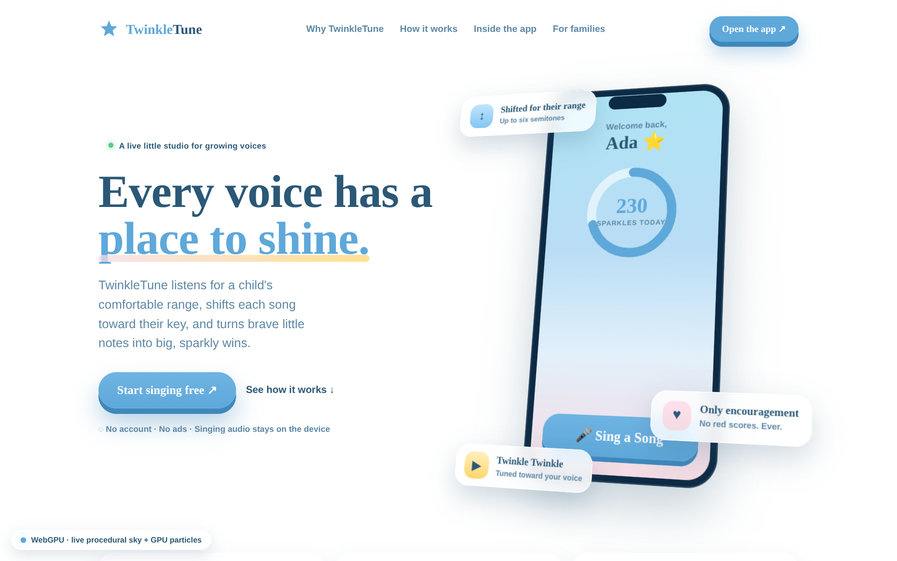
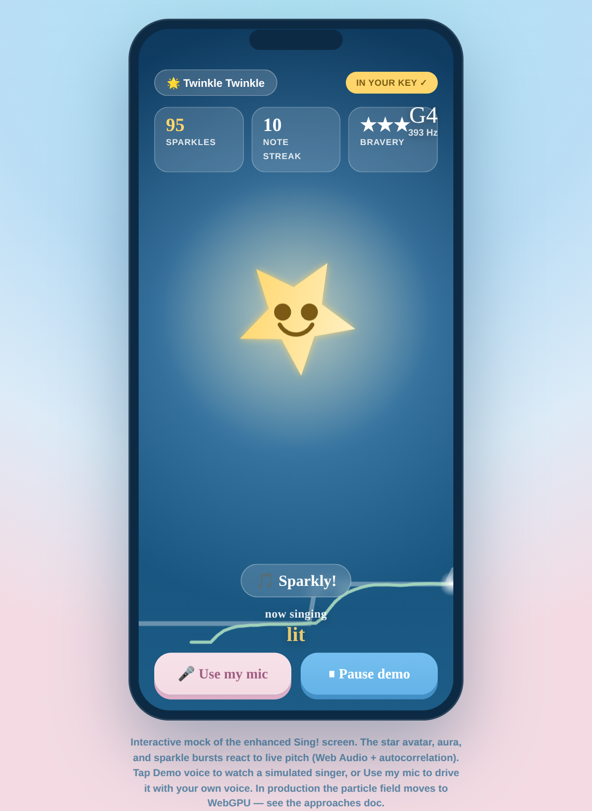

# Bleeding-edge 3D & rich-experience approaches for TwinkleTune

_Status: design exploration. Nothing here is shipped. This document proposes how
modern and near-future browser APIs — **WebGPU** first among them — could make the
marketing page and the in-app singing experience feel dramatically more alive,
without compromising the product's calm, kid-first, privacy-first character._

Companion interactive mocks live in [`docs/mocks/enhanced-3d/`](mocks/enhanced-3d/index.html):

| Mock | What it demonstrates |
|------|----------------------|
| [`marketing-hero.html`](mocks/enhanced-3d/marketing-hero.html) | A live **WebGPU aurora sky** (WGSL fragment shader) + GPU-instanced sparkle particles + a pointer-driven 3D-tilt product stage, with a full Canvas2D fallback. |
| [`sing-experience.html`](mocks/enhanced-3d/sing-experience.html) | An **audio-reactive** Sing! screen: a star avatar that grows/glows with live pitch, on-note sparkle bursts, and a scrolling pitch ribbon. Driven by Web Audio (real mic) or a self-playing demo voice. |
| [`index.html`](mocks/enhanced-3d/index.html) | Gallery + renderer-support notes. |

### Preview

**Marketing hero — live WebGPU sky + GPU sparkle particles + 3D-tilt stage**



**In-app Sing! — audio-reactive star, on-note sparkle bursts, live pitch ribbon**



> Screenshots captured running in Chromium; the hero shows the real WebGPU renderer active.
> On GPU hardware the aurora is more vivid than in the software-rendered capture here.

---

## 1. Guiding principles

Any visual upgrade must stay true to what TwinkleTune already is. These come first,
and they constrain every technique below.

1. **Calm, not chaotic.** The audience is young children. Motion should feel like a
   gentle breeze and sparkle, never a strobing arcade. Effects are ambient and
   supportive — they celebrate effort, they never distract from the one clear action.
2. **Privacy is non-negotiable.** Nothing here changes the promise that singing audio
   never leaves the device. All pitch analysis and rendering are client-side. No new
   network calls, no analytics beacons, no CDN-hosted 3D assets that phone home.
3. **Progressive enhancement, always.** The product must remain fully usable — and
   beautiful — on a low-end tablet with no WebGPU, and for a child whose OS requests
   reduced motion. Fancy is a bonus tier layered on top of a solid baseline.
4. **Performance is a feature.** These run on family tablets and hand-me-down phones.
   A gorgeous hero that drains battery or drops frames during singing is a regression.
   Frame budget and thermal/battery behaviour are acceptance criteria, not afterthoughts.
5. **Accessibility parity.** Every animated state has an equivalent that satisfies
   `prefers-reduced-motion`, maintains colour contrast for text, and avoids
   photosensitive-triggering flashes (no > 3 flashes/sec, low luminance deltas).

---

## 2. Progressive-enhancement tiers

The single most important architectural decision: treat the rich experience as a
**capability ladder**, detected at runtime, with each rung a complete, shippable
experience on its own.

```
Tier 1  WebGPU        Procedural shaders, GPU compute particles, real-time
        (WGSL)        audio-reactive scenes. Chrome/Edge 113+, Safari 18+,
                      Firefox (flagged→shipping). ~70%+ of 2025 desktop, rising mobile.
   │  feature-detect: `('gpu' in navigator)` + successful `requestAdapter()`
   ▼
Tier 2  WebGL2 /      Same visual language at lower fidelity. Three.js/regl or
        Canvas2D      hand-rolled. ~98% support. The mocks ship a Canvas2D sky +
                      sprite particles as the concrete fallback.
   │  feature-detect: WebGL2 context, or fall through to 2D
   ▼
Tier 3  CSS / static  GPU-composited CSS transforms, gradients, and the existing
                      SVG/emoji decorations. Also the `prefers-reduced-motion`
                      target: a single, still, lovely frame.
```

Detection is cheap and must be **graceful, not throwing** — see the `initWebGPU()`
function in `marketing-hero.html`, which returns `false` on any failure (no adapter,
no device, context configure error) and hands off to `initCanvas2D()`. The user never
sees an error; they see the best experience their device can render.

---

## 3. WebGPU: the flagship capability

WebGPU is the headline. It gives us the modern GPU (compute shaders, storage buffers,
explicit pipelines) directly in the browser, with far better parallelism and lower
overhead than WebGL. Three concrete places it pays off:

### 3.1 Procedural marketing backdrop (fragment shader)
Instead of a static gradient, the hero sky is **computed every frame** in a WGSL
fragment shader: a layered fBm-noise aurora that drifts, a vertical pastel gradient
built from the brand palette, and a soft "light of attention" glow that follows the
pointer. This is essentially free on the GPU (one fullscreen triangle) and impossible
to reproduce with this richness in CSS. See the `auroraShader` in the hero mock — a
self-contained, dependency-free WGSL module you can lift directly.

### 3.2 GPU particle systems (instancing + compute)
Sparkles, musical notes, and confetti are the soul of TwinkleTune's celebration
language. On the GPU we can run **thousands** of them cheaply:
- **Instanced draw** (mock uses this): one 6-vertex quad, `draw(6, N)`, per-instance
  seed data in a storage buffer, additive blending for glow. 320 particles in the mock;
  production could push 5–20k.
- **Compute-driven** (next step): a compute shader integrates particle physics into a
  storage buffer each frame (gravity, curl-noise wind, lifetime), and the render pass
  just draws them. This keeps the CPU idle and scales to full confetti bursts on the
  results screen.

### 3.3 Real-time audio-reactive scene (the Sing! screen)
This is where 3D + audio combine into something genuinely new for the product. A single
scalar signal — *how on-pitch is the child right now* — drives shader uniforms: the star
avatar's scale and glow, the nebula aura's radius and colour, and the emission rate of
the particle system. The `sing-experience.html` mock does this in Canvas2D today; the
production path feeds the same `{ pitch, energy, onNote }` uniform block into a WebGPU
scene for buttery 60/120fps with far more particles.

### 3.4 Library choice
| Option | When to use |
|--------|-------------|
| **Raw WebGPU + WGSL** (mocks use this) | Backdrops, particle systems, full control, zero dependencies, smallest bundle. Best for the marketing hero and the singing visualizer. |
| **Three.js `WebGPURenderer` (TSL)** | If we want a genuine 3D scene — a posable 3D star mascot, lit and shadowed, reacting in 3D space. Auto-fallback to WebGL. Larger bundle (~600KB), so lazy-load it only for the app, behind the Tier-1 gate. |
| **Babylon.js / PlayCanvas** | Only if the mascot grows into a full rigged character with animation blending. Probably overkill for now. |

Recommendation: **raw WebGPU for the marketing hero and the audio visualizer**
(tiny, fast, self-contained), and consider **Three.js WebGPURenderer** only if/when we
commit to a fully 3D Twinkle mascot.

---

## 4. The audio-reactive pipeline (already client-side)

TwinkleTune already runs Web Audio + [pitchy](https://github.com/ianprime0509/pitchy)
for pitch detection. The enhancement is to **fan that signal out to the renderer**:

```
mic → getUserMedia → AudioContext → AnalyserNode ─┬─→ pitch detector → note/cents
                                                  └─→ RMS → energy
                          (existing scoring)  ◄────┤
                          (new) render uniforms ◄──┴── { pitchHz, energy, onNote, streak }
```

- Detection stays exactly where it is (browser-only, audio never uploaded).
- A lightweight, smoothed uniform block is written once per frame.
- **Octave-forgiving** comparison (fold the ratio into one octave) matches the app's
  existing kind scoring — the mock replicates this so the star lights up whenever the
  child is on the note *in any octave*.
- **`AudioWorklet`** is the production upgrade over `AnalyserNode` polling: run the
  autocorrelation on a dedicated audio thread for rock-steady, low-latency pitch even
  while the GPU is busy. The mock uses main-thread autocorrelation for portability.

---

## 5. Other bleeding-edge APIs worth adopting

WebGPU is the star, but several newer platform features are lower-risk, high-impact,
and complement the 3D work:

- **View Transitions API** (`document.startViewTransition`) — buttery
  morph animations between app screens (home → sing → results), and cross-document
  transitions on the marketing site. Huge perceived-polish win, trivially degradable.
- **Scroll-driven animations** (`animation-timeline: scroll()/view()`) — the marketing
  page's reveal-on-scroll and parallax become pure declarative CSS running on the
  compositor, replacing the IntersectionObserver JS. No main-thread cost.
- **CSS 3D transforms + `transform-style: preserve-3d`** — the hero's tilting product
  stage (see the mock) is GPU-composited and needs no WebGL at all; a perfect Tier-3
  “3D” that runs everywhere.
- **OffscreenCanvas + Web Worker** — move the WebGPU/Canvas render loop off the main
  thread so scrolling and taps never jank while the sky animates. Especially valuable
  during singing, where the main thread is busy with audio and scoring.
- **`prefers-reduced-motion` / `prefers-reduced-transparency` / `prefers-contrast`** —
  first-class media-query branches (the mocks honour reduced-motion today).
- **CSS Houdini `@property`** — animate custom gradient/glow properties on the
  compositor for the Tier-3 sparkle without JS.
- **Popover API + CSS Anchor Positioning** — modernise the tooltips, Twinkle's tips,
  and the grown-ups dialogs with zero-JS, accessible overlays.
- **Wake Lock API** — keep the screen awake during a song so a quiet passage doesn't
  dim the tablet mid-performance.
- **Web Speech / SpeechSynthesis** — optional spoken encouragement from Twinkle for
  pre-readers ("Beautiful! One more?"), fully on-device.
- **WebCodecs / `captureStream`** (stretch) — let a family export a sparkly little
  "music video" of a performance, composited from the live scene, entirely on-device.

---

## 6. Performance budget

Targets on a **mid-range 2022 tablet** (the realistic worst case for the primary user):

| Surface | Budget |
|---------|--------|
| Marketing hero | ≥ 55fps; pause the render loop when the tab is hidden (`visibilitychange`) or the hero is scrolled off (`IntersectionObserver`). |
| Sing! screen | ≥ 60fps with audio running; pitch latency < 40ms; audio thread never starved. |
| First contentful paint (marketing) | Unchanged — the GPU canvas initialises **after** paint and never blocks it. |
| Battery / thermal | Cap particle count and DPR (mock clamps `devicePixelRatio` to 2); drop to Tier 2 automatically if `requestAnimationFrame` deltas indicate sustained frame drops. |
| Bundle | Raw-WebGPU paths add **zero** dependencies. Any Three.js usage is lazy-loaded, app-only, behind the Tier-1 gate. |

Mitigations baked into the mocks already: DPR clamping, additive blend instead of
per-particle sorting, single uniform buffer, and a hard fallback ladder.

---

## 7. Accessibility & safety

- **Reduced motion:** every mock branches on `prefers-reduced-motion: reduce` and
  renders a still, calm frame (badge reads “Motion reduced · static sky”).
- **Photosensitivity:** no full-screen flashes; luminance changes are gradual and
  low-amplitude; particle twinkle stays under safe flash thresholds.
- **Contrast:** all copy sits on solid or blurred-glass surfaces, never directly on the
  most active part of the shader, so text contrast stays ≥ 4.5:1.
- **Input independence:** pointer-tilt and pointer-glow are enhancements only; keyboard
  and touch users lose nothing. Effects are `aria-hidden`; semantics live in the DOM.
- **Motion sickness:** parallax/tilt amplitudes are small and eased.

---

## 8. Suggested rollout

A low-risk, incremental path — each phase ships independently and is reversible.

1. **Phase 0 — CSS/compositor polish (no WebGPU).** View Transitions between app
   screens, scroll-driven reveals, and the 3D-tilt hero stage. Broad support, immediate
   “wow,” tiny risk. _(The tilt stage is already in the hero mock.)_
2. **Phase 1 — WebGPU marketing hero.** Ship the aurora + particle backdrop behind the
   Tier ladder, Canvas2D fallback on by default. Marketing surface = safest place to
   trial WebGPU. _(Prototyped in `marketing-hero.html`.)_
3. **Phase 2 — Audio-reactive Sing! visuals.** Wire the existing pitch signal into a
   reactive star + aura + on-note sparkle bursts, Canvas2D first. _(Prototyped in
   `sing-experience.html`.)_
4. **Phase 3 — WebGPU + compute particles in-app.** Promote the Sing!/results particle
   systems to GPU compute; move the render loop to OffscreenCanvas + Worker.
5. **Phase 4 — Optional 3D mascot.** Evaluate Three.js `WebGPURenderer` for a fully 3D
   Twinkle that reacts in 3D space. Only if it earns its bundle cost.

---

## 9. Risks & open questions

- **WebGPU mobile maturity.** Improving fast but uneven across tablet GPUs/drivers; the
  Tier ladder makes this a non-blocker, but real-device QA on target tablets is required.
- **Battery on long play sessions.** Needs measurement; the auto-downgrade heuristic
  (sustained dropped frames → Tier 2) is the safety valve.
- **Aesthetic drift.** Easy to overdo it. Keep effects ambient and on-brand; treat the
  existing pastel “sky studio” mocks in `docs/mocks/` as the taste anchor.
- **Testing.** GPU rendering is hard to snapshot-test; lean on visual review + capped
  deterministic seeds, and keep the DOM/semantics fully testable independent of the canvas.

---

## 10. How to view the mocks

The mocks are single, dependency-free HTML files (Google Fonts is the only external
request). Open them directly, or serve the folder:

```bash
# from the repo root
npx serve docs/mocks/enhanced-3d      # then open the printed URL
# or just open docs/mocks/enhanced-3d/index.html in a WebGPU browser
```

For the full GPU path use **Chrome or Edge 113+** (or Safari 18+ / Firefox with WebGPU
enabled). The corner badge tells you which renderer went live. The Sing! mock's
**Demo voice** button needs no microphone; **Use my mic** asks permission and drives the
scene with your real voice — and, true to the product, that audio never leaves the page.
